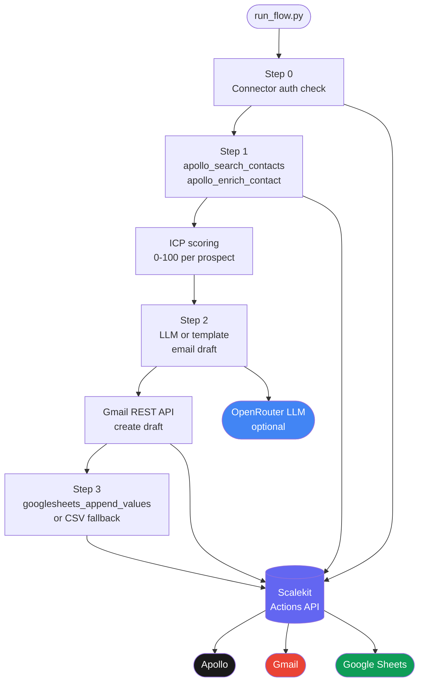

# Outbound Prospecting Agent (Apollo, Gmail, Google Sheets)

> Search Apollo for ICP-matched prospects, draft personalized Gmail outreach, and log everything to Google Sheets — all without handling OAuth tokens directly.

**Built with [Scalekit Agent Auth](https://scalekit.com).** All OAuth across Apollo, Gmail, and Google Sheets is managed by Scalekit. The agent never stores or refreshes tokens.

**Reference:** [scalekit.com/agent-templates](https://www.scalekit.com/agent-templates)

---

## Overview

The agent runs a single pipeline on each invocation:

1. Checks that all connectors are authorized via Scalekit.
2. Searches Apollo for contacts matching your ICP (title, industry, headcount).
3. Enriches each contact with buying signals and org context.
4. Scores each prospect 0-100 against ICP criteria and picks the top results.
5. Drafts a personalized outreach email per prospect using an LLM (OpenRouter) or a template fallback.
6. Creates each email as a Gmail draft via the Gmail REST API using a Scalekit-managed token.
7. Appends one row per prospect to a Google Sheet (name, company, score, signals, draft link).

No email is ever sent automatically. SDRs review and send from Gmail drafts.

---

## Architecture



---

## Setup

### 1. Create Scalekit connectors

Go to [app.scalekit.com](https://app.scalekit.com) > Agent Auth > Connections and add:

| Connection name | Service |
|---|---|
| `apollo` | Apollo |
| `gmail` | Gmail |
| `googlesheets` | Google Sheets |

Copy your API credentials from Settings > API Credentials.

### 2. Prepare your Google Sheet

Create a new Google Sheet. The agent writes these columns automatically:

| Name | Company | Title | Email | ICP Score | Buying Signals | Email Subject | Draft Link |

Copy the Sheet ID from the URL: `docs.google.com/spreadsheets/d/SHEET_ID/edit`

### 3. Configure environment

```bash
cp .env.example .env
```

Fill in `.env` (see [Environment Variables](#environment-variables) below). The agent prints a clear error listing any missing variables on startup.

### 4. Install and run

```bash
python3 -m venv .venv
source .venv/bin/activate          # Windows: .venv\Scripts\activate
pip install -r requirements.txt
python run_flow.py
```

On the first run, any connector that is not yet authorized will print a magic link. Open it in a browser, complete OAuth, press Enter. Every run after that goes straight through.

### 5. Run without Apollo (sample data mode)

```bash
USE_SAMPLE_DATA=true python run_flow.py
```

Skips Apollo entirely and uses five built-in sample prospects. Gmail drafts and Sheets logging still run against your real accounts. Good for testing the pipeline before setting up Apollo.

---

## What the output looks like

```
────────────────────────────────────────────────────────────
  Outbound Prospecting Agent
  Apollo -> Gmail Drafts -> Google Sheets via Scalekit
────────────────────────────────────────────────────────────
  Environment  : https://your-env.scalekit.dev
  Sample data  : False
  LLM drafting : OpenRouter (google/gemma-3-27b-it:free)
  Prospect cap : 5
────────────────────────────────────────────────────────────

10:00:01 | INFO     | ⚙  Step 0: Connector auth
10:00:02 | INFO     | ✔  apollo — ACTIVE
10:00:02 | INFO     | ✔  gmail — ACTIVE
10:00:03 | INFO     | ✔  googlesheets — ACTIVE
10:00:03 | INFO     | ⌕  Step 1: Finding prospects
10:00:05 | INFO     | ✔  Apollo returned 15 prospect(s)
10:00:07 | INFO     | ✔  Top 5 prospects by ICP score
10:00:07 | INFO     | ✉  Step 2: Drafting Gmail emails
10:00:07 | INFO     |    Sarah Chen | VP of Sales @ Nova HQ | score=80
10:00:07 | INFO     |    Signals: Recent Series B ($28M), Hiring 4 AEs
10:00:08 | INFO     | ✦  LLM draft OK
10:00:09 | INFO     | ✔  Draft created -> sarah.chen@novahq.io
10:00:09 | INFO     |    Subject : Quick question about Nova HQ's Series B momentum
10:00:09 | INFO     |    Link    : https://mail.google.com/mail/#drafts/...
10:00:15 | INFO     | ✔  Drafted 5/5
10:00:15 | INFO     | ▦  Step 3: Logging to Google Sheets
10:00:16 | INFO     | ✔  Sarah Chen @ Nova HQ -> Sheets
10:00:20 | INFO     | ✔  Logged 5/5 rows
────────────────────────────────────────────────────────────
10:00:20 | INFO     | ✔  Run complete
10:00:20 | INFO     |    Prospects found : 5
10:00:20 | INFO     |    Gmail drafts    : 5/5
10:00:20 | INFO     |    Sheets rows     : 5/5
10:00:20 | INFO     | ✔  No errors
10:00:20 | INFO     |    Drafts inbox: https://mail.google.com/mail/#drafts
────────────────────────────────────────────────────────────
```

---

## ICP Scoring

| Factor | Points | Criteria |
|---|---|---|
| Title match | 30 | Matches `ICP_TITLES` |
| Industry match | 25 | Matches `ICP_INDUSTRIES` |
| Company size | 20 | Within `ICP_EMP_MIN` to `ICP_EMP_MAX` |
| Buying signals | up to 25 | 5 pts per signal, capped at 25 |

All ICP criteria are set in `.env` — no code changes needed to retarget.

---

## Environment Variables

### Required

| Variable | Description |
|---|---|
| `SCALEKIT_ENV_URL` | Your Scalekit environment URL, e.g. `https://your-env.scalekit.dev` |
| `SCALEKIT_CLIENT_ID` | Client ID from Scalekit Settings > API Credentials |
| `SCALEKIT_CLIENT_SECRET` | Client secret from Scalekit Settings > API Credentials |
| `GMAIL_USER` | Gmail address used to authorize the gmail connector |
| `SHEETS_USER` | Google account email used to authorize the googlesheets connector |
| `SHEETS_ID` | The alphanumeric ID from your Google Sheet URL |

### Optional

| Variable | Default | Description |
|---|---|---|
| `APOLLO_USER` | same as `GMAIL_USER` | Email for the apollo connector (if different) |
| `SHEETS_RANGE` | `Sheet1!A:H` | Sheet tab and column range to append into |
| `ICP_TITLES` | `VP of Sales,...` | Comma-separated list of target titles |
| `ICP_INDUSTRIES` | `SaaS,Software,Technology` | Comma-separated list of target industries |
| `ICP_EMP_MIN` | `50` | Minimum company headcount |
| `ICP_EMP_MAX` | `5000` | Maximum company headcount |
| `PROSPECT_LIMIT` | `5` | Max prospects to process per run |
| `USE_SAMPLE_DATA` | `false` | Set to `true` to skip Apollo and use built-in sample prospects |
| `OPENROUTER_API_KEY` | (none) | OpenRouter API key for LLM email drafting (falls back to template if not set) |
| `OPENROUTER_MODEL` | `google/gemma-3-27b-it:free` | OpenRouter model to use |
| `LOG_LEVEL` | `INFO` | Log verbosity: `DEBUG`, `INFO`, `WARNING`, `ERROR` |

---

## Troubleshooting

| Error | Cause | Fix |
|---|---|---|
| `ValueError: Missing required env vars` | One or more vars not set in `.env` | Copy `.env.example` to `.env` and fill all values |
| Connector prints a magic link on startup | Account not yet authorized in Scalekit | Open the link in a browser, complete OAuth, press Enter |
| `apollo — connector not found` | Apollo connector not added in Scalekit | Add an `apollo` connection in Scalekit dashboard, or set `USE_SAMPLE_DATA=true` |
| Apollo returns 0 prospects | ICP filters too narrow | Broaden `ICP_TITLES`, `ICP_INDUSTRIES`, or `ICP_EMP_MIN`/`MAX` in `.env` |
| `Gmail draft failed: 401` | Gmail OAuth token expired or revoked | Re-authorize the gmail connector in Scalekit dashboard |
| `Sheets append failed` | Wrong `SHEETS_ID` or missing sheet permissions | Check the Sheet ID in the URL; make sure the Google account has edit access |
| LLM draft falls back to template | `OPENROUTER_API_KEY` not set or rate limited | Set `OPENROUTER_API_KEY` in `.env`, or leave blank to always use the template |
| Output goes to `prospects_output.csv` | `SHEETS_ID` not configured | Set `SHEETS_ID` in `.env` to a real Google Sheet ID |

---

## Project Structure

```
run_flow.py           Main pipeline: auth -> search -> draft -> Gmail -> Sheets
settings.py           Env var loading and validation (fails fast on missing vars)
.env.example          Template with all required and optional variables
requirements.txt      Dependencies: scalekit-sdk-python, requests, python-dotenv
```

---

## SDK Versions

- `scalekit-sdk-python >= 2.12.0`
- Last verified: 2026-06-19
