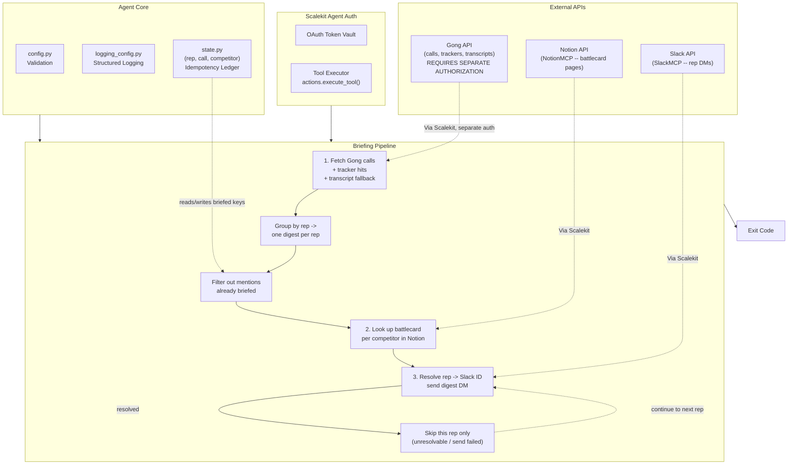

# Competitive Intelligence Briefing Agent

**Gong -> Notion -> Slack**

An agent that runs on behalf of a PMM (Product Marketing Manager): fetches Gong calls with configured competitor mentions from the last lookback window, looks up each mentioned competitor's battlecard page in Notion, and DMs each affected sales rep ONE digest message per cycle covering every call and competitor they were involved with (not one DM per call).

All three services are connected through [Scalekit Agent Auth](https://scalekit.com) using a single `actions.execute_tool()` interface. No token management, no OAuth refresh logic, no credential storage in your code.


## What It Does

For one briefing cycle, the agent runs a three-step pipeline:

| Step | Action | Tool |
|------|--------|------|
| 1 | Fetch calls in the lookback window from Gong, enrich with tracker hits/participants, fall back to transcript text-scan for competitor mentions | `gong_calls_list`, `gong_calls_get`, `gong_calls_transcript_get` |
| 2 | Group mentions by rep into one digest per rep; look up each mentioned competitor's battlecard in Notion | `notionmcp_notion-fetch`, `notionmcp_notion-search` |
| 3 | Resolve each rep to a Slack user and DM their digest | `slackmcp_slack_search_users`, `slackmcp_slack_send_message` |

**Example:** *"Which reps need a heads-up on recent Salesforce mentions?"* -> every call in the configured lookback window mentioning Salesforce (or any other tracked competitor) is found, grouped by rep, matched to the right battlecard, and DMed to each rep as one digest: call clips (a link plus a mention timestamp when known), competitors mentioned, and battlecard links.

## Architecture



## Prerequisites

- Python 3.11+
- A [Scalekit](https://scalekit.com) account (free tier works)
- **A Gong account with a Gong connection set up in your Scalekit dashboard.** This is the one connector this agent cannot function without. To connect Gong:
  1. In the Scalekit dashboard, add a Gong connection under Agent Auth > Connections.
  2. Complete Gong's auth flow (Gong's API uses Basic Auth with an access key/secret pair generated in Gong's own admin settings, per the tool catalog's `auth.strategy: BASIC` -- see your Gong account's API settings).
  3. Copy the exact connection name Scalekit shows you into `GONG_CONNECTOR` in `.env`.
  4. Ensure the Gong account has at least one Tracker configured for each competitor you want detected via tracker hits (see [Mention Detection](#mention-detection) below) -- trackers are optional (transcript text-scan is a fallback), but far more reliable and much cheaper to query at scale.
- A Notion workspace with an MCP-variant Notion connection, and one parent page (e.g. "Competitive Battlecards") containing one child page per competitor you track (e.g. "Salesforce", "HubSpot"). This agent only reads battlecards; a PMM must create them.
- A Slack workspace where the agent can DM sales reps.

## Gong Tool Verification

Tool shapes were discovered and verified against Scalekit's live tool catalog (`actions.tools.list_tools()` with a query filter), which is inspectable even with zero connected accounts -- the same technique used for `GOOGLEDWD` in a sibling repo -- and then re-verified against real call data once Gong was connected. This returned all 34 real tool definitions registered for the `GONG` and `GONGMCP` providers, including full input schemas. The tools this agent uses:

| Tool | Method/Path | Notes |
|------|--------------|-------|
| `gong_calls_list` | `GET /v2/calls` | Filters: `from_date_time`, `to_date_time`, `workspace_id`, `call_ids`, `cursor`. No keyword/mention filter exists. |
| `gong_calls_get` | `POST /v2/calls/extensive` | Requires `call_ids`. Returns enriched call data including `content.trackers` (tracker hit names/counts) and `metaData` (including `primaryUserId`). Its input schema has no `content_selector` or similar param, so it never returns `parties`/participant data, confirmed by reading the tool's own jsonnet_template against a live workspace. |
| `gong_calls_transcript_get` | `POST /v2/calls/transcript` | Requires `call_ids` (a list, not a single `call_id`). Returns speaker-attributed sentence-level transcript segments with per-sentence `start`/`end` offsets in milliseconds. |
| `gong_trackers_list` | `GET /v2/settings/trackers` | Lists tracker DEFINITIONS only (name, tracked phrases) -- not which calls hit them. |
| `gong_users_list` / `gong_users_get` | `GET /v2/users` / `POST /v2/users/extensive` | Resolve a Gong user ID (from `metaData.primaryUserId`, since `parties` is never populated) to name/email. This is the real rep-identification path -- see [Rep Identification](#rep-identification). |

All are plain REST tools under the `GONG` provider (Basic Auth, `assume_json_response: true`, base URL `https://api.gong.io`) -- no MCP envelope, unlike Notion/Slack. A separate `GONGMCP` provider also exists in the catalog with 3 higher-level tools (`gongmcp_generate_brief`, `gongmcp_ask_deal`, `gongmcp_ask_account`) that were not used here, since they answer natural-language questions about a CRM entity rather than listing calls by date range.

**Important limitation discovered during this verification:** there is no server-side "calls with keyword/tracker X mentioned" filter tool in Gong's catalog. `gong_calls_list` only filters by date range, workspace, and explicit call IDs. This agent therefore fetches every call in the lookback window, then determines competitor mentions client-side from each call's `content.trackers` hits (primary) or a transcript text-scan (fallback) -- see [Mention Detection](#mention-detection).

## Setup

### 1. Install dependencies

```bash
pip install -r requirements.txt
```

### 2. Configure environment

```bash
cp .env.example .env
```

Fill in your credentials. See `.env.example` for all available options.

### 3. Set up Scalekit connectors

In the [Scalekit dashboard](https://scalekit.com), add three connections under Agent Auth > Connections: **Gong**, an MCP-variant **Notion** connection, and an MCP-variant **Slack** connection.

**Gong**: See [Prerequisites](#prerequisites) above -- this is the connector requiring the most setup.

**Notion**: Complete the OAuth flow and share your "Competitive Battlecards" parent page (and its child battlecard pages) with the connected integration.

**Slack**: Complete the OAuth flow with `chat:write` scope (or MCP equivalent). No channel membership is required since this agent only sends DMs.

**Copy the exact connection names** shown in your dashboard into `.env`. Scalekit auto-suffixes these per workspace (e.g. `notionmcp-chAb8Lfz`), so the generic provider labels won't work for the Step 0 auth check or for disambiguating `execute_tool()` calls when one identifier has multiple connections of the same provider type.

### 4. Point the agent at your real data

- `PMM_EMAIL`: the PMM this cycle runs on behalf of (used in logs)
- `LOOKBACK_DAYS`: how many days back to search Gong for calls (default `7`)
- `COMPETITOR_NAMES`: comma-separated list of competitors to track (default `Salesforce`)
- `NOTION_BATTLECARDS_PARENT_PAGE_ID`: the parent page ID under which your per-competitor battlecard pages live

### 5. Run

```bash
python run_flow.py
```

## Mention Detection

A "competitor mention" on a call is detected two ways, in priority order:

1. **Tracker hits** (primary): if `gong_calls_get` returns a `content.trackers` list for the call and a tracker's name contains a configured competitor's name as a whole word (case-insensitive, e.g. a tracker named "Salesforce mention" matches competitor "Salesforce"), that's a mention. This requires the Gong account to have a tracker configured for each competitor -- see Prerequisites. Tracker hits do not carry a timestamp, so digest lines from this path show no clip time.
2. **Transcript text-scan** (fallback): if a call produced zero tracker-based mentions, its transcript is fetched via `gong_calls_transcript_get` and scanned sentence by sentence for each competitor name as a case-insensitive whole-word match (so "Sales" never falsely matches "Salesforce"). The `start` offset (in milliseconds) of the first matching sentence is captured and rendered as a human-readable `MM:SS` timestamp next to that mention in the Slack digest (e.g. "-- mention at 0:41"), so a rep can jump straight to the relevant moment instead of scrubbing the full recording. A verified deep-link query parameter into Gong's own call player was not found in the tool catalog, so the digest links the full call recording alongside this timestamp rather than guessing at a URL format that could silently be wrong.

A single call can mention multiple competitors; all of them appear as separate entries in that rep's one digest, not multiple DMs.

## Rep Identification

Gong's `gong_calls_get` tool has no way to request `parties`/participant data through this Scalekit connector (its input schema only accepts `call_ids` and `workspace_id`, confirmed by reading the tool's own jsonnet_template), so affiliation- or email-domain-based identification is not possible here. The real, working path is: each call's `metaData.primaryUserId` is collected, resolved in one batch via `gong_users_get(user_ids=...)` to `{emailAddress, firstName, lastName}`, and that resolved profile is used as the call's internal rep. A call whose `primaryUserId` cannot be resolved to a user is skipped with a warning rather than guessed at.

## Usage

### One-Time Mode (Default)

Process one briefing cycle and exit:

```bash
python run_flow.py
```

Ideal for cron jobs, CI/CD pipelines, manual runs, or serverless functions.

```bash
0 8 * * MON-FRI cd /path/to/agent && python run_flow.py   # daily on weekday mornings
```

### Continuous Mode (Polling)

Run indefinitely, re-checking on an interval:

```bash
POLLING_MODE=true POLL_INTERVAL_MINUTES=60 python run_flow.py
```

Press `Ctrl+C` to stop gracefully. The agent finishes the current rep's DM (or the current cycle, if between reps) and exits with code `130`.

## Configuration

Environment variables (set in `.env`):

| Variable | Default | Notes |
|----------|---------|-------|
| `SCALEKIT_ENV_URL` | - | Required: your Scalekit workspace URL |
| `SCALEKIT_CLIENT_ID` | - | Required: Scalekit client ID |
| `SCALEKIT_CLIENT_SECRET` | - | Required: Scalekit client secret |
| `GONG_USER` | - | Required: identity used to authorize Gong |
| `NOTION_USER` | - | Required: identity used to authorize Notion |
| `SLACK_USER` | - | Required: identity used to authorize Slack |
| `GONG_CONNECTOR` | `GONG` | Exact connection name from the Scalekit dashboard (placeholder; replace with your workspace's real connection name, e.g. `gong-wkAzsGmi`) |
| `NOTION_CONNECTOR` | `notionmcp-chAb8Lfz` | Exact connection name; must be an MCP-variant Notion connection |
| `SLACK_CONNECTOR` | `slackmcp` | Exact connection name; must be an MCP-variant Slack connection |
| `PMM_EMAIL` | - | Required: the PMM this cycle runs on behalf of |
| `LOOKBACK_DAYS` | `7` | How many days back to search Gong for calls |
| `COMPETITOR_NAMES` | `Salesforce` | Comma-separated list of competitors to track |
| `NOTION_BATTLECARDS_PARENT_PAGE_ID` | - | Required: parent page ID for per-competitor battlecards |
| `GONG_WORKSPACE_ID` | (empty) | Optional: restrict Gong queries to a single Gong workspace |
| `POLLING_MODE` | `false` | Enable continuous polling |
| `POLL_INTERVAL_MINUTES` | `60` | Minutes between polling cycles |
| `LOG_LEVEL` | `INFO` | `DEBUG`, `INFO`, `WARNING`, `ERROR` |

## Exit Codes

| Code | Meaning | Use Case |
|------|---------|----------|
| `0` | Success | At least one rep processed this cycle (briefed, or all their mentions were already briefed) |
| `1` | Error | Config missing, Notion provisioning failed, Gong unreachable/not configured, or 5 consecutive polling errors |
| `2` | No data | No calls with any tracked competitor mention found in the lookback window (normal, not an error) |
| `130` | Interrupted | Graceful shutdown via Ctrl+C or SIGTERM |

## Monitoring

### Logging

Structured logs with timestamps, levels, and auto-redacted secrets:

```bash
python run_flow.py                    # all logs
LOG_LEVEL=ERROR python run_flow.py     # errors only
LOG_LEVEL=DEBUG python run_flow.py     # verbose
```

Log levels:
- `DEBUG`: detailed execution flow, Scalekit client initialization, per-call mention-detection tracing
- `INFO`: key milestones, connector auth status, per-rep briefing outcomes, final cycle summary
- `WARNING`: auth issues, missing battlecards, unresolvable Slack users, per-call/per-rep skip reasons
- `ERROR`: unrecoverable failures, missing config, Gong unreachable

Every cycle ends with a summary line:

```
[SUMMARY] 3 rep(s) briefed, 1 already briefed (idempotent skip), 1 skipped (no Slack user), 0 skipped (send failed), 2 battlecard(s) found, 1 missing
```

### State

`state/briefed_mentions.json` stores a set of `sha256(rep + call_id + competitor)` keys, one per mention that has ever actually been included in a sent DM. See `state.py`'s module docstring for the full design rationale (a per-mention key was chosen over a whole-digest content fingerprint specifically so a new mention added to an otherwise-already-seen rep does not get silently swallowed by unchanged-content suppression, and does not cause already-seen mentions to be re-sent).

```bash
rm -f state/briefed_mentions.json   # reset, e.g. to force re-briefing for testing
```

## Error Handling & Edge Cases

- **Gong unauthorized or unreachable**: Step 0 reports it as a warning without crashing (Gong's connector status is a per-run data-availability condition, not a startup config error -- see `provisioning.py`'s docstring for the full reasoning). Step 1 is where this becomes a specific, actionable failure: `ConnectorUnavailableError` (never connected) or `ConnectorError` (connected but failing) is caught in `main()` and produces a clear message plus exit code `1`. This path was exercised live before Gong was connected in the reference workspace, confirming the message and exit code fire correctly; with Gong connected, the normal Step 1 success path runs instead.
- **Zero calls with any tracked competitor mention in the lookback window**: `run_cycle()` returns `None`; `main()` logs this as a normal outcome and exits `2`, not an error.
- **A competitor mentioned with no matching Notion battlecard**: logged as a warning; the rep is still DMed, with an explicit "No `<competitor>` battlecard found in Notion yet" note in place of a link. The rep's briefing is never silently dropped over one missing battlecard.
- **A rep who can't be resolved to a Slack user ID**: logged as a warning; only that rep's DM is skipped (`skipped_no_slack_user`), and processing continues to the next rep.
- **Duplicate/repeat runs for the same call+rep+competitor combo**: `state.py`'s idempotency ledger, keyed per `(rep, call_id, competitor)`, filters these out before a DM is even composed. Verified live in this build: a second identical call to `brief_one_rep()` returned `already_briefed` and sent no second DM.
- **A call with multiple competitors mentioned**: all appear as separate lines in that rep's one digest DM, grouped by competitor -- never split into multiple DMs. Verified live in this build with a synthetic two-competitor digest.
- **Notion or Slack API failures mid-run for one specific rep**: caught per-rep in `brief_one_rep()`; logged as a warning, that rep's outcome is recorded (`skipped_send_failed` or a `None` battlecard), and the loop continues to the next rep rather than aborting the batch.
- **Malformed/missing call data from Gong**: `build_rep_digests()` skips any call record missing a call ID, or with no identifiable internal rep, logging a warning and continuing to the next call rather than raising.
- **Ctrl+C / SIGTERM mid-cycle**: the in-flight rep's DM finishes (or is skipped) and the loop stops before starting the next rep; the process exits `130` with no half-sent digest.

## Troubleshooting

| Issue | Solution |
|-------|----------|
| `ModuleNotFoundError: scalekit` | Run `pip install -r requirements.txt` |
| `Missing required config: ...` | Run `cp .env.example .env` and fill in your values |
| `GONG (...) -- NOT CONFIGURED` | Connect Gong in the Scalekit dashboard (see Prerequisites); this is expected until you do |
| `Gong is not configured in this Scalekit workspace` (exit 1) | Same as above -- this is Step 1's specific failure message when Gong truly cannot be reached |
| `connector (...) -- INACTIVE` / `PENDING_AUTH` | Open the auth link printed in logs, or authorize in the Scalekit dashboard |
| `multiple connected accounts found for identifier` | Set the exact `*_CONNECTOR` env var for that provider; the same identifier is connected to more than one connection of that type in your workspace |
| `Notion battlecards parent page '...' was not found or is empty/inaccessible` | Create the parent page in Notion, share it with your connected integration, and set `NOTION_BATTLECARDS_PARENT_PAGE_ID` to its ID from the URL |
| No battlecard link in a rep's DM | Confirm a Notion child page titled (or containing) the competitor's exact name exists under your configured parent page |
| Rep never gets DMed | Check logs for `skipped_no_slack_user` -- the rep's Gong-identified email/name didn't resolve to a Slack user; try setting up the rep's email as their Gong participant identity |
| Same rep DMed twice for the same mention | Should not happen -- if it does, check `state/briefed_mentions.json` is writable and not being reset between runs |
| `No colored output` | Colors auto-disable when output is piped; force with `FORCE_COLOR=1` |