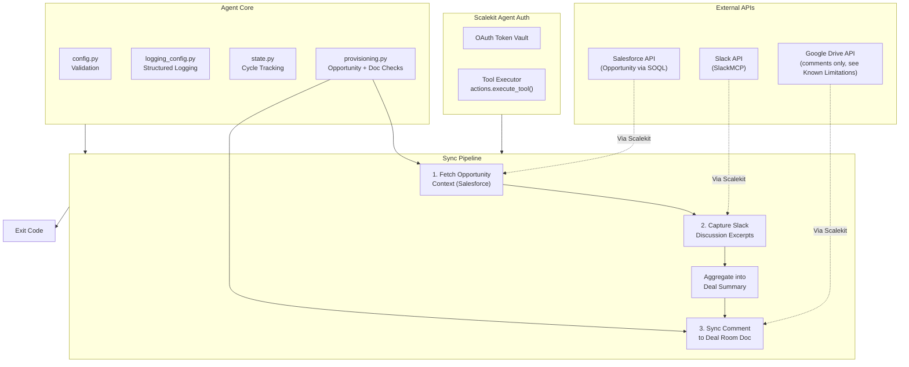

# Deal Room Sync Agent

**Salesforce + Slack -> Google Drive**

An agent that runs on behalf of an Account Executive (AE): pulls opportunity context from Salesforce (stage, amount, close date, next steps), captures key decisions from relevant Slack discussion, and syncs a running summary into the opportunity's Google Drive deal room doc as a comment log.

All three services are connected through [Scalekit Agent Auth](https://scalekit.com) using a single `actions.execute_tool()` interface. No token management, no OAuth refresh logic, no credential storage in your code.

## What It Does

For one sync cycle, the agent runs a three-step pipeline:

| Step | Action | Tool |
|------|--------|------|
| 1 | Fetch opportunity context from Salesforce | `salesforce_soql_execute` |
| 2 | Capture key decisions from relevant Slack discussion | `slackmcp_slack_search_public_and_private` or `slackmcp_slack_read_channel` |
| 3 | Sync a summary comment to the Google Drive deal room doc | `googledrive_get_file_metadata`, `googledrive_create_comment` |

**Example:** the "Lightrun - Team Expansion (40 seats)" opportunity is in Negotiation/Review, closing 2026-08-15. The agent finds that context in Salesforce, searches Slack for "Lightrun"-related discussion, and posts a timestamped summary comment on the deal's Google Drive doc: stage, amount, close date, next steps, and up to 5 relevant Slack excerpts.

## Architecture



## Prerequisites

- Python 3.11+
- A [Scalekit](https://scalekit.com) account (free tier works)
- A Salesforce org with at least one Opportunity record to sync
- A Slack workspace where relevant deal discussion happens (public or private channels the connected account can see)
- An existing Google Drive file to serve as the deal room doc (a Google Doc works well; the agent can also find-or-create one by name, see Configuration below)

## Setup

### 1. Install dependencies

```bash
pip install -r requirements.txt
```

### 2. Configure environment

```bash
cp .env.example .env
```

Fill in your credentials. See `.env.example` for all available options.

### 3. Set up Scalekit connectors

In the [Scalekit dashboard](https://scalekit.com), add three connections under Agent Auth > Connections: **Salesforce**, a **Slack** MCP variant, and **Google Drive**.

**Salesforce**: Complete the OAuth flow. Grant read (and ideally write, if you plan to extend this agent) access to the Opportunity object.

**Slack**: Use an MCP-based Slack connection (SlackMCP). This agent is built against SlackMCP's tool shapes: `slackmcp_slack_search_public_and_private`, `slackmcp_slack_read_channel`, `slackmcp_slack_read_thread`, and `slackmcp_slack_send_message`. The plain REST `SLACK` connector uses different tool names and is not supported here. Complete the OAuth flow with search and read scopes (or the equivalent MCP scopes).

**Google Drive**: Complete the OAuth flow with access to the file(s) you'll use as deal room docs.

**Copy the exact connection names** shown in your dashboard into `.env`. Scalekit auto-suffixes these per workspace (e.g. `salesforce-1`, `googledrive-9WdQ8yGN`), so the generic provider labels won't work for the Step 0 auth check or for `execute_tool()` calls. See `SALESFORCE_CONNECTOR`, `SLACK_CONNECTOR`, `GOOGLE_DRIVE_CONNECTOR` in Configuration below.

### 4. Point the agent at your real data

- `AE_EMAIL`: the Account Executive this run is on behalf of (stamped into the synced summary; used for logging/attribution only)
- `OPPORTUNITY_ID` or `OPPORTUNITY_NAME`: which Salesforce opportunity to sync. Prefer `OPPORTUNITY_ID` for unambiguous targeting in production; `OPPORTUNITY_NAME` does a case-insensitive substring match and picks the most recently modified hit if several opportunities share similar names
- `DEAL_ROOM_DOC_ID` or `DEAL_ROOM_DOC_NAME`: the Google Drive file to sync the summary into. Set `DEAL_ROOM_DOC_ID` to an existing file's ID (recommended once the deal room doc already exists), or set `DEAL_ROOM_DOC_NAME` (optionally with `DEAL_ROOM_FOLDER_ID`) to let the agent find-or-create a Google Doc by name
- `SLACK_CHANNEL_ID` (optional): scope Slack discovery to a single channel via `slack_read_channel`. Leave unset to search all public and private channels the connected account can see, keyed on `SLACK_SEARCH_KEYWORD` (falls back to the opportunity name if unset)

### 5. Run

```bash
python run_flow.py
```

## Usage

### One-Time Mode (Default)

Process one sync cycle and exit:

```bash
python run_flow.py
```

Ideal for cron jobs, CI/CD pipelines, manual runs, or serverless functions. One sync per opportunity per calendar day is the default cadence (tracked in `state/synced_cycles.json`), so a daily cron entry is the primary deployment pattern:

```bash
0 8 * * * cd /path/to/agent && python run_flow.py   # daily, 8am
```

### Continuous Mode (Polling)

Run indefinitely, re-checking on an interval:

```bash
POLLING_MODE=true POLL_INTERVAL_MINUTES=60 python run_flow.py
```

Press `Ctrl+C` to stop gracefully. The agent finishes the current cycle, exits with code `130`, and does not leave a half-posted Drive comment.

## Configuration

Environment variables (set in `.env`):

| Variable | Default | Notes |
|----------|---------|-------|
| `SCALEKIT_ENV_URL` | - | Required: your Scalekit workspace URL |
| `SCALEKIT_CLIENT_ID` | - | Required: Scalekit client ID |
| `SCALEKIT_CLIENT_SECRET` | - | Required: Scalekit client secret |
| `SALESFORCE_USER` | - | Required: identity used to authorize Salesforce |
| `SLACK_USER` | - | Required: identity used to authorize Slack |
| `GOOGLE_DRIVE_USER` | - | Required: identity used to authorize Google Drive |
| `SALESFORCE_CONNECTOR` | `salesforce-1` | Exact connection name from the Scalekit dashboard |
| `SLACK_CONNECTOR` | `slackmcp` | Exact connection name; must be an MCP-variant Slack connection |
| `GOOGLE_DRIVE_CONNECTOR` | `googledrive` | Exact connection name (often auto-suffixed) |
| `AE_EMAIL` | - | Required: Account Executive this run is on behalf of |
| `OPPORTUNITY_ID` | (empty) | Exact Salesforce Opportunity Id; at least one of `OPPORTUNITY_ID` / `OPPORTUNITY_NAME` is required |
| `OPPORTUNITY_NAME` | (empty) | Substring match, most recently modified hit wins if several match |
| `DEAL_ROOM_DOC_ID` | (empty) | Existing Google Drive file ID; at least one of `DEAL_ROOM_DOC_ID` / `DEAL_ROOM_DOC_NAME` is required |
| `DEAL_ROOM_DOC_NAME` | (empty) | Find-or-create a Google Doc by this name if no `DEAL_ROOM_DOC_ID` is set |
| `DEAL_ROOM_FOLDER_ID` | (empty) | Optional parent folder to create the doc inside, if `DEAL_ROOM_DOC_NAME` is used |
| `SLACK_CHANNEL_ID` | (empty) | Scope Slack discovery to one channel; leave unset to search all channels |
| `SLACK_SEARCH_KEYWORD` | (empty) | Keyword for workspace-wide search; falls back to the opportunity name if unset |
| `SLACK_MESSAGE_LIMIT` | `20` | Max Slack messages/results to fetch per cycle |
| `POLLING_MODE` | `false` | Enable continuous polling |
| `POLL_INTERVAL_MINUTES` | `60` | Minutes between polling cycles |
| `LOG_LEVEL` | `INFO` | `DEBUG`, `INFO`, `WARNING`, `ERROR` |

## Exit Codes

| Code | Meaning | Use Case |
|------|---------|----------|
| `0` | Success | Summary synced, or already synced this cycle (nothing new to do) |
| `1` | Error | Config missing, auth failed, provisioning failed, or 5 consecutive polling errors; investigate logs |
| `2` | No data | Opportunity found but had no useful context to sync: no Salesforce next step and no Slack discussion found |
| `130` | Interrupted | Graceful shutdown via Ctrl+C or SIGTERM |

## Monitoring

### Logging

Structured logs with timestamps, levels, and auto-redacted secrets:

```bash
python run_flow.py                    # all logs
LOG_LEVEL=ERROR python run_flow.py     # errors only
LOG_LEVEL=DEBUG python run_flow.py     # verbose
```

Log levels:
- `DEBUG`: detailed execution flow, Scalekit client initialization
- `INFO`: key milestones, connector auth status, opportunity context, Slack excerpt counts, Drive sync confirmation
- `WARNING`: auth issues, Slack fetch failures that degrade to zero excerpts
- `ERROR`: unrecoverable failures, missing config, provisioning failures

### Polling Loop

```bash
POLLING_MODE=true POLL_INTERVAL_MINUTES=30 python run_flow.py
# Ctrl+C stops after the current cycle finishes, exit code 130
```

### State

Processed `(opportunity_id, sync_cycle)` pairs are stored in `state/synced_cycles.json`, one entry per opportunity per calendar day by default, so re-running the agent within the same day won't re-post a duplicate Drive comment.

```bash
rm -f state/synced_cycles.json   # reset, e.g. to force a re-sync for testing
```

## Error Handling & Edge Cases

- **Salesforce opportunity not found**: provisioning fails fast with exit code `1` and an explicit instruction to check `OPPORTUNITY_ID` / `OPPORTUNITY_NAME`. This agent never creates a Salesforce opportunity on your behalf; a missing target is a sales-process problem, not something to paper over.
- **Slack fetch failure** (search or channel read raises a connector error): logged as a warning, treated as zero Slack excerpts for this cycle. The cycle still proceeds using whatever Salesforce context is available.
- **Slack "no results" response**: Slack's search/read tools return a text blob, not structured JSON, and a literal `"No results found."` string is what a zero-match search actually returns. `split_slack_text_blob()` in `connectors.py` detects this phrase (only when no real message block headers are also present, so a genuine message that happens to mention "no results found" is never dropped) and returns an empty excerpt list instead of treating that placeholder sentence as a real deal-discussion excerpt.
- **No Salesforce next step and no Slack discussion found**: the cycle exits `2` (no data, not an error) without writing to Google Drive.
- **Google Drive file not accessible** (bad `DEAL_ROOM_DOC_ID`, or the find-or-create path fails): provisioning fails fast with exit code `1`. This agent does not silently create a replacement file if a configured `DEAL_ROOM_DOC_ID` is wrong, since that could start writing to the wrong file's neighborhood.
- **Google Drive doc-content limitation** (confirmed live, not assumed): `GOOGLEDRIVE`'s tool catalog has no tool that reads or writes a Google Doc's actual body text. `googledrive_export_file` on a real Google Doc returns essentially no usable content (a fresh doc's export is just a byte-order-mark), and `googledrive_create_file` only creates file metadata, since populating body content requires a multipart media upload the tool doesn't support. This agent works around that gap by syncing the deal summary as a Google Drive **comment** (`googledrive_create_comment`) on the deal room file instead of overwriting its body. Comments are visible immediately in the doc's comment sidebar, confirmed live via `googledrive_list_comments`, and preserve a running history across syncs rather than clobbering a single field on every run. If your workflow specifically needs the summary written into the doc's body (not the comment sidebar), that requires a separate `GOOGLEDOCS` connector in Scalekit's catalog, which this agent does not use.
- **Google Drive unauthorized in your workspace**: the Step 0 auth check logs a warning (`googledrive (...) -- <status>`, with an authorization link) but does not stop the run. Salesforce and Slack steps still complete normally; only the final Drive-sync step fails, with exit code `1` and a clear "Cannot access Google Drive file" or "Could not find or create the deal room doc" error pointing at what to fix.
- **Malformed/corrupted state file**: detected and treated as empty (fresh start) rather than crashing.
- **Ctrl+C / SIGTERM mid-cycle**: the in-flight cycle finishes (or the next poll doesn't start) and the process exits `130`; no partial state is marked processed.

## Troubleshooting

| Issue | Solution |
|-------|----------|
| `ModuleNotFoundError: scalekit` | Run `pip install -r requirements.txt` |
| `Missing required config: ...` | Run `cp .env.example .env` and fill in your values |
| `connector (...) -- INACTIVE` / `PENDING` | Open the auth link printed in logs, or authorize in the Scalekit dashboard |
| `salesforce_soql_execute failed` / connection not found | Confirm `SALESFORCE_CONNECTOR` matches the exact connection name shown in your Scalekit dashboard, not the generic `SALESFORCE` label |
| `No Salesforce opportunity found matching '...'` | Set `OPPORTUNITY_ID` to an exact Id, or check that `OPPORTUNITY_NAME` matches an actual open opportunity |
| Slack excerpts always empty | Check `SLACK_SEARCH_KEYWORD` actually appears in your workspace's channels, or set `SLACK_CHANNEL_ID` to read a specific channel directly instead of relying on search |
| `Cannot access Google Drive file '...'` | The file doesn't exist, isn't shared with your connected account, or `DEAL_ROOM_DOC_ID` is wrong. Confirm the ID from the file's URL, or unset it and use `DEAL_ROOM_DOC_NAME` instead |
| Deal room doc body never updates | Expected: `GOOGLEDRIVE` cannot write Google Doc body content. The summary is posted as a Drive comment instead. See Error Handling & Edge Cases above |
| Google Drive step fails but Salesforce/Slack steps succeeded | Authorize `GOOGLEDRIVE` for the identity in `GOOGLE_DRIVE_USER` via the link printed in the Step 0 logs, or in the Scalekit dashboard |
| `No colored output` | Colors auto-disable when output is piped; force with `FORCE_COLOR=1` |

## Deployment

### Cron (recommended for daily cadence)

```bash
crontab -e
# Daily deal room sync, 8am
0 8 * * * cd /path/to/deal-room-sync-agent && /path/to/.venv/bin/python run_flow.py >> /var/log/deal-room-sync-agent.log 2>&1
```

### systemd (for polling mode)

```ini
[Unit]
Description=Deal Room Sync Agent
After=network.target

[Service]
Type=simple
WorkingDirectory=/path/to/deal-room-sync-agent
EnvironmentFile=/path/to/deal-room-sync-agent/.env
ExecStart=/path/to/.venv/bin/python run_flow.py
Environment=POLLING_MODE=true
Environment=POLL_INTERVAL_MINUTES=60
Restart=on-failure
RestartSec=30

[Install]
WantedBy=multi-user.target
```

### Docker

```dockerfile
FROM python:3.11-slim
WORKDIR /app
COPY requirements.txt .
RUN pip install --no-cache-dir -r requirements.txt
COPY . .
CMD ["python", "run_flow.py"]
```

```bash
docker build -t deal-room-sync-agent .
docker run --env-file .env deal-room-sync-agent
```

## Production Checklist

- [ ] All three Scalekit connections (Salesforce, SlackMCP, Google Drive) show `ACTIVE` for the identities configured in `.env`
- [ ] `SALESFORCE_CONNECTOR` / `SLACK_CONNECTOR` / `GOOGLE_DRIVE_CONNECTOR` are set to the exact per-workspace connection names, not generic provider labels
- [ ] `OPPORTUNITY_ID` is set (not just `OPPORTUNITY_NAME`) for unambiguous targeting once you know the exact Id
- [ ] `DEAL_ROOM_DOC_ID` points at a real, accessible Google Drive file created and shared in advance
- [ ] Everyone who needs the deal summary knows to look in the Drive file's **comment sidebar**, not the doc body, given the `GOOGLEDRIVE` body-content limitation documented above
- [ ] `state/synced_cycles.json` is on persistent storage if deploying to an ephemeral container, so restarts don't re-post a duplicate comment the same day
- [ ] Cron/systemd schedule matches how often your team actually wants deal room updates (daily is the documented default)
- [ ] Confirmed via logs (or a manual dry run) that Salesforce and Slack degrade gracefully and Google Drive fails loudly and clearly if any one connector loses authorization, rather than silently posting an incomplete summary
