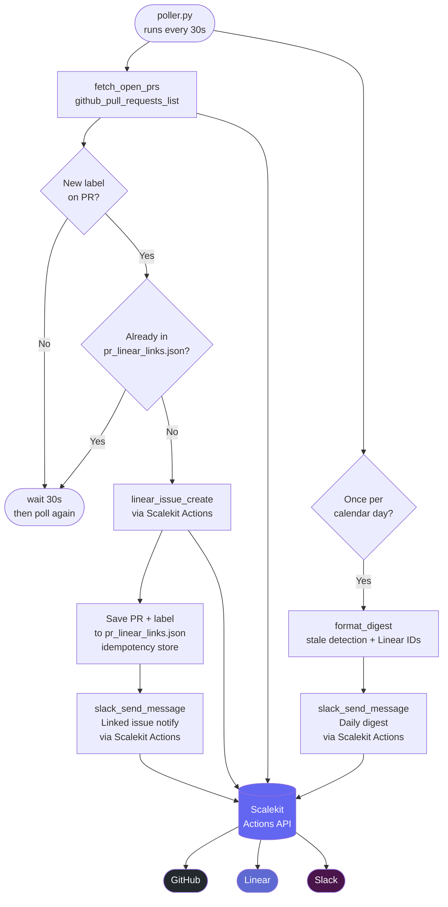

# DevOps Assistant Agent

> Automate your GitHub → Linear → Slack workflow using [Scalekit](https://scalekit.com) — no webhook servers, no token management.

This agent polls GitHub for open PRs, creates Linear issues when labels appear, and posts a daily Slack digest. All third-party calls go through Scalekit's connected-accounts API so you never handle OAuth tokens directly.

**Reference:** [scalekit.com/agent-templates/devops-assistant](https://scalekit.com/agent-templates/devops-assistant)

---

## What it does

| Step | Action |
|------|--------|
| Poll | Fetch open PRs from a GitHub repo every 30 seconds |
| Label → Linear | When a PR has a label, create a linked Linear issue (idempotent — one issue per PR + label) |
| Notify | Send a Slack message when a new Linear issue is created |
| Daily digest | Post a Slack summary of all open PRs, their reviewers, stale status, and linked Linear issues |

---

## Architecture



**Tools used via Scalekit Actions:**
- `github_pull_requests_list` — list open PRs
- `linear_issue_create` — create a Linear issue
- `slack_send_message` — send a Slack message

**File map:**

```
poller.py          Main loop: poll, label check, Linear create, Slack notify
settings.py        Env var loading and validation (fails fast on missing vars)
sk_connectors.py   ScalekitClient wrapper: retry, connection pinning, auth expiry
state/
  pr_linear_links.json   Idempotency store: PR+label -> Linear issue ID
logs/
  poller.log             Rotating log file (2 MB x 5 backups)
```

---

## Prerequisites

- Python 3.10+
- A [Scalekit](https://scalekit.com) account with GitHub, Linear, and Slack connections configured
- Your Scalekit environment URL, client ID, and client secret
- A Slack channel ID for the digest

---

## Quick Start

### 1. Clone and set up the environment

```bash
git clone https://github.com/scalekit-inc/workflow-agent-demos
cd workflow-agent-demos/devops-assistant-agent
python3 -m venv .venv
source .venv/bin/activate          # Windows: .venv\Scripts\activate
pip install -r requirements.txt
```

### 2. Configure environment variables

```bash
cp .env.example .env
```

Open `.env` and fill in every value (see [Environment Variables](#environment-variables) below). The agent will print a clear error message listing any missing variables on startup.

### 3. Run the agent

```bash
python poller.py
```

You should see colored log output like:

```
2025-06-18 12:00:00 | INFO     | DevOps poller started (Scalekit-only). Press Ctrl+C to stop.
2025-06-18 12:00:00 | INFO     | Sending daily Slack digest...
2025-06-18 12:00:01 | INFO     | Found 3 open PR(s).
2025-06-18 12:00:01 | INFO     | Processing PR #42: 'fix: auth middleware' with labels: ['bug']
2025-06-18 12:00:02 | INFO     | Recorded Linear issue LIN-123 for key: org/repo#42:bug
```

Press **Ctrl+C** to stop cleanly.

---

## Environment Variables

Copy `.env.example` to `.env` and fill in the values below.

### Required

| Variable | Description |
|----------|-------------|
| `SCALEKIT_ENV_URL` | Your Scalekit environment URL, e.g. `https://your-env.scalekit.dev` |
| `SCALEKIT_CLIENT_ID` | Client ID from your Scalekit app |
| `SCALEKIT_CLIENT_SECRET` | Client secret from your Scalekit app |
| `GITHUB_IDENTIFIER` | Identifier string that resolves the GitHub connected account in Scalekit |
| `LINEAR_IDENTIFIER` | Identifier string that resolves the Linear connected account in Scalekit |
| `SLACK_IDENTIFIER` | Identifier string that resolves the Slack connected account in Scalekit |
| `GITHUB_REPO_OWNER` | GitHub org or username, e.g. `acme-corp` |
| `GITHUB_REPO_NAME` | Repository name, e.g. `backend` |
| `SLACK_DIGEST_CHANNEL_ID` | Slack channel ID for the daily digest (starts with `C`, e.g. `C1234567890`) |
| `LINEAR_TEAM_ID` | Default Linear team ID for new issues |

### Connection names (recommended)

Set these to pin each tool call to a specific connector. Without them, Scalekit resolves by identifier alone — which fails if the same identifier has multiple connections for the same service.

| Variable | Description |
|----------|-------------|
| `GITHUB_CONNECTION_NAME` | Connector name for GitHub, e.g. `github-g0DJbhbx` |
| `LINEAR_CONNECTION_NAME` | Connector name for Linear, e.g. `linear-wuvcVfMm` |
| `SLACK_CONNECTION_NAME` | Connector name for Slack, e.g. `slack-sKfekCVz` |

> Find your connector names in Scalekit dashboard → Connected Accounts → the **connector** column.

### Optional

| Variable | Default | Description |
|----------|---------|-------------|
| `LABEL_TO_LINEAR_TEAM` | `{}` | JSON map of PR label → Linear team ID, e.g. `{"bug":"TEAM-1"}` |
| `DIGEST_STALE_DAYS` | `5` | Days without activity before a PR is marked stale in the digest |
| `RETRY_ATTEMPTS` | `3` | Number of retries for each Scalekit tool call |
| `RETRY_BACKOFF` | `1` | Initial backoff in seconds (doubles on each retry) |
| `LOG_LEVEL` | `INFO` | Log verbosity: `DEBUG`, `INFO`, `WARNING`, `ERROR` |

> **What are identifiers?**  
> In Scalekit, an *identifier* is the string you use to look up a user's connected account (e.g. their user ID or email). In development you can use a fixed test identifier. In production, pass the real per-user ID.

---

## How idempotency works

The agent stores a mapping of `owner/repo#PR-number:label → Linear issue ID` in `state/pr_linear_links.json`. Before creating a Linear issue, it checks this file. If an entry already exists, it skips creation. This means you can safely restart the poller without creating duplicate issues.

---

## Log files

Logs are written to both the console (with color) and `logs/poller.log` (plain text). The file rotates at 2 MB and keeps 5 backups. Set `LOG_LEVEL=DEBUG` in `.env` to see every API call and response.

---

## Troubleshooting

**`Missing required env vars: GITHUB_IDENTIFIER, ...`**  
→ Open `.env` and make sure every required variable has a non-empty value.

**`ScalekitException` on tool calls**  
→ Check `SCALEKIT_ENV_URL`, `SCALEKIT_CLIENT_ID`, and `SCALEKIT_CLIENT_SECRET` are correct. Also verify the connected accounts for GitHub/Linear/Slack are active in your Scalekit dashboard.

**`Found 0 open PR(s)` but there are open PRs**  
→ Check `GITHUB_REPO_OWNER` and `GITHUB_REPO_NAME` match the repo exactly. Ensure the GitHub connected account has `repo` read scope.

**Linear issues are being duplicated**  
→ The state file `state/pr_linear_links.json` may have been deleted or corrupted. Check its contents and restore any missing entries, or accept that one extra issue may have been created.

**`multiple connected accounts found for identifier`**  
→ Your identifier matches more than one connected account in Scalekit for that service. Set `GITHUB_CONNECTION_NAME`, `LINEAR_CONNECTION_NAME`, and `SLACK_CONNECTION_NAME` in `.env` to pin each call to the exact connector. Find the connector name in Scalekit dashboard → Connected Accounts → connector column.

**`AUTH EXPIRED — re-authorize here: https://...`**  
→ The agent auto-detects expired tokens and prints a re-authorization link directly in the logs. Click it, complete the OAuth flow, and the next poll cycle will work automatically.

**No Slack messages arriving**  
→ Confirm `SLACK_DIGEST_CHANNEL_ID` is the channel ID (not the name — find it by right-clicking the channel in Slack → Copy link). The Slack connected account must be invited to the channel (`/invite @YourBot`).

**`Could not set up file logging`**  
→ The `logs/` directory could not be created (permissions issue). The poller will still run and log to the console.

---

## Project structure

```
devops-assistant-agent/
├── poller.py              # Main agent entry point
├── settings.py            # Env var loading + validation
├── sk_connectors.py       # Scalekit SDK wrapper
├── requirements.txt       # Python dependencies
├── .env.example           # Environment variable template
├── .gitignore
├── state/
│   └── pr_linear_links.json   # Idempotency store (auto-created)
└── logs/
    └── poller.log             # Rotating log file (auto-created)
```

---

## Extending the agent

- **Add more connectors** — swap in any of Scalekit's 200+ connectors (GitLab, Jira, Notion, Google Calendar, etc.) by calling `conn.execute_tool(identifier=..., tool="tool_name", parameters={...})`.
- **Change poll interval** — edit `POLL_INTERVAL = 30` in `poller.py`.
- **Add CI status** — call `github_check_runs_list` and include the result in the digest formatter.
- **Run as a service** — use `systemd`, `supervisord`, or a simple `nohup python poller.py &` to keep it running.
