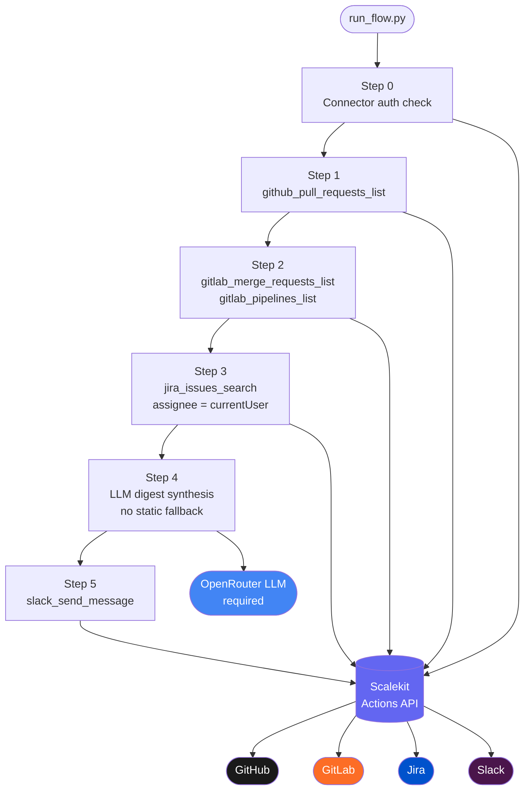

# Engineering Context Agent (GitHub, GitLab, Jira, Slack)

> Pull each engineer's open GitHub PRs, GitLab MRs + pipeline status, and in-progress Jira issues, synthesise a standup digest with an LLM, and post it to their own Slack DM. No OAuth token handling in application code. No static or template digests — every run is built from live data.

**Built with [Scalekit Agent Auth](https://scalekit.com).** All OAuth across GitHub, GitLab, Jira, and Slack is managed by Scalekit — per engineer, not a shared service account. The agent never stores or refreshes tokens.

---

## Overview

The agent runs a single pipeline per configured engineer, on each invocation:

1. Checks that all four connectors (GitHub, GitLab, Jira, Slack) are authorized via Scalekit for that engineer.
2. Fetches open GitHub PRs authored by or assigned to the engineer, across their repos.
3. Fetches open GitLab MRs assigned to the engineer, and the latest pipeline status per source branch.
4. Queries Jira with `assignee = currentUser()` — this resolves to the engineer, not a bot, because the OAuth token is theirs.
5. Synthesises a standup digest with an LLM (OpenRouter) from that live data. There is no rule-based or template fallback — if the LLM call fails, the run fails loudly for that engineer instead of posting degraded content.
6. Posts the digest to the engineer's Slack DM via `slack_send_message`, sent as them — not as a bot.

Every field in the digest — PR titles, MR pipeline states, Jira issue keys — comes straight from the connector responses for that run. Nothing is hardcoded or cached between runs.

---

## Why per-engineer identity matters

The naive approach — a shared service account with PATs for each system — breaks at team scale:

- `assignee = currentUser()` in Jira JQL resolves to the bot, not the engineer
- GitHub PR filtering by author requires knowing each engineer's username in a separate lookup
- GitLab MR `assignee_id` filter requires a username-to-ID mapping you have to maintain
- Token expiry with no refresh logic means the bot posts nothing on Monday mornings

With Scalekit Agent Auth, each engineer authenticates once per connector. Every subsequent tool call carries their own identity — so `currentUser()` works, author filtering works, and you never maintain a cross-system identity mapping.

---

## Architecture



---

## Setup

### 1. Create Scalekit connectors

Go to [app.scalekit.com](https://app.scalekit.com) → Agent Auth → Connections and add:

| Connection name | Service | Required scopes |
|---|---|---|
| `github` | GitHub | `repo`, `read:user` |
| `gitlab` | GitLab | `read_api` |
| `jira` | Jira | `read:jira-work`, `read:jira-user` |
| `slack` | Slack | `chat:write`, `im:write` |

> Use `read_api` for GitLab, not `api` — this agent only reads data; `read_api` is the correct least-privilege scope.

Copy your API credentials from Settings → API Credentials.

> **Connector name suffix:** Scalekit may append a random suffix when you create a connector (e.g. `slack-sKfekCVz`). Copy the exact name from the dashboard and set it in `.env`. A mismatch causes `execute_tool()` calls to fail.

### 2. Configure environment

```bash
cp .env.example .env
```

Fill in `.env` (see [Environment Variables](#environment-variables) below). The agent fails fast with a clear error listing any missing required variables on startup — it will not run partially configured.

### 3. Install and run

```bash
python3 -m venv .venv
source .venv/bin/activate          # Windows: .venv\Scripts\activate
pip install -r requirements.txt
python run_flow.py
```

On the first run, any connector that is not yet authorized will print a magic link. Open it in a browser, complete OAuth, press Enter. Every run after that goes straight through.

---

## What the output looks like

```
14:23:06 | INFO     | ▶  Engineering Context Agent — 2026-07-01 09:00 UTC
14:23:06 | INFO     |    Engineers: 1
14:23:06 | INFO     | ────────────────────────────────────────────────────────
14:23:06 | INFO     |   Engineer: Alice  (id=eng_alice_123)
14:23:06 | INFO     |   Step 0: Checking connector auth
14:23:07 | INFO     | ✔  github (eng_alice_123) — ACTIVE
14:23:07 | INFO     | ✔  gitlab (eng_alice_123) — ACTIVE
14:23:08 | INFO     | ✔  jira (eng_alice_123) — ACTIVE
14:23:08 | INFO     | ✔  slack (eng_alice_123) — ACTIVE
14:23:08 | INFO     |   Step 1: Fetching GitHub PRs
14:23:09 | INFO     |     Found 2 open PR(s) across 2 repo(s)
14:23:09 | INFO     |       #42 Fix auth token refresh bug
14:23:09 | INFO     |       #45 Add retry logic  ⚠ 5d old
14:23:09 | INFO     |   Step 2: Fetching GitLab MRs + pipeline status
14:23:10 | INFO     |     Found 1 open MR(s)
14:23:10 | INFO     |       !12 Update payment webhook  pipeline: ❌ failed
14:23:10 | INFO     |   Step 3: Querying Jira (assignee = currentUser())
14:23:11 | INFO     |     Found 3 in-progress issue(s)
14:23:11 | INFO     |       ENG-101: Investigate checkout latency  [In Progress]
14:23:11 | INFO     |   Step 4: Building standup digest
14:23:13 | INFO     | ✔    LLM digest built from live data
14:23:13 | INFO     |   ── Digest preview ──
   • Yesterday: Shipped #42 auth token refresh fix
   • Today: Working on #45 retry logic, investigating ENG-101
   • Blockers: !12 payment webhook pipeline failing
14:23:13 | INFO     |   Step 5: Posting digest to Slack DM
14:23:14 | INFO     | ✔    Posted to U0XXXXXXXXX (ts=1719835394.001200)
14:23:14 | INFO     | ✔  Done. Ran for 1 engineer(s).
```

If any connector returns zero results, or the LLM digest call fails, the run reports it explicitly and exits non-zero — it never substitutes placeholder or template content.

---

## Multi-engineer mode

To run for multiple engineers at once, set `ENGINEERS` in `.env` as a JSON array:

```bash
ENGINEERS="[{\"id\":\"eng_alice_123\",\"name\":\"Alice\",\"github_username\":\"alice\",\"github_repos\":[\"acme-corp/api-gateway\",\"acme-corp/auth-service\"],\"github_org\":\"acme-corp\",\"gitlab_project_path\":\"acme-corp%2Fpayment-service\",\"gitlab_user_id\":\"12345678\",\"slack_user_id\":\"U0XXXXXXXXX\"},{\"id\":\"eng_bob_456\",\"name\":\"Bob\",\"github_username\":\"bob\",\"github_repos\":[\"acme-corp/frontend\"],\"github_org\":\"acme-corp\",\"gitlab_project_path\":\"acme-corp%2Ffrontend\",\"gitlab_user_id\":\"87654321\",\"slack_user_id\":\"U1YYYYYYYYY\"}]"
```

Each engineer's four connectors are authorized independently. When you add a new engineer, the agent prints their four magic links on the first run — they can complete auth from any browser. If set, `ENGINEERS` takes priority over the single-engineer vars below.

---

## Running on a schedule

**Cron — recommended for production:**

```cron
0 9 * * 1-5  cd /path/to/engineering-context-agent && python run_flow.py >> logs/standup.log 2>&1
```

This runs at 9am every weekday. Scalekit refreshes all OAuth tokens before the tool calls fire — the agent never catches a 401.

**Note on timezones:** if your team spans timezones, run the cron at 9am per timezone, or pass the engineer's timezone into the digest prompt.

---

## Logging

Output is structured, colorized, and timestamped — every line is `HH:MM:SS | LEVEL | message`, with a status icon (`✔` done, `⚠` warning, `✖` error, `▶` run) so you can scan a run at a glance. Colors auto-disable when output isn't a TTY (e.g. piped to a log file). Set `LOG_LEVEL=DEBUG` in `.env` for more verbose output; defaults to `INFO`.

---


---

## Environment Variables

### Required

| Variable | Description |
|---|---|
| `SCALEKIT_ENV_URL` | Your Scalekit environment URL, e.g. `https://your-env.scalekit.dev` |
| `SCALEKIT_CLIENT_ID` | Client ID from Scalekit Settings → API Credentials |
| `SCALEKIT_CLIENT_SECRET` | Client secret from Scalekit Settings → API Credentials |
| `OPENROUTER_API_KEY` | OpenRouter API key — required, digests are LLM-only, no fallback formatter |
| `ENGINEER_ID` (or `ENGINEERS`) | Single-engineer ID, or a JSON array for multi-engineer mode |

### Single-engineer mode (used when `ENGINEERS` is not set)

| Variable | Description |
|---|---|
| `ENGINEER_NAME` | Display name used in the digest |
| `GITHUB_USERNAME` | GitHub login used to filter authored/assigned PRs |
| `GITHUB_REPOS` | Comma-separated `owner/repo` list to check for open PRs |
| `GITHUB_ORG` | Used to auto-discover repos when `GITHUB_REPOS` is empty |
| `GITLAB_PROJECT_PATH` | URL-encoded GitLab project path, e.g. `acme-corp%2Fpayment-service` |
| `GITLAB_USER_ID` | GitLab numeric user ID (Profile → Edit profile → User ID) |
| `SLACK_USER_ID` | Slack member ID (profile → three-dot menu → Copy member ID) |

### Optional

| Variable | Default | Description |
|---|---|---|
| `GITHUB_CONNECTOR` | `github` | Scalekit connection name for GitHub |
| `GITLAB_CONNECTOR` | `gitlab` | Scalekit connection name for GitLab |
| `JIRA_CONNECTOR` | `jira` | Scalekit connection name for Jira |
| `SLACK_CONNECTOR` | `slack` | Scalekit connection name for Slack |
| `OPENROUTER_MODEL` | `anthropic/claude-3-haiku` | OpenRouter model used to write the digest |
| `LOG_LEVEL` | `INFO` | Log verbosity: `DEBUG`, `INFO`, `WARNING`, `ERROR` |

---

## Troubleshooting

| Error | Cause | Fix |
|---|---|---|
| `ValueError: Missing required env vars` | One or more required vars not set in `.env` | Copy `.env.example` to `.env` and fill all values, including `OPENROUTER_API_KEY` |
| Connector prints a magic link on startup | Account not yet authorized in Scalekit | Open the link in a browser, complete OAuth, press Enter |
| `execute_tool()` fails with a connector error | Connector name in `.env` doesn't match the dashboard | Check the exact connector name (including any random suffix) in app.scalekit.com |
| Jira returns no issues | `currentUser()` resolves to the token owner only | Confirm the engineer's Jira account has in-progress issues assigned to them, and that the connector is fully authorized |
| GitLab pipeline status is `unknown` | No CI/CD configured, or the MR predates the first pipeline run | Expected — not an error |
| `LLM digest failed: ... — no fallback, skipping this engineer` | `OPENROUTER_API_KEY` invalid, rate-limited, or OpenRouter is down | Check the key and OpenRouter status; there is intentionally no template fallback, so the digest is skipped for that engineer until the LLM call succeeds |
| `Slack post failed` / token expired | Slack OAuth token expired or revoked | Re-authorize the slack connector in the Scalekit dashboard |
| Run exits with code `2` | One or more connectors returned empty results, or the LLM digest failed for an engineer | Check the listed rows in the error output — investigate that specific connector/engineer |


---

## SDK Versions

- `scalekit-sdk-python >= 2.12.0`
- Last verified: 2026-07-01
