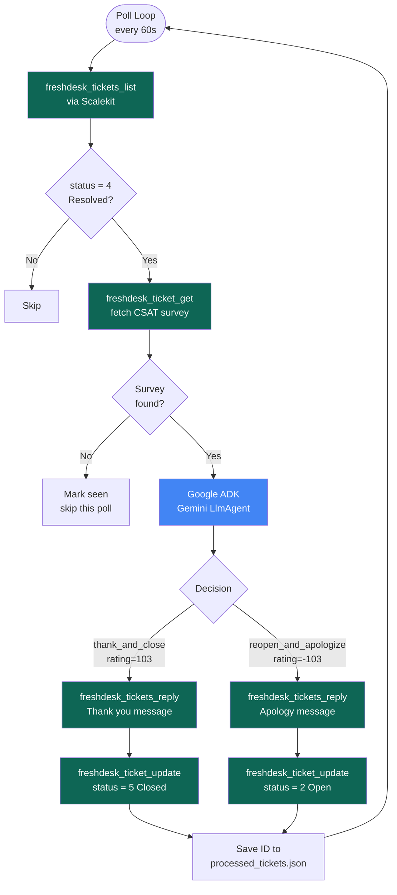

# Freshdesk CSAT Follow-up Agent

> Watches resolved Freshdesk tickets, reads CSAT survey results, and uses Gemini (via Google ADK) to decide whether to thank and close or reopen and apologize. No manual ticket review needed.

**Built with [Google ADK](https://google.github.io/adk-docs/) + [Scalekit Agent Auth](https://scalekit.com) + Freshdesk.**

**Template:** [scalekit.com/agent-templates/freshdesk-csat-agent](https://www.scalekit.com/agent-templates/freshdesk-csat-agent)

---

## How It Works

1. Polls Freshdesk every `POLL_INTERVAL` seconds for tickets with status `Resolved` (status=4)
2. Fetches the CSAT survey result for each ticket via Scalekit
3. Sends the survey result to Gemini (via Google ADK) to decide the action
4. Posts a public reply and updates the ticket status:
   - Satisfied (rating=103): replies with a thank-you, closes the ticket (status=5)
   - Not satisfied (rating=-103): apologizes, reopens the ticket (status=2)
5. Saves processed ticket IDs to `processed_tickets.json` so each ticket is handled exactly once

---

## Architecture



**Scalekit** handles all Freshdesk authentication - no API keys or domains needed in your code. The agent calls Freshdesk tools (`freshdesk_tickets_list`, `freshdesk_ticket_get`, `freshdesk_tickets_reply`, `freshdesk_ticket_update`) through Scalekit's connector, which injects the right credentials automatically.

---

## Setup

### 1. Install

```bash
cd freshdesk-google-adk
python3 -m venv .venv
source .venv/bin/activate
pip install -r requirements.txt
```

### 2. Connect Freshdesk in Scalekit

Go to your Scalekit dashboard, open the `freshdesk` connector, and connect it for your user identifier (email). This is a one-time OAuth step.

### 3. Configure

```bash
cp .env.example .env
```

Fill in `.env`:

```
SCALEKIT_ENV_URL=https://yourenv.scalekit.dev
SCALEKIT_CLIENT_ID=your_client_id
SCALEKIT_CLIENT_SECRET=your_client_secret
FRESHDESK_IDENTIFIER=your@email.com
GOOGLE_ADK_API_KEY=your_google_api_key
```

Get your keys:
- **Scalekit credentials**: Scalekit dashboard > API Credentials
- **Freshdesk identifier**: the email tied to your Freshdesk connected account in Scalekit
- **Google API key**: aistudio.google.com > Get API key

### 4. Run

```bash
python agent.py
```

The agent runs continuously, polling every 60 seconds by default. Press Ctrl+C to stop.

---

## What the output looks like

```
────────────────────────────────────────────────────────────
  Freshdesk CSAT Follow-up Agent
  Watches resolved tickets and acts on CSAT survey results
────────────────────────────────────────────────────────────
  Freshdesk identifier : parv@infrasity.com
  Scalekit env         : https://hey.scalekit.dev
  Gemini model         : gemini-2.5-flash
  Poll interval        : 60s
  State file           : processed_tickets.json
────────────────────────────────────────────────────────────

10:00:01 | INFO     | ✔  Scalekit connected
10:00:01 | INFO     | ✦  ADK agent initialised (model=gemini-2.5-flash)
10:00:01 | INFO     | ▶  Loaded 12 already-processed ticket IDs from state
10:00:01 | INFO     | ⌕  Polling Freshdesk for resolved tickets...
10:00:02 | INFO     | ✔  Fetched 3 resolved ticket(s)
10:00:02 | INFO     | 🎫  Ticket #1042 | alice@acme.com | Login broken after update
10:00:02 | INFO     | ★  Survey found for ticket #1042, rating=103
10:00:02 | INFO     | ✦  Asking ADK for decision on ticket #1042...
10:00:03 | INFO     | ⚡  Decision for ticket #1042: action=thank_and_close rating=103
10:00:03 | INFO     | ✔  Thanking and closing ticket #1042
10:00:03 | INFO     | ✔  Ticket #1042 done and saved to state
10:00:04 | INFO     | 🎫  Ticket #1043 | bob@corp.com | Export not working
10:00:04 | INFO     | ★  Survey found for ticket #1043, rating=-103
10:00:04 | INFO     | ✦  Asking ADK for decision on ticket #1043...
10:00:05 | INFO     | ⚡  Decision for ticket #1043: action=reopen_and_apologize rating=-103
10:00:05 | INFO     | ⚠  Reopening and apologizing for ticket #1043
10:00:05 | INFO     | ✔  Ticket #1043 done and saved to state
10:00:05 | INFO     | ✔  Poll complete: processed=2 skipped=1
10:00:05 | INFO     | ⌕  Next poll in 60s...
```

---

## Environment Variables

### Required

| Variable | Description |
|---|---|
| `SCALEKIT_ENV_URL` | Your Scalekit environment URL, e.g. `https://yourenv.scalekit.dev` |
| `SCALEKIT_CLIENT_ID` | Client ID from Scalekit dashboard > API Credentials |
| `SCALEKIT_CLIENT_SECRET` | Client secret from Scalekit dashboard > API Credentials |
| `FRESHDESK_IDENTIFIER` | Email tied to your Freshdesk connected account in Scalekit |
| `GOOGLE_ADK_API_KEY` | Google AI Studio API key |

### Optional

| Variable | Default | Description |
|---|---|---|
| `FRESHDESK_CONNECTION` | `freshdesk` | Scalekit connection name for Freshdesk |
| `GOOGLE_ADK_MODEL` | `gemini-2.5-flash` | Gemini model to use for decisions |
| `POLL_INTERVAL` | `60` | Seconds between Freshdesk polls |
| `LOG_LEVEL` | `INFO` | Log verbosity: `DEBUG`, `INFO`, `WARNING`, `ERROR` |

---

## Ticket Status Codes

| Freshdesk status | Code |
|---|---|
| Open | 2 |
| Pending | 3 |
| Resolved | 4 |
| Closed | 5 |

The agent only processes tickets with status 4 (Resolved). It sets status to 5 (Closed) for satisfied customers and 2 (Open) for unsatisfied ones.

---

## State File

`processed_tickets.json` stores ticket IDs that have already been processed. Delete it to reprocess all tickets from scratch. It is excluded from git via `.gitignore`.

---

## Troubleshooting

| Error | Cause | Fix |
|---|---|---|
| `Missing required env vars` | `.env` not configured | Copy `.env.example` to `.env` and fill in all values |
| `Cannot connect to Scalekit` | Wrong Scalekit credentials | Check `SCALEKIT_ENV_URL`, `SCALEKIT_CLIENT_ID`, `SCALEKIT_CLIENT_SECRET` |
| `Freshdesk tool failed` | Freshdesk not connected in Scalekit | Connect Freshdesk account in Scalekit dashboard for `FRESHDESK_IDENTIFIER` |
| `Missing key inputs argument` | Missing Google API key | Set `GOOGLE_ADK_API_KEY` in `.env` |
| `ADK returned no decision` | Gemini quota or API key issue | Check `GOOGLE_ADK_API_KEY`; agent retries with fallback models |
| `RESOURCE_EXHAUSTED` | Free-tier API quota hit | Wait for quota reset or upgrade to paid Google AI Studio tier |
| `ADK response was not valid JSON` | Model returned unexpected format | Logged as warning; ticket retried next poll |
| 5 consecutive poll failures | Scalekit or Freshdesk unreachable | Check network; agent keeps retrying |
| Tickets not being processed | Already in state file | Delete `processed_tickets.json` to reprocess |

---

## SDK Versions

- `google-adk==1.18.0`
- `scalekit-sdk-python==2.12.0`
- `python-dotenv==1.2.1`
- Last verified: 2026-06-23
