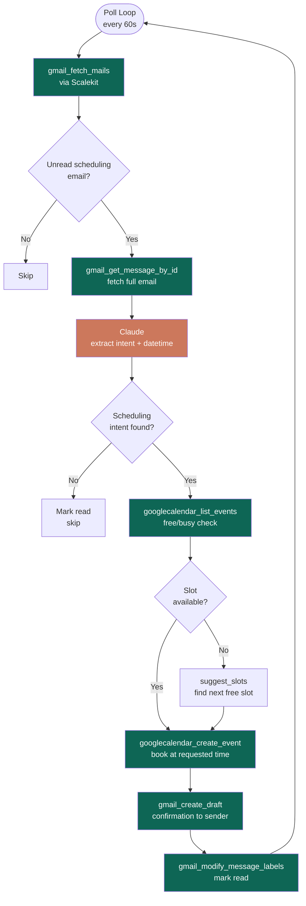

# Gmail Scheduling Agent

> Watches your Gmail for scheduling requests, checks Google Calendar availability, books the event, and saves a confirmation draft — automatically.

**Built with [Scalekit Agent Auth](https://scalekit.com) + Claude (Anthropic) + Gmail + Google Calendar.**

---

## How It Works

1. Polls Gmail every `POLL_INTERVAL` seconds for unread emails with scheduling intent
2. Sends the email subject + body to Claude to extract: meeting title, datetime, duration, attendees
3. Checks Google Calendar free/busy for the requested slot
4. If free → creates the calendar event and invites all attendees
5. If conflict → finds the next available slot within working hours and books that instead
6. Saves a confirmation draft in Gmail addressed to the original sender
7. Marks the email as read so it's never processed twice

---

## Architecture



**Scalekit** handles all Gmail and Google Calendar authentication — no OAuth flow to build, no tokens to manage. All 6 connector tools (`gmail_fetch_mails`, `gmail_get_message_by_id`, `gmail_create_draft`, `gmail_modify_message_labels`, `googlecalendar_list_events`, `googlecalendar_create_event`) are called through Scalekit which injects the right credentials automatically.

---

## Setup

### 1. Install

```bash
cd gmail-gcalender-scheduling-agent
python3 -m venv .venv
source .venv/bin/activate
pip install -r requirements.txt
```

### 2. Connect Gmail + Google Calendar in Scalekit

Go to your [Scalekit dashboard](https://app.scalekit.com) → **Agent Auth → Connections → + Create Connection**.

- Create a connection named **`gmail`** (Gmail is pre-configured, no OAuth app needed)
- Create a connection named **`googlecalendar`** for Google Calendar

### 3. Configure

```bash
cp .env.example .env
```

Fill in `.env`:

```
SCALEKIT_ENV_URL=https://yourenv.scalekit.dev
SCALEKIT_CLIENT_ID=your_client_id
SCALEKIT_CLIENT_SECRET=your_client_secret
SCALEKIT_IDENTIFIER=your@email.com
ANTHROPIC_API_KEY=your_anthropic_api_key
```

Get your keys:
- **Scalekit credentials**: Scalekit dashboard → API Credentials
- **SCALEKIT_IDENTIFIER**: the email address you want to watch
- **Anthropic API key**: [console.anthropic.com](https://console.anthropic.com) → API Keys

### 4. Run

```bash
python runner.py
```

The agent runs continuously, polling every 60 seconds. Press Ctrl+C to stop.

---

## What the output looks like

```
────────────────────────────────────────────────────────────
  Gmail Scheduling Agent
  Watches Gmail and books Google Calendar events automatically
────────────────────────────────────────────────────────────
  Identifier   : ****com
  Timezone     : Asia/Kolkata
  Work hours   : 10:00 – 18:00
  Poll interval: 60s
────────────────────────────────────────────────────────────

10:00:01 | INFO     | Checking Scalekit connections...
10:00:02 | INFO     | ✔  gmail connected for parv@infrasity.com
10:00:02 | INFO     | ✔  googlecalendar connected for parv@infrasity.com
10:00:02 | INFO     | ✔  Both connections active
10:00:02 | INFO     | ⌕  Polling Gmail for scheduling emails...
10:00:03 | INFO     | ⌕  Found 2 unread email(s) to process
10:00:03 | INFO     | 📧  Can we schedule a sync this week?
10:00:04 | INFO     | 📅  Intent: 'Team Sync' | Thu Jun 26 14:00 IST | 30min
10:00:05 | INFO     | ✔  Event created: https://calendar.google.com/calendar/event?eid=...
10:00:05 | INFO     | ✉  Confirmation draft saved (id=r-56148982786410843)
10:00:05 | INFO     | ✔  Message 19efd12ee06cc6f0 done
10:00:06 | INFO     | 📧  Project Kickoff — let's meet Friday?
10:00:07 | INFO     | ⚠  Conflict at proposed time — finding alternatives
10:00:07 | INFO     | 📅  Rescheduled → Fri, Jun 27 — 10:00 AM–10:30 AM Asia/Kolkata
10:00:08 | INFO     | ✔  Event created: https://calendar.google.com/calendar/event?eid=...
10:00:08 | INFO     | ✉  Confirmation draft saved (id=r-78234982786411001)
10:00:08 | INFO     | ✔  Poll complete — processed=2 skipped=0
10:00:08 | INFO     | ⌕  Next poll in 60s...
```

---

## Environment Variables

### Required

| Variable | Description |
|---|---|
| `SCALEKIT_ENV_URL` | Your Scalekit environment URL, e.g. `https://yourenv.scalekit.dev` |
| `SCALEKIT_CLIENT_ID` | Client ID from Scalekit dashboard → API Credentials |
| `SCALEKIT_CLIENT_SECRET` | Client secret from Scalekit dashboard → API Credentials |
| `SCALEKIT_IDENTIFIER` | Email address whose Gmail + Calendar to watch |
| `ANTHROPIC_API_KEY` | Anthropic API key for Claude (scheduling intent extraction) |

### Optional

| Variable | Default | Description |
|---|---|---|
| `USER_DEFAULT_TZ` | `Asia/Kolkata` | IANA timezone for slot suggestions |
| `WORK_START_LOCAL` | `10:00` | Start of working hours |
| `WORK_END_LOCAL` | `18:00` | End of working hours |
| `DEFAULT_DURATION_MIN` | `30` | Default meeting duration in minutes |
| `BUFFER_MIN` | `10` | Buffer between meetings when finding free slots |
| `POLL_INTERVAL_SECONDS` | `60` | Seconds between Gmail polls |
| `LOG_LEVEL` | `INFO` | Log verbosity: `DEBUG`, `INFO`, `WARNING`, `ERROR` |

---

## File Overview

| File | Purpose |
|---|---|
| [runner.py](runner.py) | Main entry point — poll loop, email processing, logging |
| [gmail_api.py](gmail_api.py) | Gmail operations via Scalekit connector tools |
| [calendar_api.py](calendar_api.py) | Google Calendar operations via Scalekit connector tools |
| [parsers.py](parsers.py) | LLM-based email intent + entity extraction (Claude) |
| [slotting.py](slotting.py) | Free/busy slot computation and suggestion |
| [sk_connectors.py](sk_connectors.py) | Scalekit client — tool execution + connection management |
| [entities.py](entities.py) | Pydantic models: `ParsedEmail`, `Attendee` |

---

## Troubleshooting

| Error | Cause | Fix |
|---|---|---|
| `SCALEKIT_IDENTIFIER not set` | Missing `.env` config | Copy `.env.example` → `.env` and fill all values |
| `not ACTIVE` on startup | Gmail/Calendar not authorized | Run `python runner.py` — it will print an auth link to open |
| `No scheduling intent found` | Email not recognized as a meeting request | Check `LOG_LEVEL=DEBUG` to see what Claude extracted |
| `Conflict with existing event` | Slot taken, no free alternative found | Agent auto-reschedules; if no slots in 7 days, increase `WORK_END_LOCAL` |
| `5 consecutive errors` | Scalekit or Google connectivity issue | Check network, verify credentials in `.env` |
| Draft not appearing in Gmail | `gmail_create_draft` tool error | Check `LOG_LEVEL=DEBUG` for the exact Scalekit error |

---

## SDK Versions

- `scalekit-sdk-python==2.12.0`
- `python-dotenv>=1.0.0`
- `requests>=2.31.0`
- Last verified: 2026-06-25
