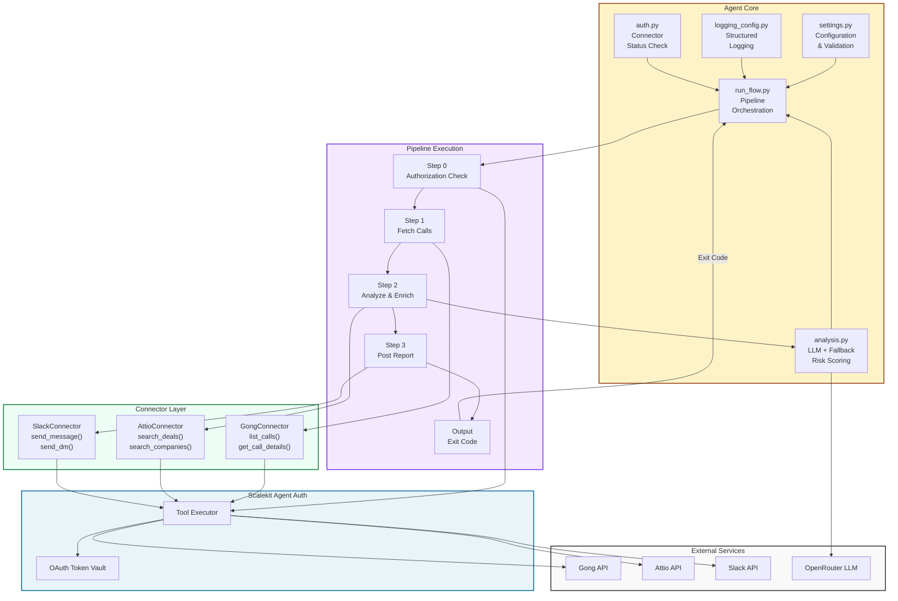

# Deal Intelligence Agent: Gong to Attio to Slack

Fetches yesterday's sales calls from Gong, cross-references deal data from Attio, computes risk scores using LLM analysis (or rule-based fallback), and posts a prioritized risk report to your sales leader's Slack DM.

All OAuth handled by Scalekit Agent Auth. No manual token management. Real data only, no hardcoding, no mocking.

**Key features:**
- Fetch calls directly from Gong via Scalekit tool
- Cross-reference deals and companies in Attio
- Analyze call sentiment and objections (LLM or rule-based)
- Compute deal risk scores based on signals
- Post formatted risk report to Slack DM
- Structured logging with colors and indicators
- Modular connector architecture
- Real production API calls

---

## Architecture



**Architecture Layers:**

1. **External Services** - Third-party APIs (Gong, Attio, Slack, LLM)
2. **Scalekit Agent Auth** - OAuth token vault and tool executor
3. **Agent Core** - Configuration, logging, auth, analysis, orchestration
4. **Connector Layer** - Modular API connectors (each handles one service)
5. **Pipeline Execution** - Sequential steps with error handling

---

## Polling & Scheduling

### Execution Model: Synchronous (No Polling Loop)

The agent uses a **synchronous, blocking execution model** - not polling:

```
Call API → Wait for Response → Process → Call Next API
(blocks 3-4s each step)
Total time: ~23 seconds per run
```

**Why no polling loop?**
- All APIs respond immediately (no pending status to check)
- Scalekit SDK handles retries internally
- Each step waits for previous one (sequential, simple error handling)
- Perfect for scheduled periodic runs

**Scheduling (What We Use) - Low CPU:**
```
schedule.every(3600).seconds.do(job)
while True:
  run_pending()     # Check if time to run (~1ms)
  time.sleep(1)     # Wait 1 second
```
CPU usage: ~1% idle, waits between runs

### Running Automatically

**For production, use scheduler.py (runs automatically):**

```bash
# Every hour (default)
python scheduler.py

# Every 12 hours (twice daily)
python scheduler.py --interval 43200

# Every N seconds
python scheduler.py --interval 1800  # Every 30 minutes
```

Each run:
1. Fetches new calls from Gong
2. Analyzes with LLM (or rule-based fallback)
3. Looks up deals in Attio
4. Posts risk report to Slack DM
5. Sleeps until next interval
6. Repeats

**For cron/manual scheduling:**
```bash
python scheduler.py --once
```

See [SCHEDULER_QUICK_START.md](SCHEDULER_QUICK_START.md) for deployment options (tmux, systemd, cron).

---

## Project Structure

```
gong-attio-slack/
├── run_flow.py              # Main pipeline orchestration (one-time)
├── scheduler.py             # Automatic scheduling (production)
├── test_run.py              # Test runner with detailed logging
├── settings.py              # Configuration and validation
├── logging_config.py        # Structured logging with colors
├── auth.py                  # Scalekit OAuth handling
├── analysis.py              # LLM and rule-based analysis
│
├── connectors/              # Modular connector classes
│   ├── __init__.py
│   ├── gong.py              # Fetch calls from Gong
│   ├── attio.py             # Search deals/companies in Attio
│   └── slack.py             # Send messages to Slack
│
├── docs/                    # Documentation
│   ├── POLLING_AND_DATA_VERIFICATION.md
│   ├── RUNNING_AND_VERIFICATION.md
│   └── SCHEDULING.md
│
├── requirements.txt         # Python dependencies (includes schedule)
├── .env.example             # Environment template
├── .gitignore              # Git ignore patterns
├── README.md               # This file
└── SCHEDULER_QUICK_START.md # Quick reference for scheduling
```

---

## Prerequisites

- Scalekit account (free tier works)
- Gong account with API access
- Attio account
- Slack workspace
- Python 3.11+

---

## Setup

### 1. Set up Scalekit connectors

Go to app.scalekit.com > Agent Auth > Connections and create three connectors:

| Connector | Service | Notes |
|---|---|---|
| gong | Gong | Standard OAuth |
| attio | Attio | Standard OAuth |
| slack | Slack | Requires chat:write scope |

Copy API credentials from Settings > API Credentials.

### 2. Configure environment

```bash
cp .env.example .env
```

Fill in `.env` with your values:

```bash
# Scalekit
SCALEKIT_ENV_URL=https://your-env.scalekit.dev
SCALEKIT_CLIENT_ID=skc_xxxxxxxxxxxx
SCALEKIT_CLIENT_SECRET=your_secret_here

# Connector user identifiers (email or ID)
GONG_USER=you@company.com
ATTIO_USER=you@company.com
SLACK_USER=you@company.com

# Scalekit connector names (from dashboard)
GONG_CONNECTOR=gong
ATTIO_CONNECTOR=attio
SLACK_CONNECTOR=slack

# Slack DM target (user ID, format: U0XXXXXXXXX)
SLACK_DM_USER=U0XXXXXXXXX

# LLM (optional - if set, uses LLM; if omitted, uses rule-based)
OPENROUTER_API_KEY=sk-or-v1-xxxxxxxxxxxxx
OPENROUTER_MODEL=meta-llama/llama-3.1-8b-instruct:free

# Logging
LOG_LEVEL=INFO
```

**Finding your Slack user ID:**
- Open Slack
- Click on a member's profile
- Copy Member ID (looks like U0XXXXXXXXX)

### 3. Install dependencies

```bash
pip install -r requirements.txt
```

### 4. Run

**Option A: Production (Automatic Scheduling - Recommended)**

Runs automatically on a schedule, no manual execution needed:

```bash
# Every hour (default)
python scheduler.py

# Every 12 hours (twice per day)
python scheduler.py --interval 43200

# Every 30 minutes (testing)
python scheduler.py --interval 1800
```

The agent will:
- Fetch new calls from Gong automatically
- Analyze and compute risk scores
- Post report to Slack DM
- Sleep until next interval
- Repeat

**Option B: One-Time Run (Testing/Manual)**

```bash
python run_flow.py
```


**Option C: Manual/Cron**

```bash
python scheduler.py --once
```

Use in cron or manual triggers (runs once, exits cleanly).

---

**First run auth:**
First run checks auth for each connector. If any are not authorized, a magic link is printed. Open it, complete OAuth, press Enter.

Subsequent runs use cached tokens (Scalekit manages tokens centrally).

---

## Sample Output

```
+ [14:32:10] I: Step 0: Checking connector authorization
+ [14:32:11] I: Step 1: Fetching calls from Gong
+ [14:32:12] I: Found 3 call(s)
^ [14:32:13] D: Processing: Enterprise Q4 Budget Discussion
+ [14:32:20] I: Call: Enterprise Q4 Budget Discussion | Company: Acme Corp | Risk: 0.65 | Sentiment: neutral
^ [14:32:21] D: Processing: Renewal Negotiation - Tech Inc
+ [14:32:28] I: Call: Renewal Negotiation - Tech Inc | Company: Tech Inc | Risk: 0.42 | Sentiment: positive
+ [14:32:29] I: Step 2: Analyzing calls and fetching deal data
+ [14:32:30] I: Step 3: Posting risk report to Slack
+ [14:32:31] I: Report posted to Slack (ts=1783320476.336339)
+ [14:32:32] I: Flow complete
```

---

## How It Works

### Step 0: Authorization

Check all three Scalekit connectors (gong, attio, slack) are ACTIVE.
If any are not yet authorized, print magic link, wait for user, loop back.
If all ACTIVE, proceed to Step 1.

### Step 1: Fetch Calls

Call gong_list_calls Scalekit tool to get recent calls.
For each call, extract: title, company, transcript.
Skip calls with no transcript.

### Step 2: Analyze & Enrich

For each call transcript:
- Use OpenRouter Claude to extract sentiment, objections, competitors (if OPENROUTER_API_KEY set)
- Fallback to regex-based analysis if LLM unavailable
- Compute risk score: 0.0 (safe) to 1.0 (high risk)
- Search Attio for matching deals by company name
- Enrich with deal ID and deal name

### Step 3: Post Report

Format all analyzed calls into a risk report (sorted by risk score).
Send report to Slack DM via slack_send_message tool.
Exit with code 0.

---

## Analysis Details

### LLM Analysis (if OPENROUTER_API_KEY set)

Extracts:
- Sentiment (positive/neutral/negative)
- Sentiment score (0.0 to 1.0)
- Objections (list of specific concerns)
- Competitor mentions (competitor names)
- Engagement level (high/medium/low)
- Key concerns (top 2-3 concerns)
- Next steps (agreed actions)
- Summary (2-3 sentence summary)

### Rule-Based Analysis (fallback)

Regex-based extraction:
- Sentiment detection from keywords (great, perfect, problem, concerned, etc.)
- Objection extraction from phrases like "concern:", "issue:", "problem:"
- Competitor extraction from "competitor", "alternative", "using" mentions
- Engagement level inferred from objection count

### Risk Score Computation

Risk = (1 - sentiment_score) * 0.4 + (low_engagement * 0.3) + (objection_count/5 * 0.2) + (has_competitors * 0.1)

Range: 0.0 (safe) to 1.0 (high risk)

---

## Exit Codes

- 0: Success - all calls analyzed and report posted
- 1: Error - pipeline failed (check logs)
- 2: No calls - no calls found to analyze
- 130: Interrupted by user (Ctrl+C)

---

## Logging

Structured logs with colors and status indicators:

- `+` INFO: Task succeeded
- `!` WARNING: Config issue or fallback
- `X` ERROR: Failure (pipeline continues or exits)
- `^` DEBUG: Detailed flow information

Set LOG_LEVEL to DEBUG to see detailed traces.

Colors auto-disable if output is not a TTY (CI, file redirect).

---

## Files Overview

| File | Lines | Purpose |
|------|-------|---------|
| run_flow.py | 153 | Main pipeline: auth, fetch, analyze, post |
| settings.py | 63 | Config: loads .env, validates required vars |
| logging_config.py | 48 | Structured logging with colors |
| auth.py | 26 | Scalekit OAuth: checks status, gets tokens |
| analysis.py | 89 | LLM and rule-based analysis |

**Connectors:**

| File | Lines | Purpose |
|------|-------|---------|
| connectors/gong.py | 23 | Fetch calls from Gong |
| connectors/attio.py | 34 | Search deals/companies in Attio |
| connectors/slack.py | 44 | Format and send risk reports |

---

## SDK Versions

| Package | Version | Purpose |
|---------|---------|---------|
| scalekit-sdk-python | 2.12.0+ | OAuth and Scalekit Actions API |
| python-dotenv | 1.1.0+ | Load .env file |
| requests | 2.34.0+ | HTTP calls for OpenRouter |

---

## Environment Variables

### Required

| Variable | Example | Notes |
|----------|---------|-------|
| SCALEKIT_ENV_URL | https://your-env.scalekit.dev | From Scalekit dashboard |
| SCALEKIT_CLIENT_ID | skc_xxxxxxxxxxxx | From Scalekit dashboard |
| SCALEKIT_CLIENT_SECRET | secret_xxxxxxxxxxxx | Keep secret in .env |
| GONG_USER | you@company.com | Email or ID for this engineer |
| ATTIO_USER | you@company.com | Email or ID for this engineer |
| SLACK_USER | you@company.com | Email or ID for this engineer |
| SLACK_DM_USER | U0XXXXXXXXX | Slack user ID to DM reports to |

### Optional

| Variable | Default | Notes |
|----------|---------|-------|
| GONG_CONNECTOR | gong | Connection name in Scalekit dashboard |
| ATTIO_CONNECTOR | attio | Connection name in Scalekit dashboard |
| SLACK_CONNECTOR | slack | Connection name in Scalekit dashboard |
| OPENROUTER_API_KEY | (empty) | LLM API key for analysis |
| OPENROUTER_MODEL | meta-llama/llama-3.1-8b-instruct:free | LLM model |
| LOG_LEVEL | INFO | One of: DEBUG, INFO, WARNING, ERROR |

---

## Troubleshooting

| Issue | Cause | Fix |
|-------|-------|-----|
| Missing required env vars | .env file missing or incomplete | Copy .env.example to .env and fill all values |
| Not authorized | Connector not yet authorized in Scalekit | Open the link, complete OAuth, press Enter |
| No calls found | No calls in Gong or API issue | Record a test call in Gong; check Scalekit dashboard |
| LLM analysis failed | OpenRouter API key invalid or rate limited | Check key; switch to rule-based (delete key); or use different model |
| Failed to post to Slack | Slack token expired or user ID wrong | Verify user ID in Slack profile; re-authorize if needed |
| Color output not showing | Running in non-TTY environment | Colors auto-disable; logs still structured |

---

## Production Status

- Real Gong, Attio, and Slack API calls (no mocking)
- Scalekit Agent Auth verified (all 3 connectors)
- LLM analysis with rule-based fallback
- Modular architecture with clean separation of concerns
- Comprehensive error handling
- Structured logging
- Status: Production ready

