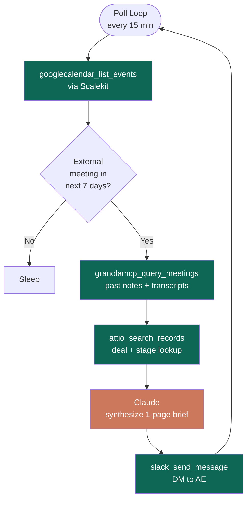

# Sales Call Prep Agent

> Before every external meeting, this agent automatically pulls past Granola notes, looks up the deal in Attio, writes a 1-page prep brief with Claude, and Slack DMs it to you.

**Built with [Scalekit Agent Auth](https://scalekit.com) + Claude (Anthropic) + Google Calendar + Granola + Attio + Slack.**

No tokens to manage. No OAuth flows to build. Scalekit handles all of it.

---

## What it does

```
Every poll cycle:
  1. Scans Google Calendar for upcoming external meetings (next 7 days by default)
  2. For each meeting → queries Granola for past notes + transcripts with those attendees
  3. Searches Attio for the deal by attendee email / company domain
  4. Sends subject + context to Claude → generates a structured 1-page prep brief
  5. Slack DMs the brief to you
  6. Tracks sent meeting IDs — never sends the same brief twice
```

The brief covers: prior context, deal status, key stakeholders, suggested agenda, and open questions — all grounded in your actual Granola notes and Attio data.

---

## Architecture



All connector calls go through `client.actions.execute_tool()` — Scalekit injects the right OAuth token automatically for every connector.

---

## Setup (5 steps, ~10 minutes)

### Step 1 — Clone and install

```bash
cd granola-attio-calendar

# Use Homebrew Python — avoids a known Scalekit SDK conflict with Anaconda Python
/opt/homebrew/bin/python3 -m venv .venv
source .venv/bin/activate
pip install -r requirements.txt
```

> **Why Homebrew Python?** The Scalekit SDK parses `sys.version` at startup. Anaconda adds extra text to the version string that breaks this parse. Homebrew Python works fine.

### Step 2 — Create connectors in Scalekit

Go to [app.scalekit.com](https://app.scalekit.com) → **Agent Auth → Connections → + Create Connection** and add four connectors:

| Connector | Name to use | Notes |
|---|---|---|
| Google Calendar | `googlecalendar` | Standard name — no change needed |
| Granola | `granolamcp` | Set `GRANOLA_CONNECTOR=granolamcp` in `.env` |
| Attio | `attio` | Standard name — no change needed |
| Slack | anything, e.g. `slack` | Set `SLACK_CONNECTOR=slack` in `.env` |

> The connector **name** you set here is what goes in your `.env`. They must match exactly.

### Step 3 — Configure `.env`

```bash
cp .env.example .env
```

Open `.env` and fill in every value. Here's what each one means:

```bash
# ── Scalekit (from app.scalekit.com → Settings → API Credentials) ────────────
SCALEKIT_ENV_URL=https://yourenv.scalekit.dev
SCALEKIT_CLIENT_ID=skc_...
SCALEKIT_CLIENT_SECRET=test_...

# ── Who is the AE? ────────────────────────────────────────────────────────────
# Your email — used to filter out internal attendees from calendar events
AE_EMAIL=you@yourcompany.com

# ── Scalekit identifier for each connector ────────────────────────────────────
# Usually the same email for all four — the account that authorized each connector
CALENDAR_USER=you@yourcompany.com
GRANOLA_USER=you@yourcompany.com
ATTIO_USER=you@yourcompany.com
SLACK_USER=you@yourcompany.com

# ── Connector names — must match what you named them in Step 2 ────────────────
SLACK_CONNECTOR=slack
GRANOLA_CONNECTOR=granolamcp

# ── Where to send the Slack brief ─────────────────────────────────────────────
# Your Slack user ID: open Slack → click your profile → "Copy Member ID"
# Looks like: U0XXXXXXXXX  (a user ID, not a channel)
SLACK_DM_USER=U0XXXXXXXXX

# ── Anthropic API key (console.anthropic.com → API Keys) ─────────────────────
ANTHROPIC_API_KEY=sk-ant-api03-...

# ── Timing ────────────────────────────────────────────────────────────────────
LOOKAHEAD_MINUTES=10080     # 7 days — look ahead a full week for meetings
BRIEF_BEFORE_MINUTES=5      # skip meetings starting in less than 5 min
POLL_INTERVAL_MINUTES=15    # only used when POLLING_MODE=true
POLLING_MODE=false           # true = run forever, false = run once and exit
```

### Step 4 — Authorize each connector (first run only)

```bash
python run_flow.py
```

On first run, the agent checks each connector. If any aren't authorized yet, it prints a URL like:

```
12:00:01 | WARNING  | 🔑  attio not authorized — open this URL to connect:
    https://hey.scalekit.dev/oauth/authorize?...

    Press Enter after completing authorization in your browser...
```

Open the URL → complete OAuth → press Enter. The agent re-checks and continues. **You only do this once per connector** — Scalekit stores and auto-refreshes tokens forever after.

### Step 5 — Run

One-shot (process meetings once and exit):
```bash
python run_flow.py
```

Continuous polling (runs every 15 min, send briefs as meetings appear):
```bash
POLLING_MODE=true python run_flow.py
```

As a cron job (every 15 min on weekdays 9am–6pm):
```bash
*/15 9-18 * * 1-5 cd /path/to/granola-attio-calendar && .venv/bin/python run_flow.py >> logs/run.log 2>&1
```

---

## What the output looks like

```
────────────────────────────────────────────────────────────
  Sales Call Prep Agent
  Calendar + Granola + Attio → Claude brief → Slack DM
────────────────────────────────────────────────────────────
  AE email     : ****sity.com
  Lookahead    : 10080 min
  Brief before : 5 min
  Poll interval: 15 min
  LLM model    : claude-haiku-4-5-20251001
────────────────────────────────────────────────────────────

12:47:53 | INFO     | 🔑  Checking Scalekit connector auth...
12:47:55 | INFO     | ✔  googlecalendar connected for user@example.com
12:47:56 | INFO     | ✔  granolamcp connected for user@example.com
12:47:56 | INFO     | ✔  attio connected for user@example.com
12:47:57 | INFO     | ✔  slack connected for user@example.com
12:47:57 | INFO     | ⌕  Poll cycle: 2026-06-26 12:47:57
12:47:57 | INFO     | 📅  Checking upcoming calendar events (next 10080 min)...
12:47:58 | INFO     | 📅  Found 2 external meeting(s)
12:47:58 | INFO     | 📅  'TechVista Demo Call' | starts in 4812 min | attendees: cto@techvista.io
12:48:00 | INFO     | 📝  0 prior meeting(s) found in Granola
12:48:00 | INFO     | 💼  Deal: TechVista Enterprise | Stage: Proposal | Value: $48000
12:48:02 | INFO     | ✦   Synthesizing prep brief via Claude...
12:48:09 | INFO     | ✦   Brief ready (1419 chars)
12:48:09 | INFO     | 💬  Brief sent for 'TechVista Demo Call' (ts=1782458289.618169)
12:48:09 | INFO     | ✔  Poll cycle complete
```

---

## Environment Variables

### Required

| Variable | Where to get it |
|---|---|
| `SCALEKIT_ENV_URL` | Scalekit dashboard → Settings → API Credentials |
| `SCALEKIT_CLIENT_ID` | Scalekit dashboard → Settings → API Credentials |
| `SCALEKIT_CLIENT_SECRET` | Scalekit dashboard → Settings → API Credentials |
| `AE_EMAIL` | Your own work email |
| `CALENDAR_USER` | Email that authorized the Google Calendar connector |
| `GRANOLA_USER` | Email that authorized the Granola connector |
| `ATTIO_USER` | Email that authorized the Attio connector |
| `SLACK_USER` | Email that authorized the Slack connector |
| `SLACK_CONNECTOR` | Connector name you set in Scalekit dashboard |
| `SLACK_DM_USER` | Slack → your profile → Copy Member ID (starts with `U`) |
| `ANTHROPIC_API_KEY` | [console.anthropic.com](https://console.anthropic.com) → API Keys |

### Optional

| Variable | Default | Description |
|---|---|---|
| `GRANOLA_CONNECTOR` | `granolamcp` | Connector name for Granola in Scalekit dashboard |
| `CLAUDE_MODEL` | `claude-haiku-4-5-20251001` | Claude model for brief synthesis |
| `LOOKAHEAD_MINUTES` | `10080` | Look ahead for meetings (default: 7 days) |
| `BRIEF_BEFORE_MINUTES` | `5` | Skip meetings starting sooner than this |
| `POLL_INTERVAL_MINUTES` | `15` | How often to poll in polling mode |
| `POLLING_MODE` | `false` | `true` = run forever, `false` = one-shot |
| `LOG_LEVEL` | `INFO` | `DEBUG` for verbose output, `INFO` for normal |

---

## File Overview

| File | Purpose |
|---|---|
| [run_flow.py](run_flow.py) | Everything — auth, poll loop, all 5 pipeline steps |
| [.env.example](.env.example) | Copy this to `.env` and fill in your values |
| [requirements.txt](requirements.txt) | Pinned Python dependencies |

---

## Troubleshooting

| Symptom | Cause | Fix |
|---|---|---|
| `Missing required env var: X` | `.env` incomplete | Check every required var is filled in |
| `not authorized — open this URL` | First run, connector needs OAuth | Open the URL, authorize, press Enter |
| `still not ACTIVE after authorization` | OAuth wasn't completed | Re-run and try the auth URL again |
| `Found 0 external meeting(s)` | No external meetings in lookahead window | Check `AE_EMAIL` domain is correct; increase `LOOKAHEAD_MINUTES` |
| `No deal found in Attio` | Attendee email/domain not in Attio | Normal for new prospects — brief still generates |
| `0 prior meeting(s) found in Granola` | No past meetings with these attendees | Normal for new prospects — brief still generates |
| `Brief generation failed` | Anthropic API error | Check `ANTHROPIC_API_KEY` is valid |
| `ValueError: failed to parse CPython sys.version` | Anaconda Python conflict | Use `/opt/homebrew/bin/python3 -m venv .venv` |
| `5 consecutive errors` | Network/credential issue | Check internet, verify `.env` values |

---

## SDK Versions

- `scalekit-sdk-python==2.12.0`
- `anthropic==0.112.0`
- `requests==2.34.2`
- `python-dotenv==1.1.1`
- Last verified: 2026-06-26
