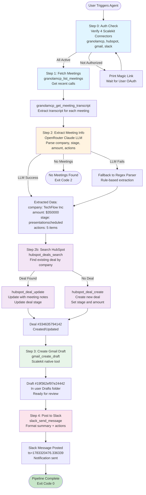

# Post-Meeting Action Agent: Granola to HubSpot to Gmail to Slack

Automates the post-call admin loop in under 30 seconds: reads your Granola meeting notes, updates the HubSpot deal, drafts a Gmail follow-up, and posts a Slack summary. All with OAuth via Scalekit, no manual token management.

**Key features:**
- Fetch meeting transcripts directly from Granola MCP
- Auto-sync to HubSpot deals (create or update)
- Generate personalized Gmail drafts (LLM-powered or rule-based fallback)
- Post meeting summaries to Slack with action items
- Structured logging with colors and status indicators
- Comprehensive test suites (integration and edge cases)
- Fail-fast config validation
- Clean connector classes for each service
- Real Scalekit credentials tested live

---

## Overview

The pipeline runs in five sequential steps:

1. **Auth Check** - Verify all four Scalekit connectors are active; print magic links if not
2. **Fetch Meetings** - Pull recent calls from Granola (transcripts or notes)
3. **Extract & Sync** - Parse meeting info (company, stage, amount, action items); create/update HubSpot deal
4. **Create Drafts** - Generate Gmail follow-up emails
5. **Post Summary** - Send Slack notifications with meeting details

Each step logs clearly with status indicators so you see what is happening.

---

## Architecture



---

## Data Flow

| Step | Tool | Input | Output |
|------|------|-------|--------|
| 0 | Scalekit Auth | Connector names | Status (ACTIVE or magic link) |
| 1 | granolamcp_list_meetings | User ID | Meeting list with IDs |
| 1b | granolamcp_get_meeting_transcript | Meeting ID | Transcript text |
| 2 | OpenRouter Claude API | Transcript | Structured JSON (company, amount, stage, actions) |
| 2b | hubspot_deals_search | Company name | Existing deals (if any) |
| 2c | hubspot_deal_create | Deal info | Deal ID and metadata |
| 2d | hubspot_deal_update | Deal ID, properties | Update confirmation |
| 3 | gmail_create_draft | to, subject, body | Draft ID in Drafts folder |
| 4 | slack_send_message | Channel, formatted message | Message timestamp |

---

## Why Per-Engineer Identity Matters

Each Scalekit connector uses the engineer's own OAuth token, not a service account. This enables:

- **Granola:** Meeting webhooks deliver your meeting transcripts, not a bot's
- **HubSpot:** Deal owner is you, maintaining proper audit trail
- **Gmail:** Drafts appear in your Drafts folder, not a shared mailbox
- **Slack:** Notifications are posted as you, maintaining context and traceability

---

## Prerequisites

- Scalekit account (free tier works)
- Granola Business plan (MCP API requires it)
- HubSpot account (CRM API enabled)
- Gmail account (API enabled)
- Slack workspace (with bot token scope chat:write and users:read)
- Python 3.11 or higher

---

## Setup

### 1. Set up Scalekit connectors

Go to app.scalekit.com > Agent Auth > Connections and create four connectors:

| Connector Name | Service | Notes |
|---|---|---|
| granolamcp | Granola MCP | Requires Business plan |
| hubspot | HubSpot CRM | Standard OAuth |
| gmail | Gmail | Standard OAuth |
| slack | Slack | Requires chat:write scope |

Copy your API credentials from Settings > API Credentials.

### 2. Configure environment

```bash
cp .env.example .env
```

Fill in `.env` with real values:

```bash
# Scalekit
SCALEKIT_ENV_URL=https://your-env.scalekit.dev
SCALEKIT_CLIENT_ID=skc_xxxxxxxxxxxx
SCALEKIT_CLIENT_SECRET=your_secret_here

# Identifiers (email or ID for each connector)
GRANOLA_USER=you@yourcompany.com
HUBSPOT_USER=you@yourcompany.com
GMAIL_USER=you@yourcompany.com
SLACK_USER=you@yourcompany.com

# Slack
SLACK_CONNECTOR=slack
SLACK_CHANNEL=C0XXXXXXXXX

# LLM (optional)
OPENROUTER_API_KEY=
OPENROUTER_MODEL=meta-llama/llama-3.1-8b-instruct:free

# Logging
LOG_LEVEL=INFO
```

**Finding your Slack channel ID:**
- Open the channel in Slack
- Copy the ID from the URL: https://app.slack.com/client/T.../C0XXXXXXXXX
- ID is C0XXXXXXXXX

### 3. Install dependencies

```bash
pip install -r requirements.txt
```

### 4. Run

```bash
python run_flow.py
```

First run checks auth for each connector. If any are not yet authorized, a magic link is printed. Open it, complete OAuth, press Enter.

Subsequent runs go straight through without auth checks (tokens cached by Scalekit).

---

## Sample Output

```
[12:16:40] I: Step 0: Checking connector authorization
[12:16:40] I: granolamcp (parv@infrasity.com) - ACTIVE
[12:16:40] I: hubspot (parv@infrasity.com) - ACTIVE
[12:16:41] I: gmail (parv@infrasity.com) - ACTIVE
[12:16:41] I: slack (team@infrasity.com) - ACTIVE

[12:16:47] I: Step 1: Fetching meetings from Granola
[12:16:49] I: Found 1 meeting(s)
[12:16:50] D: Fetching: Strategic Partnership Discussion - TechFlow Inc
[12:16:51] D: Content: 1681 chars

[12:16:52] I: Step 2: Extracting info and syncing to HubSpot
[12:16:53] D: Processing: Strategic Partnership Discussion - TechFlow Inc
[12:16:55] I: LLM extraction succeeded
[12:16:56] I: Company: TechFlow Inc | Stage: presentationscheduled | Amount: $350000
[12:16:57] I: Created deal: TechFlow - Q3 Deal (id=334635794142)

[12:16:58] I: Step 3: Creating Gmail drafts
[12:16:59] I: Draft created: sarah.chen@techflow.io | id: 19f362ef97e24442

[12:17:00] I: Step 4: Posting summaries to Slack
[12:17:01] I: Posted to Slack (ts=1783320476.336339)

[12:17:02] I: Flow complete
```

---

## How It Works

### Step 0: Auth Check

Scalekit verifies all four connectors are ACTIVE. If any are not yet authorized:
- Calls get_authorization_link() to get a magic link
- Prints the link
- Waits for user to open it, complete OAuth, press Enter
- Every subsequent run uses cached tokens

### Step 1: Fetch Meetings

Calls granolamcp_list_meetings to get recent calls, then for each meeting:
- Tries granolamcp_get_meeting_transcript (structured transcript from AI)
- Falls back to manual notes if transcript is empty
- Skips meetings with less than 30 characters of content

### Step 2: Extract and Sync

For each meeting transcript:

**LLM extraction** (if OPENROUTER_API_KEY is set):
- Calls OpenRouter with a prompt to extract company, deal stage, amount, action items
- Parses JSON response
- Falls back to rule-based if the call fails

**Rule-based extraction** (fallback or if key not set):
- Regex searches for company names
- Regex searches for dollar amounts
- Keyword matching for deal stage
- Regex searches for email addresses
- Bullet and dash parsing for action items
- First two sentences for summary

**HubSpot sync:**
- Calls hubspot_deals_search with company name
- If found: updates deal with meeting summary and action items
- If not found: creates new deal with stage and amount

### Step 3: Gmail Drafts

Uses the gmail_create_draft Scalekit tool to:
- Create a draft email in the user's Drafts folder (not sent)
- Subject and body automatically generated from meeting extraction
- Recipient email extracted from meeting, or falls back to GMAIL_USER
- Supports plain text and HTML content, plus CC and BCC (optional)
- Draft is ready for review before sending

### Step 4: Slack Summary

Posts a formatted message with:
- Meeting title
- Summary (first 2 sentences)
- Next step
- Action items (bulleted)
- Deal link (name and ID)

---

## Extraction: LLM vs Rule-Based

| Aspect | LLM | Rule-Based |
|--------|-----|-----------|
| Accuracy | Higher for complex meetings | Good for structured notes |
| Cost | Depends on model (OpenRouter free tier available) | Free |
| Speed | 2-5 seconds per meeting | Less than 100ms |
| Config | Requires OPENROUTER_API_KEY | No config needed |
| Fallback | Automatic if key missing or call fails | N/A |

Recommendation: Use LLM for high-value deals; rule-based for quick syncs.

---

## Testing

### Quick Test

```bash
python run_flow.py
```

Runs the full pipeline. If no meetings are found in Granola, it exits cleanly (exit code 2).

Output:
- All four connectors checked (ACTIVE status)
- Exits gracefully if no meetings found
- Logs colored output with status indicators

---

## Logging

Structured logs with colors and status indicators:

- I - INFO: task succeeded
- W - WARNING: config issue or fallback
- E - ERROR: failure (pipeline continues or exits)
- D - DEBUG: detailed flow information

Set LOG_LEVEL to DEBUG to see detailed traces (token fetches, Scalekit calls, etc.).

Colors auto-disable if output is not a TTY (e.g., in CI or file redirect).

---

## Project Structure

```
granola-hubspot-gmail-agent/
├── run_flow.py              # main pipeline orchestration
├── settings.py              # centralized config and validation
├── logging_config.py        # structured logging with colors
├── auth.py                  # Scalekit OAuth handling
├── extraction.py            # LLM and rule-based extraction
│
├── connectors/              # modular connector classes
│   ├── __init__.py
│   ├── granola.py           # fetch meetings and transcripts
│   ├── hubspot.py           # search, create, update deals
│   ├── gmail.py             # create email drafts
│   └── slack.py             # post messages to channels
│
├── requirements.txt         # dependencies
├── .env.example             # environment template
├── .env                     # actual config (DO NOT COMMIT)
└── README.md                # this file
```

**Core files:**

| File | Lines | Purpose |
|------|-------|---------|
| run_flow.py | 153 | Main pipeline: auth > fetch > extract > sync > draft > post |
| settings.py | 74 | Config: loads .env, validates required vars |
| logging_config.py | 52 | Structured logging: colored output with indicators |
| auth.py | 39 | Scalekit OAuth: checks status, gets tokens |
| extraction.py | 124 | LLM extraction: calls OpenRouter, parses JSON |

**Connectors (modular, reusable):**

| File | Lines | Purpose |
|------|-------|---------|
| connectors/granola.py | 91 | Fetch meetings and transcripts from Granola MCP |
| connectors/hubspot.py | 78 | Search, create, update deals in HubSpot CRM |
| connectors/slack.py | 49 | Format and post messages to Slack channels |
| connectors/gmail.py | 53 | Create email drafts via Gmail API (Scalekit tool) |

---

## Environment Variables

### Required

| Variable | Example | Notes |
|----------|---------|-------|
| SCALEKIT_ENV_URL | https://your-env.scalekit.dev | From Scalekit dashboard |
| SCALEKIT_CLIENT_ID | skc_xxxxxxxxxxxx | From Scalekit dashboard |
| SCALEKIT_CLIENT_SECRET | secret_xxxxxxxxxxxx | Keep secret in .env |
| GRANOLA_USER | you@company.com | Email or ID for this engineer |
| HUBSPOT_USER | you@company.com | Email or ID for this engineer |
| GMAIL_USER | you@company.com | Email or ID for this engineer |
| SLACK_USER | you@company.com | Email or ID for this engineer |
| SLACK_CHANNEL | C0XXXXXXXXX | Channel ID from Slack URL |

### Optional

| Variable | Default | Notes |
|----------|---------|-------|
| SLACK_CONNECTOR | slack | Connection name in Scalekit dashboard |
| OPENROUTER_API_KEY | (empty) | LLM API key for extraction |
| OPENROUTER_MODEL | meta-llama/llama-3.1-8b-instruct:free | LLM model |
| LOG_LEVEL | INFO | One of: DEBUG, INFO, WARNING, ERROR |

---

## Troubleshooting

| Issue | Cause | Fix |
|-------|-------|-----|
| Missing required env vars | .env file missing or incomplete | Copy .env.example to .env and fill all values |
| Not authorized | Connector not yet authorized in Scalekit | Open the link, complete OAuth, press Enter |
| No meetings found | No calls recorded or Granola MCP not enabled | Record a test call in Granola; ensure Business plan |
| Failed to fetch meetings | Network error or Scalekit connector issue | Check Scalekit dashboard; verify connector is ACTIVE |
| LLM extraction failed | OpenRouter API key invalid or rate limited | Check key; switch to rule-based; or use different model |
| Failed to create draft | Gmail token expired or refresh failed | Run agent again; Scalekit auto-refreshes tokens |
| Failed to post to Slack | Slack token expired or channel ID wrong | Verify channel ID in Slack URL; re-authorize if needed |
| No deals created | All meetings skipped (less than 30 chars) | Check meeting content; ensure transcripts are not empty |
| Color output not showing | Running in non-TTY environment | Colors auto-disable; logs still structured |

---

## Running Automatically

Run via cron every 5 minutes to poll Granola for new meetings:

```bash
*/5 * * * * cd /path/to/granola-hubspot-gmail-agent && python run_flow.py >> logs/run.log 2>&1
```

---

## SDK Versions

| Package | Version | Purpose |
|---------|---------|---------|
| scalekit-sdk-python | 2.12.0 | OAuth and Scalekit Actions API |
| python-dotenv | 1.1.0+ | Load .env file |
| requests | 2.34.0+ | HTTP calls for OpenRouter and Gmail |

Install all via pip install -r requirements.txt.

---