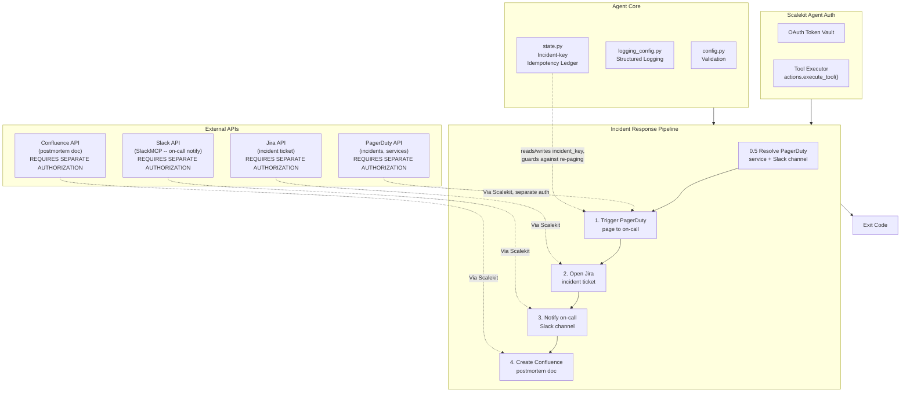

# Incident Response Agent

**PagerDuty -> Jira -> Slack -> Confluence**

An agent that runs on behalf of an on-call engineer: given a detected alert, triggers a PagerDuty page to on-call, opens a Jira incident ticket with severity and context, posts to the on-call Slack channel with the Jira link, and creates a Confluence postmortem doc from a template.

All four services are connected through [Scalekit Agent Auth](https://scalekit.com) using a single `actions.execute_tool()` interface. No token management, no OAuth refresh logic, no credential storage in your code.

## Status of this build

This repo was built and validated against a real Scalekit workspace, and has been run live end-to-end through all five steps: a real PagerDuty incident was triggered, a real Jira ticket was opened and linked back to it, a real Slack notification was posted to an on-call channel, and a real Confluence postmortem doc was created and independently fetched back to confirm its content, all in one run -- with a second run against the same `--incident-key` proving the idempotency guard (no re-page, no duplicate ticket, no duplicate message). `CONFLUENCE_SPACE_ID` has no in-catalog lookup tool to resolve from a space key or URL (see Prerequisites below for exactly how to find it); when it isn't configured correctly, the run degrades exactly as designed: a warning is logged and the run still exits `0`, since PagerDuty/Jira/Slack are already real and actionable without it.

## What It Does

For one detected alert, the agent runs a five-step pipeline:

| Step | Action | Tool |
|------|--------|------|
| 0 | Authorize PagerDuty + Jira + Confluence + Slack | `get_or_create_connected_account` (per connector) |
| 1 | Trigger a PagerDuty page to on-call | `pagerduty_incident_create` |
| 2 | Open a Jira incident ticket with severity and context | `jira_issue_create` |
| 3 | Post to the on-call Slack channel with the Jira link | `slackmcp_slack_send_message` |
| 4 | Create a Confluence postmortem doc from a template | `confluence_page_create` |

**Example:** *"Page on-call and open an incident for the API latency spike in prod"* -> a PagerDuty incident is triggered against the configured service, a Jira ticket is opened with severity and a link back to the PagerDuty incident, the on-call Slack channel is notified with both links, and a Confluence postmortem doc is created from a fixed template with the incident details pre-filled.

## Architecture



## Prerequisites

- Python 3.11+
- A [Scalekit](https://scalekit.com) account (free tier works)
- **A PagerDuty account with a PagerDuty connection set up in your Scalekit dashboard.** To connect:
  1. In the Scalekit dashboard, add a PagerDuty connection under Agent Auth > Connections.
  2. Complete PagerDuty's OAuth flow.
  3. Copy the exact connection name Scalekit shows you into `PAGERDUTY_CONNECTOR` in `.env`.
  4. Note the exact service name (or ID) you want incidents created against -- set `PAGERDUTY_SERVICE_NAME` or `PAGERDUTY_SERVICE_ID`.
- **A Jira account with a Jira connection set up in your Scalekit dashboard.** Note there are three separate Jira-related connectors in Scalekit's catalog (`JIRA`, `JIRASERVICEMANAGEMENT`, `ATLASSIANMCP`) -- this agent uses the plain `JIRA` REST connector, verified live to have a working `jira_issue_create` tool. Copy the exact connection name into `JIRA_CONNECTOR`. Set `JIRA_PROJECT_KEY` to the project incidents should be filed under, and confirm `JIRA_ISSUE_TYPE` is a valid issue type name for that specific project (issue type names vary per project; verify via `jira_issue_create_meta_issue_types_list` rather than assuming "Bug" exists everywhere).
- **A Confluence account with a Confluence connection set up in your Scalekit dashboard.** Uses the plain `CONFLUENCE` REST connector (not `ATLASSIANMCP`). Set `CONFLUENCE_SPACE_ID` to the numeric space ID postmortems should be created under -- this must be the numeric ID, not the space key (e.g. `SD`) and not the site's cloud ID (a UUID); both were tried live against this workspace's real `confluence_space_get` tool and both were rejected with `"Provided value {...} for 'id' is not the correct type. Expected type is long"`. The plain `CONFLUENCE` connector's tool catalog has no spaces-list tool to resolve a key or name to this number at runtime (verified live). The real, working way to find it: open the space in your browser (its URL looks like `https://yoursite.atlassian.net/wiki/spaces/<KEY>/overview?homepageId=<PAGE_ID>`), then call `confluence_page_get(id=<PAGE_ID>)` -- the response's `spaceId` field is the numeric ID `confluence_page_create` needs. Verified live in this build exactly this way.
- **A Slack workspace with an MCP-variant Slack connection (`SLACKMCP`).** Complete the OAuth flow with `chat:write` scope. Set `SLACK_CHANNEL` to the on-call channel's name or ID.

## Jira and Confluence Tool Verification

Tool shapes were discovered and verified against Scalekit's live tool catalog (`search_tools`), which is inspectable even with zero connected accounts, and have since been re-verified against real PagerDuty/Jira/Confluence/Slack data end-to-end (a real page, a real ticket, a real notification, and a real postmortem doc, in one run). Three things worth calling out explicitly:

- **Jira has three separate connectors in the catalog**: `JIRA` (plain REST, general issue tracking), `JIRASERVICEMANAGEMENT` (customer requests/service desks, a different product), and `ATLASSIANMCP` (a unified MCP server covering Jira + Confluence + Compass together, with its own tool set like `atlassianmcp_createjiraissue`). This agent uses the plain `JIRA` connector's `jira_issue_create`, since it is the most direct match for "create an incident ticket" and does not require resolving a separate `cloudId` the way `ATLASSIANMCP`'s tools do.
- **Confluence's plain REST connector has no spaces-list tool.** Only `ATLASSIANMCP` exposes `atlassianmcp_getconfluencespaces`; the plain `CONFLUENCE` connector's `confluence_page_create` requires a numeric `spaceId` with no in-catalog way to resolve one from a human-readable space key. See Prerequisites above for the real, verified way to find it (via a space's homepage page ID).
- **`jira_issue_create`'s response never carries the ticket's real, human-facing browse URL.** Its `self` field only ever contains the API's cloud UUID (`https://api.atlassian.com/ex/jira/{cloud_id}/...`), and Jira Cloud's actual browse URL needs the site's real subdomain name, not that UUID -- constructing one from the UUID was tried in an earlier version of this build and confirmed live to 404. No tool in this connector's catalog exposes the real site name. This agent therefore never guesses a Jira URL: tickets are referenced by key alone (e.g. `ECS-18`) in Slack, PagerDuty notes, and the Confluence doc, unless the operator sets `JIRA_SITE_URL` themselves -- with that set, links render properly clickable everywhere (verified live: a real Slack message showing `Jira: <link>ECS-19</link>` and a real Confluence page with a real `<a href>` anchor, both read back and confirmed after sending).

| Tool | Method/Path | Notes |
|------|--------------|-------|
| `pagerduty_incident_create` | `POST /incidents` | Requires `title`, `service_id`, `from_email`. `incident_key`, if set, is PagerDuty's own server-side deduplication key -- this agent relies on it for at-the-source idempotency, not just its own local state file. |
| `pagerduty_services_list` | `GET /services` | Used to resolve `PAGERDUTY_SERVICE_NAME` to the `service_id` the create tool requires, since create only accepts an ID. |
| `pagerduty_incident_note_create` | `POST /incidents/{id}/notes` | Used to post the Jira ticket link back onto the PagerDuty incident once it exists. Failing this is logged as a warning, not fatal -- the incident and ticket already exist regardless. |
| `jira_issue_create` | `POST /ex/jira/{cloud_id}/rest/api/3/issue` | Requires `project_key`, `summary`, `issue_type`. `issue_type` and `priority_name` are project-specific NAMES, not IDs -- an invalid name for a specific project fails at Jira's own API with a message this agent surfaces as-is. |
| `confluence_page_create` | `POST /wiki/api/v2/pages` | Requires numeric `spaceId` and `title`. `body_representation` and `body_value` must both be provided together (this agent always uses `storage` format) or both omitted. |
| `slackmcp_slack_search_channels` | (MCP) | Resolves `SLACK_CHANNEL` from a bare name to a channel ID. Verified live: returns a markdown TEXT block (same shape as `slack_search_users` in the sibling repos), not structured JSON -- the channel ID is parsed out of each result block's `Permalink` URL, since there is no separate `Channel ID` field. An exact name match is required; unlike a fuzzy name search, there is no first-result fallback, since posting on-call's notification to the wrong channel is worse than failing to resolve one. |
| `slackmcp_slack_send_message` | (MCP) | `channel_id=`/`message=`, not `channel`/`text` -- verified in the sibling repos as the working parameter shape for the `SLACKMCP` connector variant. |

All PagerDuty/Jira/Confluence tools are plain REST (OAuth). Slack's `SLACKMCP` connector wraps responses in an MCP envelope (`{"content": [{"type": "text", "text": "<json>"}]}`), unwrapped by `_unwrap_mcp_envelope()` in `connectors.py`.

## Setup

### 1. Install dependencies

```bash
pip install -r requirements.txt
```

### 2. Configure environment

```bash
cp .env.example .env
```

Fill in your credentials. See `.env.example` for all available options.

### 3. Set up Scalekit connectors

In the [Scalekit dashboard](https://scalekit.com), add four connections under Agent Auth > Connections: **PagerDuty**, **Jira** (the plain REST connector, not JiraServiceManagement or AtlassianMCP), **Confluence** (the plain REST connector, not AtlassianMCP), and an MCP-variant **Slack** connection.

**Copy the exact connection names** shown in your dashboard into `.env`. Scalekit auto-suffixes these per workspace (e.g. `slackmcp-xY12ab`), so the generic provider labels won't work for the Step 0 auth check or for disambiguating `execute_tool()` calls when one identifier has multiple connections of the same provider type.

### 4. Point the agent at your real data

- `ONCALL_EMAIL`: the on-call engineer this run is on behalf of (required by PagerDuty on every write)
- `PAGERDUTY_SERVICE_ID` or `PAGERDUTY_SERVICE_NAME`: which PagerDuty service to page
- `JIRA_PROJECT_KEY` / `JIRA_ISSUE_TYPE`: where the incident ticket is filed
- `CONFLUENCE_SPACE_ID`: the numeric space the postmortem doc is created under
- `SLACK_CHANNEL`: the on-call channel to notify

### 5. Run

```bash
python run_flow.py --title "API latency spike in prod" --severity high --description "p99 latency crossed 2s starting 09:14 UTC"
```

## Usage

```bash
python run_flow.py --title "TITLE" [--severity critical|high|medium|low] [--description TEXT] [--incident-key KEY]
```

- `--title` (required): short incident title, used as the PagerDuty page title and Jira summary.
- `--severity` (default `high`): mapped to PagerDuty urgency (`critical`/`high` -> `high`, `medium`/`low` -> `low`) and Jira priority (`critical` -> Highest, `high` -> High, `medium` -> Medium, `low` -> Low).
- `--description`: additional context included in the PagerDuty incident body, Jira description, and Confluence postmortem summary.
- `--incident-key`: a deduplication key from your alert source (e.g. an alertmanager fingerprint). Defaults to `--title` if not given -- provide a real one whenever your alert source has one, since two unrelated alerts that happen to share a title would otherwise be deduplicated against each other.

This agent does not itself poll or subscribe to any monitoring/alerting system -- "alert detection" is the caller's responsibility (an alertmanager/Datadog webhook handler, a Slack slash command, or an on-call engineer invoking this directly). Wire it up behind whichever alert source you use by invoking `run_flow.py` with the alert's title, severity, and a stable incident key.

```bash
# from an alertmanager webhook handler, for example:
python run_flow.py --title "$ALERT_NAME" --severity "$ALERT_SEVERITY" \
  --description "$ALERT_SUMMARY" --incident-key "$ALERT_FINGERPRINT"
```

## Idempotency

Re-running this agent with the same `--incident-key` does not page on-call twice, open a second Jira ticket, or send a duplicate Slack notification. This is enforced two ways:

1. **PagerDuty's own server-side deduplication**: `--incident-key` is passed directly as `pagerduty_incident_create`'s `incident_key` parameter, so even if this agent's local state were ever lost, a retried run still cannot cause PagerDuty itself to open a second page for the same key.
2. **`state/handled_incidents.json`**: a local ledger keyed by a hash of `--incident-key`, recording the full outcome (PagerDuty incident ID, Jira ticket key, Confluence page ID) of a completed run, and a `"partial"` marker if a run paged on-call but failed before finishing later steps -- so a retry after a partial failure resumes by reporting the specific failure rather than re-paging.

```bash
rm -f state/handled_incidents.json   # reset, e.g. to force re-handling for testing
```

## Configuration

Environment variables (set in `.env`):

| Variable | Default | Notes |
|----------|---------|-------|
| `SCALEKIT_ENV_URL` | - | Required: your Scalekit workspace URL |
| `SCALEKIT_CLIENT_ID` | - | Required: Scalekit client ID |
| `SCALEKIT_CLIENT_SECRET` | - | Required: Scalekit client secret |
| `PAGERDUTY_USER` | - | Required: identity used to authorize PagerDuty |
| `JIRA_USER` | - | Required: identity used to authorize Jira |
| `CONFLUENCE_USER` | - | Required: identity used to authorize Confluence |
| `SLACK_USER` | - | Required: identity used to authorize Slack |
| `PAGERDUTY_CONNECTOR` | `PAGERDUTY` | Exact connection name from the Scalekit dashboard |
| `JIRA_CONNECTOR` | `JIRA` | Exact connection name; must be the plain Jira REST connector |
| `CONFLUENCE_CONNECTOR` | `CONFLUENCE` | Exact connection name; must be the plain Confluence REST connector |
| `SLACK_CONNECTOR` | `SLACKMCP` | Exact connection name; must be an MCP-variant Slack connection |
| `ONCALL_EMAIL` | - | Required: on-call engineer this run is on behalf of |
| `PAGERDUTY_SERVICE_ID` | (empty) | PagerDuty service ID; takes priority over `PAGERDUTY_SERVICE_NAME` if both are set |
| `PAGERDUTY_SERVICE_NAME` | (empty) | PagerDuty service name to resolve to an ID at startup; one of `PAGERDUTY_SERVICE_ID`/`PAGERDUTY_SERVICE_NAME` is required |
| `JIRA_PROJECT_KEY` | - | Required: Jira project the incident ticket is created under |
| `JIRA_ISSUE_TYPE` | `Bug` | Issue type name; must be valid for `JIRA_PROJECT_KEY`'s project |
| `JIRA_SITE_URL` | (empty) | Optional: your real Jira site URL (e.g. `https://yourteam.atlassian.net`), used to build a clickable ticket link. Left blank, tickets are referenced by key alone (e.g. `ECS-18`) -- see Jira and Confluence Tool Verification below for why this can't be discovered automatically |
| `CONFLUENCE_SPACE_ID` | - | Required: numeric Confluence space ID (not the space key) |
| `CONFLUENCE_PARENT_PAGE_ID` | (empty) | Optional: parent page ID to nest the postmortem doc under |
| `SLACK_CHANNEL` | - | Required: on-call channel name or ID to notify |
| `LOG_LEVEL` | `INFO` | `DEBUG`, `INFO`, `WARNING`, `ERROR` |

## Exit Codes

| Code | Meaning | Use Case |
|------|---------|----------|
| `0` | Success | Incident triggered, ticketed, and notified (Confluence doc creation failing alone still exits 0, with a warning -- see Error Handling below) |
| `1` | Error | Config missing, a connector not authorized, PagerDuty service or Slack channel could not be resolved, PagerDuty paging failed, or Jira ticket creation failed after PagerDuty already paged |
| `130` | Interrupted | Graceful shutdown via Ctrl+C or SIGTERM |

## Monitoring

### Logging

Structured logs with timestamps, levels, and auto-redacted secrets:

```bash
python run_flow.py --title "..."                    # all logs
LOG_LEVEL=ERROR python run_flow.py --title "..."     # errors only
LOG_LEVEL=DEBUG python run_flow.py --title "..."     # verbose
```

Log levels:
- `DEBUG`: detailed execution flow, Scalekit client initialization
- `INFO`: key milestones, connector auth status, each step's outcome, final summary
- `WARNING`: auth issues, non-fatal step failures (PagerDuty note, Slack notify, Confluence doc)
- `ERROR`: unrecoverable failures, missing config, a required connector unreachable

Every successful run ends with a summary line:

```text
[SUMMARY] PagerDuty #482 triggered, Jira OPS-1183 opened, Slack notified, Confluence created
```

### State

`state/handled_incidents.json` stores one entry per `sha256(incident_key)`, recording either the full outcome of a completed run or a `"partial"` marker noting which step failed. See `state.py`'s module docstring for the full design rationale (why this is a per-incident-key ledger rather than a content fingerprint, and how it composes with PagerDuty's own native deduplication).

```bash
rm -f state/handled_incidents.json   # reset, e.g. to force re-handling for testing
```

## Error Handling & Edge Cases

- **A connector unauthorized or unreachable at Step 0**: unlike a digest-style agent where one connector can degrade gracefully, every step here depends on its connector being ACTIVE -- the agent reports which connector(s) failed and exits `1` immediately, without attempting to page on-call with an incomplete toolset.
- **`PAGERDUTY_SERVICE_NAME` matches zero or more than one service**: Step 0.5 fails with a specific message before any incident is created, rather than paging an ambiguous or wrong service.
- **`SLACK_CHANNEL` cannot be resolved to a channel ID**: Step 0.5 fails before any incident is created -- silently skipping the on-call notification is not an acceptable degradation the way skipping one rep's DM is in a digest agent.
- **Jira ticket creation fails after PagerDuty has already paged on-call**: the local state ledger records a `"partial"` outcome keyed by the incident key before the error is raised, so a retry with the same `--incident-key` does not trigger a second PagerDuty page while the operator fixes the underlying Jira config issue (invalid project key or issue type name) and re-runs.
- **Posting the Jira link back onto the PagerDuty incident fails**: logged as a warning, not fatal -- the incident and ticket both already exist regardless of whether this cross-link succeeds.
- **Slack notification fails**: logged as a warning, not fatal -- PagerDuty and Jira are already real and actionable without it. The run still exits `0`.
- **Confluence postmortem creation fails**: logged as a warning, not fatal, and the run still exits `0` -- a missing postmortem doc does not undo an already-triggered page and already-open ticket, and a PMM/on-call lead can create it manually from the same template context logged in the warning.
- **Re-running with the same `--incident-key` after a fully completed prior run**: `run_incident_response()` returns the prior run's recorded outcome immediately, without re-paging, re-ticketing, or re-notifying.
- **`--title`/`--description` containing HTML-special characters (`<`, `>`, `&`, quotes)**: Confluence's postmortem body is real XHTML (`storage` format), so this caller-supplied free text is HTML-escaped (`html.escape()`) before being embedded, rather than trusted as-is -- an alert summary containing e.g. a raw `<script>`-looking string cannot break the page's markup or inject unintended content.
- **Ctrl+C / SIGTERM before PagerDuty has been paged**: the run stops cleanly with no incident created, exit `130`. **After** PagerDuty has been paged but before later steps finish, a shutdown request is logged but the in-flight step is allowed to complete (an interrupted mid-page/mid-ticket write is worse than a few extra seconds of shutdown latency), then the process exits.

## Troubleshooting

| Issue | Solution |
|-------|----------|
| `ModuleNotFoundError: scalekit` | Run `pip install -r requirements.txt` |
| `Missing required config: ...` | Run `cp .env.example .env` and fill in your values |
| `One or more connectors are not authorized` | Connect the named provider(s) in the Scalekit dashboard; this agent requires all four ACTIVE before running, unlike a digest agent that can degrade gracefully |
| `No PagerDuty service found named '...'` | Confirm `PAGERDUTY_SERVICE_NAME` is the exact service name in your PagerDuty dashboard, or set `PAGERDUTY_SERVICE_ID` directly |
| `Multiple PagerDuty services named '...' found` | Set `PAGERDUTY_SERVICE_ID` directly to disambiguate |
| `Slack channel '...' was not found` | Confirm `SLACK_CHANNEL` is an exact channel name or a valid channel ID, and that the connected Slack account can see it |
| `PagerDuty incident #N was triggered, but creating the Jira ticket failed` | Confirm `JIRA_PROJECT_KEY` and `JIRA_ISSUE_TYPE` are valid for that project (run `jira_issue_create_meta_issue_types_list`), then re-run with the same `--incident-key` -- PagerDuty will not be re-paged |
| `multiple connected accounts found for identifier` | Set the exact `*_CONNECTOR` env var for that provider; the same identifier is connected to more than one connection of that type in your workspace |
| `Confluence postmortem creation failed ... "Could not create content with type page"` (logged as a warning, run still exits 0) | `CONFLUENCE_SPACE_ID` is not a real numeric space ID in your site. See Prerequisites above for the verified, working way to find it: open the space's homepage in your browser, note the `homepageId` query param in the URL, then call `confluence_page_get(id=<homepageId>)` and read its `spaceId` field |
| Same incident paged twice | Should not happen -- if it does, check `state/handled_incidents.json` is writable and not being reset between runs, and confirm `--incident-key` is stable across retries |
