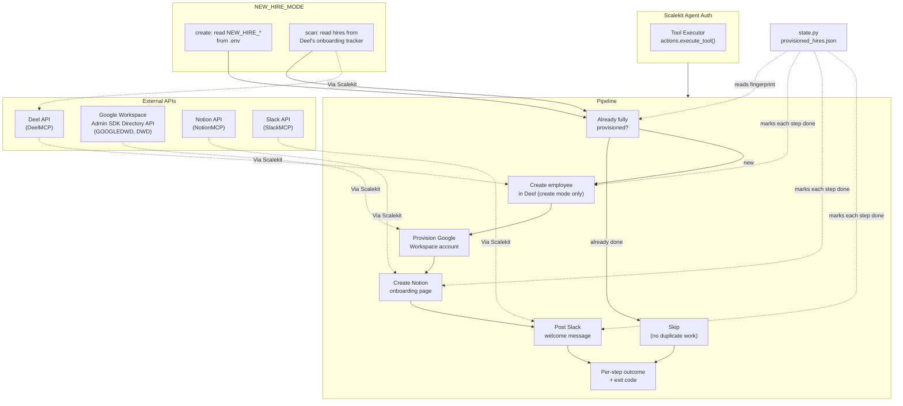

# New Hire Provisioning Agent

Automates new-hire onboarding: creates (or detects) an employee record in Deel, provisions their Google Workspace account, creates a Notion onboarding page, and posts a Slack welcome message.

All connectors run through [Scalekit Agent Auth](https://scalekit.com) -- no manual OAuth, no token storage in code.

## What it does

| Step | Action |
|------|--------|
| 1 | Create (or detect) the hire in Deel |
| 2 | Provision their Google Workspace account |
| 3 | Create a Notion onboarding page |
| 4 | Post a welcome message to Slack |

Two modes, set with `NEW_HIRE_MODE`:

- **`create`** (default) -- you supply one new hire's details in `.env`, and the agent creates a real employee record in Deel, then runs the rest of the pipeline. Deel has no way to delete an employee record once created, so run with `NEW_HIRE_DRY_RUN=true` first to confirm everything resolves correctly before creating anything for real.
- **`scan`** -- the agent looks at Deel's onboarding tracker for hires someone already created there, and runs Workspace + Notion + Slack for each one that isn't fully provisioned yet. It never creates a Deel record in this mode.

Every step is safe to re-run: already-completed work is skipped, not repeated.

## Architecture



## Setup

```bash
pip install -r requirements.txt
cp .env.example .env
```

Fill in `.env`:

1. **Scalekit credentials** -- from your Scalekit dashboard.
2. **Connections** -- in the Scalekit dashboard (Agent Auth > Connections), connect Deel, Notion, a Slack MCP connection, and Google Workspace (DWD). Copy each connection's exact name into `.env` (`DEEL_CONNECTOR`, `NOTION_CONNECTOR`, etc.) -- these are workspace-specific, not generic labels.
   - **Notion**: share your onboarding-docs hub page with your integration first (page's "..." menu > Connections).
   - **Slack**: invite the connected bot into your welcome channel if it isn't already a member.
   - **Google Workspace**: see [Google Workspace setup](#google-workspace-setup) below -- it needs two things most guides skip.
3. **Hire details** (`create` mode) or leave as-is (`scan` mode) -- see `.env.example` for the full list.

## Run

```bash
# create mode: verify first, then create for real
NEW_HIRE_DRY_RUN=true python run_flow.py
NEW_HIRE_DRY_RUN=false python run_flow.py

# scan mode: detect and provision hires already in Deel
NEW_HIRE_MODE=scan python run_flow.py
```

Add `POLLING_MODE=true POLL_INTERVAL_MINUTES=15` to run continuously instead of once. `Ctrl+C` stops it cleanly.

## Google Workspace setup

Domain-Wide Delegation (DWD) needs a GCP service account authorized in Google Workspace Admin Console, connected in Scalekit as the `GOOGLEDWD` connector. Two things are easy to get wrong:

1. **Authorize all four OAuth scopes together**, not just the one you think you need: `openid`, `https://www.googleapis.com/auth/userinfo.email`, `https://www.googleapis.com/auth/userinfo.profile`, and `https://www.googleapis.com/auth/admin.directory.user`. Google's DWD grant is all-or-nothing -- missing any one of these causes every request to fail with a 401, even though it looks like a scope you didn't need.
2. **`GOOGLE_WORKSPACE_USER` must be a genuine Workspace Super Admin**, not just any user or the HR admin running this agent. A non-admin subject gets a 403 from Google's Admin API even when the DWD connection itself is working correctly.

If Google Workspace isn't set up yet, this step just logs a warning and skips -- Notion and Slack still run normally.

## Configuration reference

| Variable | Notes |
|----------|-------|
| `SCALEKIT_ENV_URL` / `SCALEKIT_CLIENT_ID` / `SCALEKIT_CLIENT_SECRET` | Your Scalekit credentials |
| `DEEL_USER` / `NOTION_USER` / `SLACK_USER` | Identity used to authorize each connector |
| `GOOGLE_WORKSPACE_USER` | Must be a real Super Admin -- see above |
| `*_CONNECTOR` | Exact connection name from your Scalekit dashboard |
| `HR_ADMIN_EMAIL` | Label only, shown in logs |
| `NEW_HIRE_MODE` | `create` or `scan` |
| `NEW_HIRE_*` | Hire details, required in `create` mode only -- see `.env.example` |
| `NEW_HIRE_DRY_RUN` | `create` mode: preview without writing to Deel |
| `DEEL_LEGAL_ENTITY_ID` / `DEEL_TEAM_ID` / `DEEL_DEPARTMENT_ID` | Optional -- auto-resolved if your Deel account only has one of each |
| `NOTION_PARENT_PAGE_ID` | Page the onboarding doc gets created under |
| `SLACK_WELCOME_CHANNEL` | Channel name or ID |
| `GOOGLE_WORKSPACE_DOMAIN` | Domain for the hire's Workspace email address |
| `POLLING_MODE` / `POLL_INTERVAL_MINUTES` | Run continuously instead of once |
| `LOG_LEVEL` | `DEBUG` / `INFO` / `WARNING` / `ERROR` |

## Exit codes

| Code | Meaning |
|------|---------|
| `0` | Success (including "nothing new to do") |
| `1` | Config or connectivity error |
| `2` | `create` mode: the Deel creation itself failed |
| `130` | Interrupted (Ctrl+C) |

## Troubleshooting

| Issue | Fix |
|-------|-----|
| `Missing required config: ...` | Run `cp .env.example .env` and fill in your values |
| `connector (...) -- EXPIRED` / `PENDING_AUTH` | Re-authorize using the link printed in the logs, or via the Scalekit dashboard |
| `multiple connected accounts found for identifier` | Set the exact `*_CONNECTOR` value for that provider |
| Google Workspace 401 (`REAUTHENTICATION_NEEDED`) | Missing OAuth scope -- see [Google Workspace setup](#google-workspace-setup) |
| Google Workspace 403 (`Not Authorized`) | `GOOGLE_WORKSPACE_USER` isn't a Super Admin -- see [Google Workspace setup](#google-workspace-setup) |
| `Could not verify Notion connectivity` | Share the parent page with your Notion integration |
| `Could not resolve Slack channel` | Check the channel name, or use a literal channel ID |
| `NEW_HIRE_SENIORITY did not match` | Use one of the valid names shown in the error |
| Duplicate Slack message after switching modes | Expected -- `create` and `scan` track completed work separately. See `state.py` if you need to reconcile them by hand |

## State

Progress is tracked in `state/provisioned_hires.json` so re-running never repeats completed work. Delete it to force a full re-run. `create` and `scan` modes track hires under different keys, so a hire provisioned in one mode won't automatically be recognized as done by the other.
