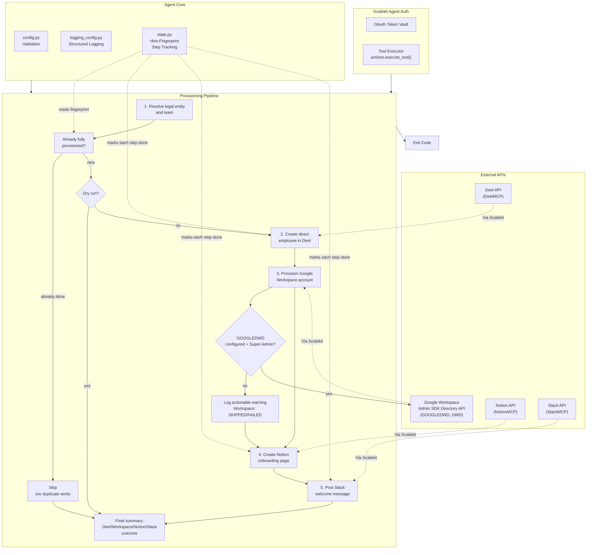

# New Hire Provisioning Agent

**Deel -> Google Workspace + Notion + Slack**

An agent that runs on behalf of an HR admin, in one of two modes: **create** a real direct-employee record for one new hire in Deel (person + employment contract, under the organization's own legal entity), or **scan** Deel's own onboarding tracker to detect hires already created there. Either way, it then provisions a Google Workspace account for them via Domain-Wide Delegation (DWD), creates a Notion onboarding doc from a template/hub page, and posts a welcome message to a shared Slack channel.

All connectors are wired through [Scalekit Agent Auth](https://scalekit.com) using a single `actions.execute_tool()` interface. No token management, no OAuth refresh logic, no credential storage in your code.

Every step in both modes is verified live end-to-end against a real Scalekit workspace, including Google Workspace provisioning: DWD authentication and the Admin Directory API create-user call both work today, given the setup described in [Google Workspace Provisioning](#google-workspace-provisioning-setup-that-was-required) below.

## What It Does

Set with `NEW_HIRE_MODE` (default `create`):

**`create` mode** -- Deel's own creation tool (`deelmcp_org_direct_employee_create`) has no equivalent detection counterpart for records it hasn't created yet, so this mode takes one new hire's real details directly as configuration (`NEW_HIRE_*`) and creates them for real. One run provisions one new hire.

| Step | Action | Tool |
|------|--------|------|
| 1 | Resolve the org's Deel legal entity and team (auto-resolved if unambiguous) | `deelmcp_org_legal_entity_list`, `deelmcp_org_team_list`, `deelmcp_org_department_list`, `deelmcp_lookup_seniority_list` |
| 2 | Create a direct-employee record in Deel (the one irreversible write) | `deelmcp_org_direct_employee_create` |
| 3 | Provision a Google Workspace account via Domain-Wide Delegation (optional, degrades gracefully) | `googledwd_create_admin_user` |
| 4 | Create a Notion onboarding page from a template/hub page | `notionmcp_notion-search`, `notionmcp_notion-create-pages` |
| 5 | Post a welcome message to a shared Slack channel | `slackmcp_slack_search_channels`, `slackmcp_slack_send_message` |

**Important:** Deel has no delete/terminate/offboard tool anywhere in its real catalog for a direct employee (confirmed live by exhausting every plausible query name). A mistakenly-created employee record cannot be cleaned up through this agent or any other Scalekit tool. Set `NEW_HIRE_DRY_RUN=true` for first-time setup verification -- it resolves every real ID and logs exactly what would be created without ever calling the real creation tool.

**`scan` mode** -- detects hires already created directly in Deel (by an HR admin, or by a separate `create`-mode run) via `deelmcp_onboarding_tracker_list`, and runs Workspace + Notion + Slack for every one currently at onboarding status `INVITED` that isn't already fully provisioned. Never calls the Deel creation tool. One run can process multiple hires. See [Detection Mode](#detection-mode-new_hire_modescan) below for the full details, including a real quirk in the tracker tool's own status filter that this agent works around.

## Architecture



## Prerequisites

- Python 3.11+
- A [Scalekit](https://scalekit.com) account (free tier works)
- A Deel org connected through Scalekit's DeelMCP connector, with a real legal entity and team already set up in Deel (this agent creates employees under existing ones, it does not create a legal entity)
- A Notion workspace with a page you can share with your Notion integration, to act as the onboarding-docs hub (a child page is created under it for the new hire)
- A Slack workspace where the connected bot can post to a shared channel (e.g. `#general`)
- **Google Workspace (Domain-Wide Delegation)** -- see [Google Workspace Provisioning](#google-workspace-provisioning-setup-that-was-required) below for the exact setup this required, including two non-obvious gotchas that block it if skipped.

## Setup

### 1. Install dependencies

```bash
pip install -r requirements.txt
```

### 2. Configure environment

```bash
cp .env.example .env
```

Fill in your credentials. See `.env.example` for all available options.

### 3. Set up Scalekit connectors

In the [Scalekit dashboard](https://scalekit.com), add connections under Agent Auth > Connections: **Deel** (DeelMCP), **Notion** (NotionMCP), a **Slack** MCP variant (SlackMCP), and **Google Workspace (DWD)** (GOOGLEDWD, see below).

**Deel**: Complete the OAuth flow for the org you want to provision new hires in.

**Notion**: Complete the OAuth flow, then share your chosen onboarding-docs hub page with the integration (open the page in Notion, use the "..." menu > Connections > add your integration).

**Slack**: Use an MCP-based Slack connection (send-message tool signatures differ between the plain REST `SLACK` connector and the `SLACKMCP` variant; this agent uses SlackMCP's `channel_id`/`message` parameter names). Complete the OAuth flow with `chat:write` scope (or equivalent MCP scope), and invite the connected bot into whatever channel you configure as `SLACK_WELCOME_CHANNEL` if it isn't already a member.

**Google Workspace (DWD)**: See [Google Workspace Provisioning](#google-workspace-provisioning-setup-that-was-required) below. Optional -- the pipeline degrades gracefully if this isn't set up, but two live-confirmed setup steps are easy to miss.

**Copy the exact connection names** shown in your dashboard into `.env`. Scalekit auto-suffixes these per workspace (e.g. `deelmcp-zTWsHKTh`, `notionmcp-chAb8Lfz`, `googledwd-f0ebCm3b`), so the generic provider labels won't work for the Step 0 auth check or for disambiguating `execute_tool()` calls when one identifier has multiple connections of the same provider type. See `DEEL_CONNECTOR`, `NOTION_CONNECTOR`, `SLACK_CONNECTOR`, `GOOGLE_WORKSPACE_CONNECTOR` in Configuration below.

### 4. Point the agent at your real data

- `HR_ADMIN_EMAIL`: the HR admin this agent runs on behalf of (used only as a label in logs/state)
- `NEW_HIRE_*`: the new hire's real details -- see `.env.example` for the full list and which fields Deel requires per country (e.g. `NEW_HIRE_STATE` is required for India)
- `DEEL_LEGAL_ENTITY_ID` / `DEEL_TEAM_ID` / `DEEL_DEPARTMENT_ID`: optional, auto-resolved at startup if exactly one legal entity/team exists in your Deel account
- `NOTION_PARENT_PAGE_ID` (or `NOTION_TEMPLATE_PAGE_ID`): the Notion page the onboarding doc gets created under
- `SLACK_WELCOME_CHANNEL`: a channel like `#general` (resolved to an ID automatically) or a literal channel ID
- `GOOGLE_WORKSPACE_DOMAIN`: the domain used to build the new hire's Workspace email address
- `GOOGLE_WORKSPACE_USER`: the Workspace **Super Admin** email to impersonate for DWD (see below -- this must be a real Super Admin, not just any user)

### 5. Run

```bash
NEW_HIRE_DRY_RUN=true python run_flow.py    # verify resolved IDs and details first
NEW_HIRE_DRY_RUN=false python run_flow.py   # actually create the hire
```

## Google Workspace Provisioning: Setup That Was Required

Getting `GOOGLEDWD` from "connected" to "actually works" required two non-obvious fixes beyond the standard DWD setup instructions. Both were diagnosed live against a real Scalekit workspace and are documented here so you don't have to rediscover them.

**Standard DWD setup** (prerequisite to everything below):
1. In Google Cloud Console, create a GCP service account for your Google Workspace domain and generate a JSON key.
2. In your Google Workspace Admin Console (Security > API Controls > Domain-wide Delegation), add a new entry using that service account's numeric Client ID.
3. In your Scalekit dashboard, connect the **GOOGLEDWD** connector using that service account's JSON key, and note its Scopes list on the Configuration tab.

**Gotcha #1 -- the scope set is all-or-nothing.** Scalekit's GOOGLEDWD connector configuration page has a Scopes list with checkboxes. Three scopes (`openid`, `userinfo.email`, `userinfo.profile`) are always checked and cannot be unchecked -- they're baseline and get requested on every DWD token exchange alongside whatever API-specific scopes you check (e.g. `admin.directory.user`). Google's DWD token endpoint validates the **entire** requested scope set as one grant: if you only authorize `admin.directory.user` in Workspace Admin Console and omit the three baseline scopes, every connected-account auth attempt fails with a real 401 `REAUTHENTICATION_NEEDED` / "Google DWD token endpoint returned status 401" -- even though the one scope you actually care about was authorized correctly. **Fix:** authorize all four scopes together in the Workspace Admin DWD entry for that Client ID: `openid, https://www.googleapis.com/auth/userinfo.email, https://www.googleapis.com/auth/userinfo.profile, https://www.googleapis.com/auth/admin.directory.user`.

**Gotcha #2 -- the impersonated subject must be a Super Admin.** Once the scope set matches, the connected account reaches `ACTIVE` and DWD authentication itself succeeds. But the Admin Directory API enforces a *separate* authorization layer on top of OAuth scopes: it checks whether the impersonated subject (the `GOOGLE_WORKSPACE_USER` identity) actually holds Admin privilege in Workspace. A non-admin subject gets a real 403 `"Not Authorized to access this resource/api"` from Google's API itself, distinct from the earlier 401. This was confirmed live against three real Workspace accounts in the same domain: two non-admin subjects both got the 403, and the one confirmed Super Admin succeeded and could create/read/delete a real user. **Fix:** set `GOOGLE_WORKSPACE_USER` to an email that is a genuine Workspace Super Admin, not just the HR admin running this agent (they may not be the same person) -- there is deliberately no fallback to `HR_ADMIN_EMAIL` in `run_flow.py` for this reason, since that would silently retry with a subject already known to be wrong for this API.

**What works today, verified live end-to-end:** `googledwd_create_admin_user` was called for real, the created user was confirmed readable back via `googledwd_get_admin_user`, and cleaned up via `googledwd_delete_admin_user` (which moves the account to a recoverable-deleted state, undoable via `googledwd_undelete_admin_user` within the recovery window -- unlike Deel, a mistaken Workspace user creation is not permanent).

**Until GOOGLEDWD is set up correctly:** every run logs a clear, actionable warning for Step 3 and continues to Notion and Slack. The final summary always reports `Workspace: SKIPPED` (not configured / no `GOOGLE_WORKSPACE_USER`) or `FAILED` (configured but the call errors, e.g. the 403 above) rather than silently omitting the step or claiming full success.

## Detection Mode (`NEW_HIRE_MODE=scan`)

An earlier build of this agent concluded Deel had no way to detect hires that already existed -- "every real Deel listing tool lists people already fully in the system." That conclusion was **wrong**, corrected live in this same workspace: `deelmcp_onboarding_tracker_list` genuinely lists workers currently going through onboarding, filterable and rich with real content.

**How it works:** `NEW_HIRE_MODE=scan` calls `deelmcp_onboarding_tracker_list(include_overview=True)`, normalizes each record into the same internal `Hire` shape create mode uses (see `hire.py`), and runs Workspace + Notion + Slack for every hire currently at onboarding status `INVITED` that isn't already fully provisioned. It never calls the Deel creation tool -- an HR admin (or a separate `create`-mode run) is expected to have created the hire in Deel directly.

**A real quirk this agent works around:** the tool's own `progressStatuses` filter parameter only accepts `ACTIVE`, `INACTIVE`, or `ONBOARDING` -- there is no `INVITED` option. Worse, passing `progressStatuses=["ONBOARDING"]` does **not** reliably return records whose real `progress.status` is `INVITED`; confirmed live, it returned zero records while an unfiltered call in the same account showed three real `INVITED` records at that exact moment. `DeelConnector.list_onboarding_hires()` in `connectors.py` works around this by never passing `progressStatuses` to the tool at all, instead filtering the returned records client-side against each record's real `progress.status` field.

**What each detected hire's data looks like:** with `include_overview=True`, each tracker record carries `hris_profile` (name, work email, personal email), a `summary` list (start date, job title, work-location country, background-check status), `contract` (real Deel contract ID, creation timestamp), and a `checklist` of pending onboarding steps with due dates. It does **not** carry salary, currency, seniority, nationality, or state -- those live elsewhere in Deel and are irrelevant to scan mode anyway, since scan mode never calls the creation tool that would need them.

**Idempotency in scan mode** is keyed on Deel's own real contract ID (`state.compute_scan_fingerprint`), not the name+email+date hash create mode uses -- since a scanned hire already has a real, stable Deel identity, there's no need to hash anything. This is a genuinely different fingerprint namespace from create mode's (`scan:<contract_id>` vs. a SHA-256 hex digest), so a hire provisioned once via `create` mode and later picked up by a `scan` run over the same real Deel record needs its `scan:` state entry present too, or scan mode will not recognize the earlier work and will re-attempt whichever of Workspace/Notion/Slack it doesn't yet see marked done for that fingerprint (Notion's title-search and this agent's own per-step state check both still prevent an actual duplicate write, but Slack has no built-in duplicate-message guard at all -- a second scan run without the matching `scan:` state entry WILL post a second welcome message). If you switch between modes for the same real hires, backfill their `scan:<contract_id>` state entries first.

## Configuration

Environment variables (set in `.env`):

| Variable | Default | Notes |
|----------|---------|-------|
| `SCALEKIT_ENV_URL` | - | Required: your Scalekit workspace URL |
| `SCALEKIT_CLIENT_ID` | - | Required: Scalekit client ID |
| `SCALEKIT_CLIENT_SECRET` | - | Required: Scalekit client secret |
| `DEEL_USER` | - | Required: identity used to authorize Deel |
| `NOTION_USER` | - | Required: identity used to authorize Notion |
| `SLACK_USER` | - | Required: identity used to authorize Slack |
| `GOOGLE_WORKSPACE_USER` | (empty) | Identity for Google Workspace/DWD. Must be a real Super Admin (see above). Leave unset to have Step 3 skip cleanly every run |
| `DEEL_CONNECTOR` | `deelmcp-zTWsHKTh` | Exact connection name from the Scalekit dashboard |
| `NOTION_CONNECTOR` | `notionmcp-chAb8Lfz` | Exact connection name |
| `SLACK_CONNECTOR` | `slackmcp` | Exact connection name; must be an MCP-variant Slack connection |
| `GOOGLE_WORKSPACE_CONNECTOR` | `googledwd-f0ebCm3b` | Exact connection name once GOOGLEDWD is connected |
| `HR_ADMIN_EMAIL` | - | Required: HR admin this agent runs on behalf of (label only) |
| `NEW_HIRE_MODE` | `create` | `create` (creates one hire in Deel from `NEW_HIRE_*`) or `scan` (detects hires already in Deel's onboarding tracker; ignores `NEW_HIRE_*`) |
| `NEW_HIRE_FIRST_NAME` / `NEW_HIRE_LAST_NAME` | - | Required in `create` mode |
| `NEW_HIRE_PERSONAL_EMAIL` | - | Required in `create` mode |
| `NEW_HIRE_WORK_EMAIL` | - | Optional, falls back to personal email (`create` mode) |
| `NEW_HIRE_COUNTRY` | - | Required in `create` mode, ISO country code |
| `NEW_HIRE_STATE` | (empty) | Required for some countries (confirmed for India); Deel rejects with a real 400 if missing and required (`create` mode) |
| `NEW_HIRE_NATIONALITY` | - | Required in `create` mode, ISO country code |
| `NEW_HIRE_JOB_TITLE` | - | Required in `create` mode |
| `NEW_HIRE_SENIORITY` | - | Required in `create` mode, matched case-insensitively as a substring against real Deel seniority level names |
| `NEW_HIRE_START_DATE` | - | Required in `create` mode, `YYYY-MM-DD` |
| `NEW_HIRE_SALARY` | - | Required in `create` mode, must be > 0 |
| `NEW_HIRE_CURRENCY` | - | Required in `create` mode |
| `NEW_HIRE_EMPLOYMENT_TYPE` | `FULL_TIME` | `FULL_TIME` or `PART_TIME` (`create` mode) |
| `DEEL_LEGAL_ENTITY_ID` / `DEEL_TEAM_ID` / `DEEL_DEPARTMENT_ID` | (empty) | Optional: auto-resolved if exactly one candidate exists (`create` mode) |
| `NOTION_PARENT_PAGE_ID` / `NOTION_TEMPLATE_PAGE_ID` | - | Required (either one): Notion page onboarding docs are created under |
| `SLACK_WELCOME_CHANNEL` | `#general` | Channel name (resolved to an ID) or a literal channel ID |
| `GOOGLE_WORKSPACE_DOMAIN` | (empty) | Domain for constructing the new hire's email address |
| `NEW_HIRE_DRY_RUN` | `false` | `create` mode only: resolve everything and log what WOULD be created, without calling the real Deel creation tool. Strongly recommended for first-time setup, since Deel has no delete/terminate tool |
| `POLLING_MODE` | `false` | `create` mode: re-checks whether the configured hire has finished processing yet; does not re-create a hire that already completed. `scan` mode: re-scans on an interval, since new hires can appear in Deel's tracker between cycles |
| `POLL_INTERVAL_MINUTES` | `15` | Minutes between polling cycles |
| `LOG_LEVEL` | `INFO` | `DEBUG`, `INFO`, `WARNING`, `ERROR` |

## Usage

### One-Time Mode (Default)

`create` mode: provision the configured new hire once and exit.

```bash
NEW_HIRE_MODE=create python run_flow.py
```

`scan` mode: scan Deel's onboarding tracker once, provision every matching hire found, and exit.

```bash
NEW_HIRE_MODE=scan python run_flow.py
```

### Continuous Mode (Polling)

```bash
POLLING_MODE=true POLL_INTERVAL_MINUTES=15 python run_flow.py
```

In `create` mode, provisioning one hire is inherently a one-shot action once completed, so polling here re-checks whether the *configured* hire has finished processing yet -- it does not re-create a hire that already completed, and the loop exits as soon as that hire is fully done. In `scan` mode, polling keeps re-scanning on the interval, since new hires can appear in Deel's onboarding tracker between cycles -- this is the more natural fit for `POLLING_MODE` if you want continuous, hands-off detection. Press `Ctrl+C` to stop gracefully; the agent finishes the current step (never mid-write) and exits with code `130`.

## Exit Codes

| Code | Meaning | Use Case |
|------|---------|----------|
| `0` | Success | `create` mode: the hire was fully processed (created now, or already completed on a prior run and correctly skipped). `scan` mode: the scan completed -- zero matching hires found is also success, a normal outcome |
| `1` | Error | Config missing, provisioning check failed (Deel unreachable or Notion parent page unreachable), or 5 consecutive polling errors |
| `2` | Deel creation failed | `create` mode only: the Deel direct-employee creation itself failed or was rejected -- serious enough not to fold into a generic success-with-warnings outcome |
| `130` | Interrupted | Graceful shutdown via Ctrl+C or SIGTERM |

## Monitoring

### Logging

Structured logs with timestamps, levels, and auto-redacted secrets (including the `skc_` Scalekit client ID pattern):

```bash
python run_flow.py                    # all logs
LOG_LEVEL=ERROR python run_flow.py     # errors only
LOG_LEVEL=DEBUG python run_flow.py     # verbose
```

Log levels:
- `DEBUG`: detailed execution flow, Scalekit client initialization
- `INFO`: key milestones, connector auth status, per-step outcomes, Deel/Notion/Slack writes
- `WARNING`: auth issues, Google Workspace not configured, already-provisioned skips
- `ERROR`: unrecoverable failures for a single step, missing config

### Polling Loop

```bash
POLLING_MODE=true POLL_INTERVAL_MINUTES=15 python run_flow.py
# Ctrl+C stops after the current step finishes, exit code 130
```

### State

`state.py` tracks which provisioning steps have succeeded, in `state/provisioned_hires.json`, using two different fingerprint namespaces depending on which mode produced the hire:

- **`create` mode**: tracks `deel`, `workspace`, `notion`, `slack`, keyed by a request-fingerprint (a hash over first name, last name, personal email, and start date), not a Deel ID -- since the record doesn't exist yet until Step 2 creates it, there is nothing to key on beforehand.
- **`scan` mode**: tracks `workspace`, `notion`, `slack` (never `deel` -- scan mode doesn't create Deel records), keyed by `scan:<deel_contract_id>` -- since a scanned hire already has a real, stable Deel identity, there's no need to hash anything (see `state.compute_scan_fingerprint`).

Each step is tracked independently. A hire whose Notion doc and Slack welcome succeeded but whose Google Workspace account is still pending (because GOOGLEDWD wasn't set up yet) is **not** marked fully provisioned, and re-running will correctly retry just the missing step, without re-creating the Deel record, re-creating a duplicate Notion page, or re-posting a duplicate Slack welcome.

**Switching modes for the same real hires:** the two fingerprint namespaces don't overlap. A hire provisioned via `create` mode has no `scan:<contract_id>` state entry, so a later `scan` run over that same real Deel record won't recognize the earlier work and will re-attempt whichever of Workspace/Notion/Slack it doesn't see marked done under the `scan:` key -- Notion's own title-search prevents an actual duplicate page, but **Slack has no duplicate-message guard at all**. If you plan to run both modes against overlapping real hires, backfill the `scan:<contract_id>` state entries for anything `create` mode already finished before running `scan` mode over it.

```bash
rm -f state/provisioned_hires.json   # reset, e.g. to force re-provisioning for testing
```

## Error Handling & Edge Cases

- **Hire already provisioned**: `state.py` marks each of the four steps independently as they succeed. A second run for the same hire fingerprint skips any already-completed step with a clear log line and never creates a duplicate Deel record, Notion page, or Slack post.
- **Deel creation fails**: exits `2` specifically (not folded into `1`), with an explicit warning that since Deel has no delete/terminate tool, if the failure happened *after* a real record was actually created, the Deel dashboard should be checked directly before retrying.
- **Google Workspace account provisioning fails or GOOGLEDWD is unauthorized/not configured**: logged as a clear, actionable warning (or error, if GOOGLEDWD is connected but the call itself errors, e.g. a non-Super-Admin subject) for just that step; Notion and Slack still run. The final summary always states each step's real outcome (e.g. `Workspace: SKIPPED, Notion: OK, Slack: OK`), never silently claiming full success when Workspace provisioning didn't happen.
- **Notion parent/template page not found or not shared with the integration**: `provisioning.py`'s Step 0.5 check fails fast with exit code `1` and an explicit instruction to share the page with the integration and confirm the page ID, before any Deel write happens for the whole run.
- **Slack channel not found or bot not a member**: logged as an error for Step 5 specifically; if Notion already succeeded, it stays succeeded (state.py already marked it).
- **NEW_HIRE_SENIORITY doesn't match a real Deel seniority level**: fails with exit `1` and the real list of valid seniority names from `deelmcp_lookup_seniority_list`, before any write is attempted.
- **NEW_HIRE_STATE missing for a country that requires it**: Deel's own API is the source of truth; a missing required state returns a real 400 "No state was selected" from Deel, surfaced as an actionable error.
- **Deel connector never configured at all (RESOURCE_NOT_FOUND)**: distinguished from "configured but expired/broken" via a dedicated `ConnectorUnavailableError`, logged as "not configured" rather than a generic failure. Deel is the one connector this agent cannot degrade around -- Step 0 fails fast with exit `1` rather than surfacing the failure later at Step 2 with less context.
- **`scan` mode: zero hires found at status INVITED**: a normal, common outcome (not an error) -- logged and the process exits `0`.
- **`scan` mode: an onboarding tracker record is missing a name or start date**: `hire_from_tracker_record()` returns `None` for that record rather than raising or guessing; the record is skipped with a warning naming its `unique_id`, and the rest of the scan continues normally.
- **`scan` mode: a hire previously provisioned via `create` mode**: has no `scan:<contract_id>` state entry (different fingerprint namespace -- see State above), so scan mode will not recognize it as already done and will re-attempt whichever steps it doesn't see marked under the `scan:` key. Notion's title-search prevents an actual duplicate page; Slack does not have an equivalent guard and will post a second welcome message. Backfill state before switching modes over the same real hires.
- **Malformed/corrupted state file**: detected and treated as empty (fresh start) rather than crashing.
- **Ctrl+C / SIGTERM**: if received before the Deel creation call, the process exits `130` cleanly with nothing created. If received after, the pipeline continues logging a warning rather than leaving the already-created Deel record unaccounted for in state.

## Troubleshooting

| Issue | Solution |
|-------|----------|
| `ModuleNotFoundError: scalekit` | Run `pip install -r requirements.txt` |
| `Missing required config: ...` | Run `cp .env.example .env` and fill in your values |
| `connector (...) -- EXPIRED` / `PENDING_AUTH` | Open the auth link printed in logs, or re-authorize in the Scalekit dashboard |
| `connector (...) -- NOT CONFIGURED` | Expected for Google Workspace until DWD setup is complete; unexpected for Deel/Notion/Slack, meaning that connection doesn't exist in your Scalekit workspace at all yet |
| `multiple connected accounts found for identifier` | Set the exact `*_CONNECTOR` env var for that provider; the same identifier is connected to more than one connection of that type in your workspace |
| `Google DWD token endpoint returned status 401` / `REAUTHENTICATION_NEEDED` | Scope mismatch -- see [Gotcha #1](#google-workspace-provisioning-setup-that-was-required): authorize all four scopes (`openid`, `userinfo.email`, `userinfo.profile`, `admin.directory.user`) together in the Workspace Admin DWD entry, not just the one you think you need |
| `403 Not Authorized to access this resource/api` on a `googledwd_*` call | The impersonated `GOOGLE_WORKSPACE_USER` is not a Workspace Super Admin -- see [Gotcha #2](#google-workspace-provisioning-setup-that-was-required) |
| `Could not verify Notion connectivity for parent page` | Share the page with your Notion integration (page's "..." menu > Connections in Notion) and confirm `NOTION_PARENT_PAGE_ID` is the correct ID from the page URL |
| `Could not resolve Slack channel '...'` | The channel name search returned no results; double-check spelling, confirm the bot is a member, or use a literal channel ID (`C...`) instead |
| `NEW_HIRE_SENIORITY '...' did not match any real Deel seniority level` | Use one of the real names logged in the error, e.g. `"Mid (Individual Contributor Level 2)"` -- a short substring like `"Mid"` also matches |
| `No state was selected` from Deel | Set `NEW_HIRE_STATE` for the target country |
| `Invalid enum value` on `progressStatuses` from `deelmcp_onboarding_tracker_list` | You're calling the tool directly with a status like `INVITED` -- the tool only accepts `ACTIVE`/`INACTIVE`/`ONBOARDING`. Use `DeelConnector.list_onboarding_hires()`, which filters client-side instead (see [Detection Mode](#detection-mode-new_hire_modescan)) |
| `scan` mode found 0 hires but Deel's dashboard shows hires mid-onboarding | Confirm they're actually at `progress.status: "INVITED"` and not some other sub-state; only `INVITED` is scanned for today |
| A hire got a duplicate Slack welcome message after switching `NEW_HIRE_MODE` | Expected without a state backfill -- see [State](#state) above for why the two modes' fingerprints don't overlap |
| `No colored output` | Colors auto-disable when output is piped; force with `FORCE_COLOR=1` |

## Deployment

This agent is stateless aside from the local `state/provisioned_hires.json` file, so deployment is straightforward:

- **Cron / scheduled task / manual run**: since provisioning one hire is a one-shot action, this is typically run manually or triggered by an HR workflow rather than on a recurring schedule. `POLLING_MODE=true` exists for cases where you want the process to stay alive and re-check completion status rather than being re-invoked externally.
- **Serverless (e.g. AWS Lambda, Cloud Run Jobs)**: works for the one-time mode; persist `state/provisioned_hires.json` to durable storage between invocations (e.g. S3/GCS) rather than relying on ephemeral local disk, or a completed hire's state could be lost and steps re-attempted.
- **Long-running process / container**: use `POLLING_MODE=true`; the graceful-shutdown handling (SIGINT/SIGTERM -> exit `130`) makes this safe to run under a process supervisor or container orchestrator that sends `SIGTERM` on redeploy.

## Production Checklist

- [ ] Deel, Notion, and Slack connectors are ACTIVE in your Scalekit dashboard, with the exact connection names set in `.env`
- [ ] Deel legal entity and team already exist in your Deel org (this agent does not create them)
- [ ] Notion parent/hub page is shared with your Notion integration
- [ ] Slack bot is a member of `SLACK_WELCOME_CHANNEL`
- [ ] `state/provisioned_hires.json` is on durable, persistent storage for your deployment target
- [ ] `NEW_HIRE_DRY_RUN=true` was run at least once and the resolved legal entity/team/seniority/details were manually checked before ever setting `NEW_HIRE_DRY_RUN=false` -- Deel has no delete/terminate tool for a direct employee
- [ ] Google Workspace DWD scopes include all four (`openid`, `userinfo.email`, `userinfo.profile`, `admin.directory.user`), and `GOOGLE_WORKSPACE_USER` is confirmed to be a real Workspace Super Admin -- see [Google Workspace Provisioning](#google-workspace-provisioning-setup-that-was-required)
