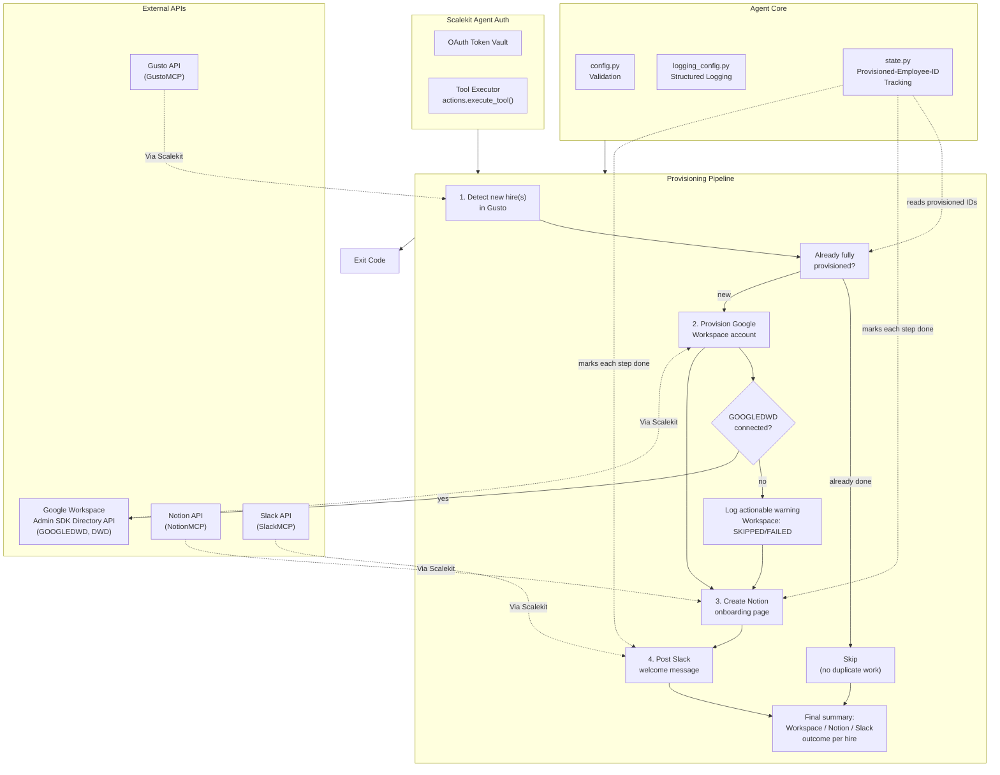

# New Hire Provisioning Agent

**Gusto -> Google Workspace + Notion + Slack**

An agent that runs on behalf of an HR admin: detects a new hire record created in Gusto, provisions a Google Workspace account for them via Domain-Wide Delegation (DWD), creates a Notion onboarding doc from a template/hub page, and posts a welcome message to a shared Slack channel.

All connectors are wired through [Scalekit Agent Auth](https://scalekit.com) using a single `actions.execute_tool()` interface. No token management, no OAuth refresh logic, no credential storage in your code.

**Honesty up front:** Google Workspace provisioning requires additional setup outside this repo (a GCP service account with Domain-Wide Delegation, connected in Scalekit) before that one step will actually run. See [Google Workspace Provisioning](#google-workspace-provisioning-what-you-still-need-to-set-up) below. Gusto, Notion, and Slack are fully working today, verified live against a real Scalekit workspace.

## What It Does

For each new hire detected, the agent runs a four-step pipeline:

| Step | Action | Tool |
|------|--------|------|
| 1 | Detect new hire record(s) in Gusto not yet provisioned | `gustomcp_list_employees`, `gustomcp_get_employee` |
| 2 | Provision a Google Workspace account via Domain-Wide Delegation (optional, degrades gracefully) | GOOGLEDWD (not yet connected in most workspaces, see below) |
| 3 | Create a Notion onboarding page from a template/hub page | `notionmcp_notion-search`, `notionmcp_notion-create-pages` |
| 4 | Post a welcome message to a shared Slack channel | `slackmcp_slack_search_channels`, `slackmcp_slack_send_message` |

**Example:** *"Did we hire anyone new this week?"* -> Gusto is scanned for employees who look like new hires (onboarding incomplete, or a start date near today), a Workspace account is provisioned if set up, an onboarding doc is created in Notion with their role details and a checklist, and the team is welcomed in `#general`.

## Architecture



## Prerequisites

- Python 3.11+
- A [Scalekit](https://scalekit.com) account (free tier works)
- A Gusto company account connected through Scalekit's GustoMCP connector, with at least the ability to read employee records
- A Notion workspace with a page you can share with your Notion integration, to act as the onboarding-docs hub (child pages are created under it, one per new hire)
- A Slack workspace where the connected bot can post to a shared channel (e.g. `#general`)
- **Google Workspace (Domain-Wide Delegation) -- requires additional setup outside this repo.** This is the one piece that will NOT work out of the box:
  1. In Google Cloud Console, create a GCP service account for your Google Workspace domain.
  2. In your Google Workspace Admin Console, enable Domain-Wide Delegation for that service account and authorize it for the Admin SDK Directory API scopes needed to create users (following Google's own documentation for setting up domain-wide delegation of authority for a service account -- this agent does not fabricate a specific walkthrough URL here since none was verified during this build; search Google Workspace Admin help for "domain-wide delegation service account" for the current official steps).
  3. In your Scalekit dashboard, connect the **GOOGLEDWD** connector ("Google Workspace (DWD)") using that service account's credentials.
  4. Only once GOOGLEDWD shows as connected in Scalekit will Step 2 of this agent be able to do real work. Until then, it logs a clear warning and skips, and the rest of the pipeline (Notion + Slack) still runs normally.

  **Verified at build time:** in the Scalekit workspace this repo was built and tested against, GOOGLEDWD showed `setup: not_configured`, had zero connected accounts, and exposed zero discoverable tools via Scalekit's tool catalog (multiple Admin-SDK-style search queries, including `"create user"` and `"users insert directory"`, returned zero GOOGLEDWD results). This means the real Scalekit tool name for "create a Google Workspace user" could not be verified and is NOT guessed anywhere in this codebase. See [Google Workspace Provisioning](#google-workspace-provisioning-what-you-still-need-to-set-up) below.

## Setup

### 1. Install dependencies

```bash
pip install -r requirements.txt
```

### 2. Configure environment

```bash
cp .env.example .env
```

Fill in your credentials. See `.env.example` for all available options.

### 3. Set up Scalekit connectors

In the [Scalekit dashboard](https://scalekit.com), add connections under Agent Auth > Connections: **Gusto** (GustoMCP), **Notion** (NotionMCP), a **Slack** MCP variant (SlackMCP), and optionally **Google Workspace (DWD)** (GOOGLEDWD, see Prerequisites above).

**Gusto**: Complete the OAuth flow for the company you want to provision new hires for. Note: Gusto's OAuth tokens are short-lived in practice -- this was directly observed during this repo's own build and test process (a connection that was `ACTIVE` at the start of a session showed `EXPIRED` less than an hour later, with no automatic silent refresh through the tool-call path). Re-authorize from the Scalekit dashboard (or the authorization link this agent prints in its Step 0 logs) whenever you see this.

**Notion**: Complete the OAuth flow, then share your chosen onboarding-docs hub page with the integration (open the page in Notion, use the "..." menu > Connections > add your integration).

**Slack**: Use an MCP-based Slack connection (send-message tool signatures differ between the plain REST `SLACK` connector and the `SLACKMCP` variant; this agent uses SlackMCP's `channel_id`/`message` parameter names). Complete the OAuth flow with `chat:write` scope (or equivalent MCP scope), and invite the connected bot into whatever channel you configure as `SLACK_WELCOME_CHANNEL` if it isn't already a member.

**Google Workspace (DWD)**: See Prerequisites above. Optional for now.

**Copy the exact connection names** shown in your dashboard into `.env`. Scalekit auto-suffixes these per workspace (e.g. `gustomcp-SoSOMZ20`, `notionmcp-chAb8Lfz`), so the generic provider labels won't work for the Step 0 auth check or for disambiguating `execute_tool()` calls when one identifier has multiple connections of the same provider type. See `GUSTO_CONNECTOR`, `NOTION_CONNECTOR`, `SLACK_CONNECTOR`, `GOOGLE_WORKSPACE_CONNECTOR` in Configuration below.

### 4. Point the agent at your real data

- `HR_ADMIN_EMAIL`: the HR admin this agent runs on behalf of (used in logs/state; Gusto queries themselves are org-wide, all employees in the connected company)
- `NOTION_PARENT_PAGE_ID` (or `NOTION_TEMPLATE_PAGE_ID`): the Notion page onboarding docs get created under, as child pages
- `SLACK_WELCOME_CHANNEL`: a channel like `#general` (resolved to an ID automatically) or a literal channel ID
- `GOOGLE_WORKSPACE_DOMAIN`: the domain used to build each new hire's email address, once Google Workspace provisioning is set up
- `NEW_HIRE_LOOKBACK_DAYS` / `NEW_HIRE_LOOKAHEAD_DAYS`: how wide a start-date window counts as "a new hire" during a scan

### 5. Run

```bash
python run_flow.py
```

## New Hire Detection: Scan vs. Specific Override

By default, this agent **scans** Gusto for employees who look like new hires: anyone whose `onboarded` flag is `false`, or whose `start_date` falls within `[today - NEW_HIRE_LOOKBACK_DAYS, today + NEW_HIRE_LOOKAHEAD_DAYS]`. This mirrors how an HR admin actually thinks about the problem: "did Gusto get a new hire record I haven't handled yet", not "tell me about this one specific person I already know the ID of". Employees already marked fully provisioned in `state.py` are filtered out before any work is attempted, so a normal scan run only ever surfaces real work.

Two optional overrides target one specific person instead, useful for testing or a manual one-off run:

- `NEW_HIRE_EMPLOYEE_ID`: an exact Gusto employee UUID, fetched directly via `gustomcp_get_employee`
- `NEW_HIRE_NAME`: a name substring matched (case-insensitive) against the first 25 employees returned by `gustomcp_list_employees`

If neither is set, the agent scans. If `NEW_HIRE_EMPLOYEE_ID` is set, it takes precedence over `NEW_HIRE_NAME`.

## Google Workspace Provisioning: What You Still Need to Set Up

This mirrors how `performance-review-collector-agent` documented "Airtable's API cannot create a new base, this needs manual setup" and how `deal-room-sync-agent` documented "Google Drive cannot edit doc body content, this needs a workaround": full honesty about what does and does not work today, no overselling.

**What works today:** `connectors.py`'s `GoogleWorkspaceConnector` class has the right shape (a `provision_user(primary_email, first_name, last_name, recovery_email=None)` method), and `run_flow.py` calls it correctly, catches its result gracefully, and reports the outcome accurately in the final per-hire summary.

**What does not work yet, and why:** the method body raises `NotImplementedError` unconditionally. At build time, the Scalekit workspace this agent was verified against had the `GOOGLEDWD` connector ("Google Workspace (DWD)": *"Connect to Google Workspace APIs (Gmail, Drive, Docs, Sheets, Slides, Forms) using a GCP service account with Domain-Wide Delegation for server-to-server authentication without user login"*) present in the catalog but showing `setup: not_configured`, with zero connected accounts and zero discoverable tools returned by Scalekit's tool search across multiple Admin-SDK-style queries. There is no way to verify the real `execute_tool()` tool name for "create a Google Workspace user" without a connected account to test against, so this codebase does not guess one. As a documented reference point only (explicitly NOT a confirmed Scalekit tool name): Google's own Admin SDK Directory API exposes a REST `users.insert` operation for creating a user, which is the underlying operation this method is expected to wrap once the real Scalekit tool name is confirmed.

**To finish this yourself:**
1. Complete the GCP service account + Domain-Wide Delegation setup described in Prerequisites.
2. Connect GOOGLEDWD in your Scalekit dashboard.
3. Use Scalekit's `search_tools(connector="GOOGLEDWD")` (or the equivalent in your Scalekit MCP/dashboard tooling) to find the real, live tool name and parameter shape for user creation.
4. Replace the `raise NotImplementedError(...)` in `GoogleWorkspaceConnector.provision_user()` with the real `self.execute_tool(...)` call, following the exact pattern used by `GustoConnector`/`NotionConnector`/`SlackConnector` in the same file (including the MCP-envelope-unwrapping already handled by the base `Connector` class).
5. Re-run this agent's Step 0 auth check: once GOOGLEDWD shows `ACTIVE`, Step 2 will attempt real provisioning instead of skipping.

**Until then:** every run logs a clear, actionable warning for Step 2 and continues to Notion and Slack. The final summary always reports `Workspace: SKIPPED` (or `FAILED`, if GOOGLEDWD is connected but the call errors) rather than silently omitting the step or claiming full success.

## Configuration

Environment variables (set in `.env`):

| Variable | Default | Notes |
|----------|---------|-------|
| `SCALEKIT_ENV_URL` | - | Required: your Scalekit workspace URL |
| `SCALEKIT_CLIENT_ID` | - | Required: Scalekit client ID |
| `SCALEKIT_CLIENT_SECRET` | - | Required: Scalekit client secret |
| `GUSTO_USER` | - | Required: identity used to authorize Gusto |
| `NOTION_USER` | - | Required: identity used to authorize Notion |
| `SLACK_USER` | - | Required: identity used to authorize Slack |
| `GOOGLE_WORKSPACE_USER` | (empty) | Identity for Google Workspace auth checks. Leave unset to have Step 2 skip cleanly every run |
| `GUSTO_CONNECTOR` | `gustomcp-SoSOMZ20` | Exact connection name from the Scalekit dashboard |
| `NOTION_CONNECTOR` | `notionmcp-chAb8Lfz` | Exact connection name |
| `SLACK_CONNECTOR` | `slackmcp` | Exact connection name; must be an MCP-variant Slack connection |
| `GOOGLE_WORKSPACE_CONNECTOR` | `googledwd` | Exact connection name once GOOGLEDWD is connected |
| `HR_ADMIN_EMAIL` | - | Required: HR admin this agent runs on behalf of |
| `NEW_HIRE_EMPLOYEE_ID` | (empty) | Optional: target one specific Gusto employee UUID instead of scanning |
| `NEW_HIRE_NAME` | (empty) | Optional: target one specific employee by name substring instead of scanning |
| `NOTION_PARENT_PAGE_ID` / `NOTION_TEMPLATE_PAGE_ID` | - | Required (either one): Notion page onboarding docs are created under |
| `SLACK_WELCOME_CHANNEL` | `#general` | Channel name (resolved to an ID) or a literal channel ID |
| `GOOGLE_WORKSPACE_DOMAIN` | (empty) | Domain for constructing new hire email addresses, e.g. `yourcompany.com` |
| `NEW_HIRE_LOOKBACK_DAYS` | `14` | How many days in the past a start_date can be and still count as a new hire |
| `NEW_HIRE_LOOKAHEAD_DAYS` | `30` | How many days in the future a start_date can be and still count as a new hire |
| `POLLING_MODE` | `false` | Enable continuous polling |
| `POLL_INTERVAL_MINUTES` | `60` | Minutes between polling cycles |
| `LOG_LEVEL` | `INFO` | `DEBUG`, `INFO`, `WARNING`, `ERROR` |

## Usage

### One-Time Mode (Default)

Scan Gusto once, provision any new hires found, and exit:

```bash
python run_flow.py
```

Ideal for cron jobs, CI/CD pipelines, manual runs, or serverless functions. New hires don't arrive continuously, so an hourly or daily cron entry is a reasonable default:

```bash
0 * * * * cd /path/to/agent && python run_flow.py   # hourly
```

### Continuous Mode (Polling)

Run indefinitely, re-scanning on an interval (default: hourly):

```bash
POLLING_MODE=true POLL_INTERVAL_MINUTES=60 python run_flow.py
```

Press `Ctrl+C` to stop gracefully. The agent finishes the current hire (or stops before starting the next one) and exits with code `130`, never leaving a half-created Notion page or a partially-posted Slack message unaccounted for in state.

## Exit Codes

| Code | Meaning | Use Case |
|------|---------|----------|
| `0` | Success | No new hires found (normal), or one or more new hires were processed with at least one step succeeding |
| `1` | Error | Config missing, provisioning check failed (Gusto unreachable or Notion parent page unreachable), or 5 consecutive polling errors |
| `2` | Nothing provisioned | New hire(s) were found but every step failed for every one of them this run |
| `130` | Interrupted | Graceful shutdown via Ctrl+C or SIGTERM |

## Monitoring

### Logging

Structured logs with timestamps, levels, and auto-redacted secrets (including the `skc_` Scalekit client ID pattern):

```bash
python run_flow.py                    # all logs
LOG_LEVEL=ERROR python run_flow.py     # errors only
LOG_LEVEL=DEBUG python run_flow.py     # verbose
```

Log levels:
- `DEBUG`: detailed execution flow, Scalekit client initialization
- `INFO`: key milestones, connector auth status, per-hire step outcomes, Notion/Slack writes
- `WARNING`: auth issues, Google Workspace not configured, missing employee fields, already-provisioned skips
- `ERROR`: unrecoverable failures for a single step, missing config

### Polling Loop

```bash
POLLING_MODE=true POLL_INTERVAL_MINUTES=30 python run_flow.py   # check every 30 minutes
# Ctrl+C stops after the current hire finishes, exit code 130
```

### State

`state.py` tracks which of the three provisioning steps (`workspace`, `notion`, `slack`) have succeeded for each Gusto employee ID, in `state/provisioned_employees.json`. This is a processed-ID-set design, not a content fingerprint: "has this specific new hire already been onboarded" is a one-time boolean per person, not a moving target to diff against (see the design-choice docstring at the top of `state.py` for the full reasoning, including why this agent deliberately does NOT reuse `revenue-forecast-commentary-agent`'s fingerprint pattern).

Each step is tracked independently. An employee whose Notion doc and Slack welcome succeeded but whose Google Workspace account is still pending (because GOOGLEDWD wasn't connected yet) is **not** marked fully provisioned, and will be correctly re-surfaced by the next scan to retry just the missing step, without re-creating a duplicate Notion page or re-posting a duplicate Slack welcome (`upsert_onboarding_page`'s title search and the per-step state check both guard against that independently).

```bash
rm -f state/provisioned_employees.json   # reset, e.g. to force re-provisioning for testing
```

## Error Handling & Edge Cases

- **New hire already provisioned**: `state.py` marks each of the three steps independently as they succeed. A second run for the same employee ID skips any already-completed step with a clear log line (`"... already created for this hire, skipping"`) and never creates a duplicate Notion page or re-posts a duplicate Slack welcome. Verified with a real two-run test against live Notion and Slack (see below).
- **No new hires found in Gusto**: a normal, non-error outcome. The cycle logs `"No new hires found to provision this cycle"` and the process exits `0`.
- **Google Workspace account provisioning fails or GOOGLEDWD is unauthorized/not configured**: logged as a clear, actionable warning (or error, if GOOGLEDWD is connected but the call itself errors) for just that step; Notion and Slack still run for the same hire. The final per-hire summary always states each step's real outcome (e.g. `Workspace: SKIPPED, Notion: OK, Slack: OK`), never silently claiming full success when Workspace provisioning didn't happen.
- **Notion parent/template page not found or not shared with the integration**: `provisioning.py`'s Step 0.5 check fails fast with exit code `1` and an explicit instruction to share the page with the integration and confirm the page ID, before any Gusto scanning or Slack posting happens for the whole run.
- **Slack channel not found or bot not a member**: logged as an error for that hire's Step 4 specifically; if Notion already succeeded for that hire, it stays succeeded (state.py already marked it), and other hires in the same run are unaffected.
- **Employee record missing required fields (e.g. no start date, no job title)**: `aggregator.py`'s `extract_onboarding_fields()` never raises on a missing field. Each missing field is collected into a `warnings` list, shown as `"Not yet set in Gusto"` in the generated Notion doc and omitted gracefully from the Slack message's sentence structure, and a summary warning is logged listing exactly what was incomplete about the source record.
- **Gusto connector token expired mid-session**: observed directly during this repo's own build/test process (a connection that was ACTIVE became EXPIRED less than an hour later). `provisioning.py`'s Step 0.5 check catches this and fails fast with an actionable message pointing at re-authorization, rather than a confusing raw 401 traceback.
- **Gusto connector never configured at all (RESOURCE_NOT_FOUND)**: distinguished from "configured but expired/broken" via a dedicated `ConnectorUnavailableError`, logged as "not configured" rather than a generic failure.
- **Malformed/corrupted state file**: detected and treated as empty (fresh start) rather than crashing.
- **Ctrl+C / SIGTERM mid-cycle**: the in-flight hire finishes its current step (or the loop stops before the next hire) and the process exits `130`; no partial state is marked as a completed step it didn't actually finish.

## Troubleshooting

| Issue | Solution |
|-------|----------|
| `ModuleNotFoundError: scalekit` | Run `pip install -r requirements.txt` |
| `Missing required config: ...` | Run `cp .env.example .env` and fill in your values |
| `connector (...) -- EXPIRED` / `PENDING_AUTH` | Open the auth link printed in logs, or re-authorize in the Scalekit dashboard. Gusto tokens were observed to expire in well under an hour during this agent's own testing -- this is a known, expected occurrence, not a bug |
| `connector (...) -- NOT CONFIGURED` | Expected for Google Workspace until you complete the DWD setup in Prerequisites; unexpected for Gusto/Notion/Slack, meaning that connection doesn't exist in your Scalekit workspace at all yet |
| `multiple connected accounts found for identifier` | Set the exact `*_CONNECTOR` env var for that provider; the same identifier is connected to more than one connection of that type in your workspace |
| `Cannot query Gusto employees` | Confirm `GUSTO_CONNECTOR` points at an ACTIVE Gusto connection; re-authorize if the message mentions "token expired" or "reauthentication required" |
| `Could not verify Notion connectivity for parent page` | Share the page with your Notion integration (page's "..." menu > Connections in Notion) and confirm `NOTION_PARENT_PAGE_ID` is the correct ID from the page URL |
| `Could not resolve Slack channel '...'` | The channel name search returned no results; double-check spelling, confirm the bot is a member, or use a literal channel ID (`C...`) instead |
| Google Workspace always shows `SKIPPED` | Expected until GOOGLEDWD is connected in your Scalekit dashboard and `GoogleWorkspaceConnector.provision_user()` is implemented against its real, verified tool name -- see [Google Workspace Provisioning](#google-workspace-provisioning-what-you-still-need-to-set-up) |
| New hire not detected by the scan | Check `NEW_HIRE_LOOKBACK_DAYS`/`NEW_HIRE_LOOKAHEAD_DAYS` cover their start_date, or that Gusto's `onboarded` flag for them is actually `false`; otherwise target them directly with `NEW_HIRE_EMPLOYEE_ID` |
| `No colored output` | Colors auto-disable when output is piped; force with `FORCE_COLOR=1` |

## Deployment

This agent is stateless aside from the local `state/provisioned_employees.json` file, so deployment is straightforward:

- **Cron / scheduled task**: the simplest option for a hourly/daily new-hire check. Ensure the `state/` directory persists between runs (same machine, or a shared volume/bucket if running on ephemeral compute) so the duplicate-prevention guard keeps working across runs.
- **Serverless (e.g. AWS Lambda, Cloud Run Jobs)**: works for the one-time mode; persist `state/provisioned_employees.json` to durable storage between invocations (e.g. S3/GCS) rather than relying on ephemeral local disk, or the same new hire could be re-provisioned on every cold invocation.
- **Long-running process / container**: use `POLLING_MODE=true` for continuous operation; the graceful-shutdown handling (SIGINT/SIGTERM -> exit `130`) makes this safe to run under a process supervisor or container orchestrator that sends `SIGTERM` on redeploy.

## Production Checklist

- [ ] Gusto, Notion, and Slack connectors are ACTIVE in your Scalekit dashboard, with the exact connection names set in `.env`
- [ ] Notion parent/hub page is shared with your Notion integration
- [ ] Slack bot is a member of `SLACK_WELCOME_CHANNEL`
- [ ] `state/provisioned_employees.json` is on durable, persistent storage for your deployment target
- [ ] `NEW_HIRE_LOOKBACK_DAYS`/`NEW_HIRE_LOOKAHEAD_DAYS` match how far in advance your company typically creates Gusto records relative to actual start dates
- [ ] **Google Workspace provisioning requires additional setup outside this repo, see [Prerequisites](#prerequisites)** -- do not treat this checklist item as done until GOOGLEDWD is connected in Scalekit AND `GoogleWorkspaceConnector.provision_user()` has been implemented against its real, verified tool name. Until then, this agent is fully production-ready for Notion + Slack onboarding, with Google Workspace intentionally degraded to a clear "not yet set up" skip on every run.
