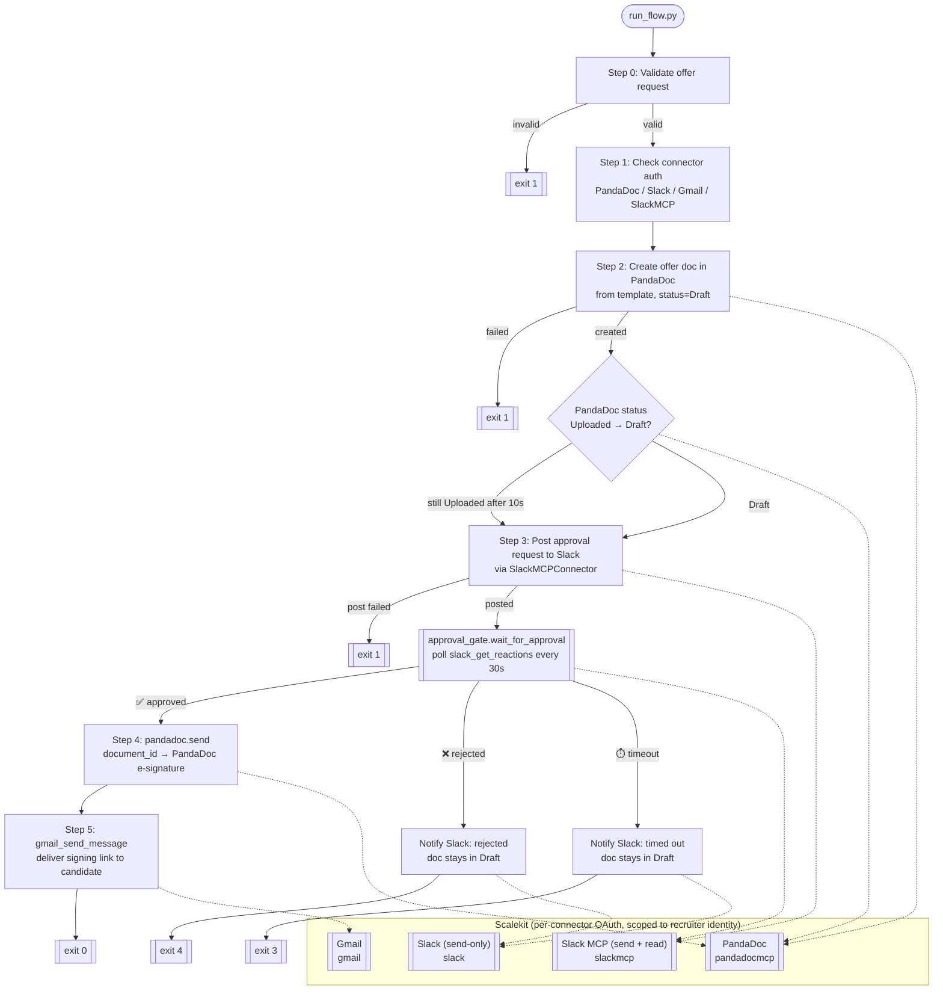

# Offer Letter & Comp Routing Agent

Drafts an offer letter in PandaDoc, **blocks on real approval from the hiring
manager in Slack**, then sends it to the candidate for e-signature and emails
them the signing link. All connectors are authorized through **Scalekit**,
scoped to the recruiter's own identity. There is no shared "HR bot" account:
every API call is made as the recruiter who ran the agent.

## What this actually does (plain-English walkthrough)

Run one command with a candidate's details, and the agent does this in
sequence:

1. **Validates your input.** Before touching any API, it checks the email
   looks like an email, the salary looks like a number, and the start date is
   a real date in the future. Bad input is rejected immediately — nothing
   partially executes.
2. **Creates the offer document in PandaDoc** from your company's reviewed
   template, filled in with the candidate's name, role, salary, and start
   date. The document is left in **Draft** — nothing is sent yet.
3. **Posts an approval request to the hiring manager in Slack, and blocks.**
   The agent actively polls for a ✅ or ❌ reaction on that message (every 30s,
   up to 30 minutes by default) before doing anything the candidate would
   see. This is a real gate, not a courtesy notification — the send in step 4
   only happens after approval.
4. **If approved:** sends the document to the candidate for e-signature via
   PandaDoc, then emails the candidate the actual signable link.
   **If rejected:** stops. The document stays in Draft in PandaDoc; the
   candidate never hears anything. **If the manager doesn't respond in time:**
   stops the same way, and posts a timeout notice back to Slack.

Nothing here is a chatbot — it's a scripted pipeline you run once per offer
(by hand, from a form, or from a recruiting-system webhook). Step 3's polling
does mean the process stays running and blocked until someone reacts (or it
times out) — it isn't a fire-and-forget script.

Set `REQUIRE_APPROVAL=false` to skip the gate entirely and go back to
notify-only behavior (post to Slack, send regardless) — useful if you don't
have the SLACKMCP connector set up (see below) or don't want a blocking step.

## Architecture

Small, single-purpose connector classes, a settings module that validates
config before anything runs, and structured logging throughout.



- `PandaDocConnector` — create_from_template(), send(), get_status(), get_details()
- `SlackConnector` — send-only (the plain Slack connector); format_approval_request(), format_sent_notification()
- `SlackMCPConnector` — send AND read-back (reactions) via the separate SlackMCP connector; required for the approval gate
- `approval_gate.wait_for_approval()` — pure polling loop, clock injected for testability (no real sleeps in tests)
- `send_message()` (Gmail) — stateless function wrapper around `gmail_send_message`
- `validate_offer_request()` — fail-fast input validation with human-readable errors
- `run_flow.py` — orchestrates Step 0–5: validate → auth → create doc → approval gate → send → email

| File | Purpose |
|------|---------|
| `run_flow.py` | Main pipeline |
| `settings.py` | Centralized config + fail-fast validation |
| `validation.py` | Input validation & salary/date normalization |
| `approval_gate.py` | Blocking poll-for-reaction logic |
| `logging_config.py` | Structured, colorized logging (auto-disables color outside a TTY) |
| `auth.py` | Scalekit connector authorization checks + token fetch |
| `connectors/pandadoc.py` | PandaDoc document lifecycle |
| `connectors/slack.py` | Slack send-only (approval requests, notifications) |
| `connectors/slack_mcp.py` | Slack send + read-back (reactions) for the approval gate |
| `connectors/gmail.py` | Gmail delivery to the candidate |
| `test_edge_cases.py` | 58 offline tests (validation, connector formatting, approval-gate timing, failure paths) |

## Real Scalekit connectors used

Verified against Scalekit's live connector catalog **and** actually exercised
against the live PandaDoc/Slack/Gmail APIs (not just read from the catalog —
see "Known limitations" for where the catalog and the live servers disagreed):

| Connector | Identifier | Tools used |
|---|---|---|
| PandaDoc | `pandadocmcp` | `documents_create`, `documents_send`, `documents_status_get`, `documents_details_get` |
| Slack (send-only) | `slack` | `slack_send_message` |
| Slack MCP (send + read) | `slackmcp` | `slack_send_message`, `slack_get_reactions` |
| Gmail | `gmail` | `gmail_send_message` |

## Setup

```bash
cp .env.example .env        # fill in your credentials
pip install -r requirements.txt
```

Fill in `.env`:

- `SCALEKIT_ENV_URL`, `SCALEKIT_CLIENT_ID`, `SCALEKIT_CLIENT_SECRET` — from
  app.scalekit.com → Settings → API Credentials.
- `RECRUITER_USER` — the identity the agent acts on behalf of. Per-connector
  overrides (`PANDADOC_USER`, `SLACK_USER`, `GMAIL_USER`, `SLACKMCP_USER`)
  exist because in practice the same person can end up authorized under
  *different* identifier strings per connector (see "Known limitations" —
  this bit us during setup). Check Scalekit's dashboard → Connections →
  (your connector) → Connected Accounts to see which identifier is actually
  `Connected` before assuming an email address will just work.
- `PANDADOC_TEMPLATE_UUID` — **required.** See "PandaDoc template setup" below.
- `SLACK_HIRING_MANAGER_ID` and/or `SLACK_APPROVALS_CHANNEL` — where approval
  requests are routed. Set at least one.
- `SLACKMCP_USER` / `SLACKMCP_CONNECTOR` — required if `REQUIRE_APPROVAL=true`
  (the default). See "Approval gate setup" below.
- `COMPANY_NAME` — used in the offer letter and emails.

### PandaDoc template setup (required)

PandaDoc's live MCP server does not currently implement Markdown-based
document creation (`documents_create_from_markdown` returns "Unknown tool" —
confirmed 2026-07-15), so a real template is the only working path.

1. In PandaDoc, go to **Templates** (not Documents — the two are different
   resource types in PandaDoc's API; a regular document's ID will be
   rejected with "Template is not available" if used here).
2. Build your offer letter template. Add template tokens named exactly:
   `candidate_name`, `role_title`, `base_salary`, `start_date`, `company_name`.
3. Add a recipient role. **PandaDoc's own default role name is `Client`**, not
   `Signer` — use whatever role name your template actually has and set
   `PANDADOC_RECIPIENT_ROLE` to match if it's not `Client`.
4. Copy the template UUID from the template's URL and set
   `PANDADOC_TEMPLATE_UUID` in `.env`.

### Approval gate setup

Reading a Slack reaction back requires the **SlackMCP** connector — a
different connection from the plain **Slack** connector used to send
messages. The plain Slack connector can only send; it has no tool to read
reactions, threads, or channel history back.

1. In Scalekit dashboard → Connections → Add Connection → search "Slack MCP" → Enable.
2. Authorize it for the recruiter's identity (normal Slack OAuth click).
3. Set `SLACKMCP_CONNECTOR` (the connection name Scalekit gave it) and
   `SLACKMCP_USER` in `.env`.

If you don't want to set this up, set `REQUIRE_APPROVAL=false` — the agent
falls back to posting a notification (not a gate) and sends the offer
immediately, same as before this feature existed.

## Usage

```bash
python run_flow.py \
  --candidate-first Alex \
  --candidate-last Chen \
  --email alex.chen@example.com \
  --role "Staff Engineer" \
  --salary 180000 \
  --start-date 2026-08-03
```

`--salary` accepts `180000`, `180k`, or `$180,000` — all normalize to
`$180,000`. `--start-date` must be `YYYY-MM-DD` and in the future.

Optional: `--hiring-manager <slack_user_id>` to route this specific offer to
a different manager than the default in `.env`.

`python run_flow.py --help` works without any `.env` configured.

With `REQUIRE_APPROVAL=true` (the default), the process **blocks** at Step 3
until someone reacts in Slack or the timeout elapses — plan for that when
running it (e.g. don't run it somewhere that gets killed after a few seconds).


## Error handling

- **Fail-fast:** missing `.env` vars, unreachable Scalekit environment, or
  invalid candidate input → logged clearly, exit code `1`.
- **Aborts the flow:** PandaDoc document creation failing, or (with the
  approval gate on) failing to post the approval request at all.
- **Stops cleanly on reject/timeout:** exit code `4` if the hiring manager
  reacts ❌, exit code `3` if the timeout elapses with no reaction — in both
  cases the document stays in Draft in PandaDoc and the candidate is never
  contacted.
- **Degrades gracefully:** if `documents_send` fails after approval, the
  document still exists as a draft in PandaDoc (recoverable manually).

## Exit codes

- `0` — Success (offer sent to candidate)
- `1` — Error (missing config, invalid input, Scalekit unreachable, document
  creation failed, unhandled exception)
- `3` — Approval timed out — offer NOT sent
- `4` — Approval rejected — offer NOT sent
- `130` — Interrupted by user (Ctrl+C)

## Troubleshooting

| Symptom | Cause | Fix |
|---|---|---|
| Document is created but fields like name/salary/date are blank in PandaDoc | The template's token names don't match what the agent sends | Open the template in PandaDoc's editor and rename tokens to exactly: `candidate_name`, `role_title`, `base_salary`, `start_date`, `company_name` (case-sensitive, no spaces). A mismatched or missing token is silently left blank by PandaDoc — it does not error. |
| `Template is not available` | `PANDADOC_TEMPLATE_UUID` points to a regular **document**, not a **template** | PandaDoc's API treats Templates and Documents as separate resource types. Go to PandaDoc → **Templates** tab specifically, open your template, and copy the UUID from that URL — not from a document you created "from" a template. |
| `Role 'X' does not exist` | `PANDADOC_RECIPIENT_ROLE` doesn't match a role actually defined on the template | Open the template in PandaDoc's editor, check the exact recipient role name it uses (PandaDoc's own default is `Client`, not `Signer`), and set `PANDADOC_RECIPIENT_ROLE` in `.env` to match. |
| `Unknown tool: 'documents_create_from_markdown'` | PandaDoc's live MCP server doesn't implement this tool, even though Scalekit's catalog lists it | Not fixable on our side — a real `PANDADOC_TEMPLATE_UUID` is required; there's no template-free fallback (see "Known limitations"). |
| `multiple connected accounts found for identifier` | Scalekit found more than one connected account with that identifier across connections for a connector, because `connection_name` wasn't passed to `execute_tool` | Already fixed in every connector file (`connection_name=` is always passed) — if you added a new connector call and hit this, you're missing that parameter. As a workaround, check Scalekit dashboard → Connections → (connector) → Connected Accounts for the exact identifier string that shows `Connected`, and set the matching `*_USER` env var to that exact string. |
| Agent hangs at "Waiting up to Ns for a reaction" | This is expected — `REQUIRE_APPROVAL=true` blocks until someone reacts | React ✅/❌ on the message in Slack, or wait for the timeout, or set `REQUIRE_APPROVAL=false` to skip the gate. |
| `run_flow.py --help` fails with missing env var errors | An older version parsed settings before argparse | Already fixed — `parse_args()` runs before `_init()`. If you still see this, you're on a stale copy of `run_flow.py`. |
| Scalekit connection fails with a raw traceback instead of a clean error | An older version didn't wrap `ScalekitClient(...)` construction in try/except | Already fixed in `_init()` — check `SCALEKIT_ENV_URL`, `SCALEKIT_CLIENT_ID`, `SCALEKIT_CLIENT_SECRET` if you see this. |
| `nested venv` / `ensurepip` / `ValueError: failed to parse CPython sys.version` on `pip install` | A venv was created while an Anaconda/conda environment was already activated in the shell | Deactivate all shells (`conda deactivate`, `deactivate`) first, then create the venv directly from a Homebrew/system Python, e.g. `/opt/homebrew/bin/python3.13 -m venv .venv`. |

