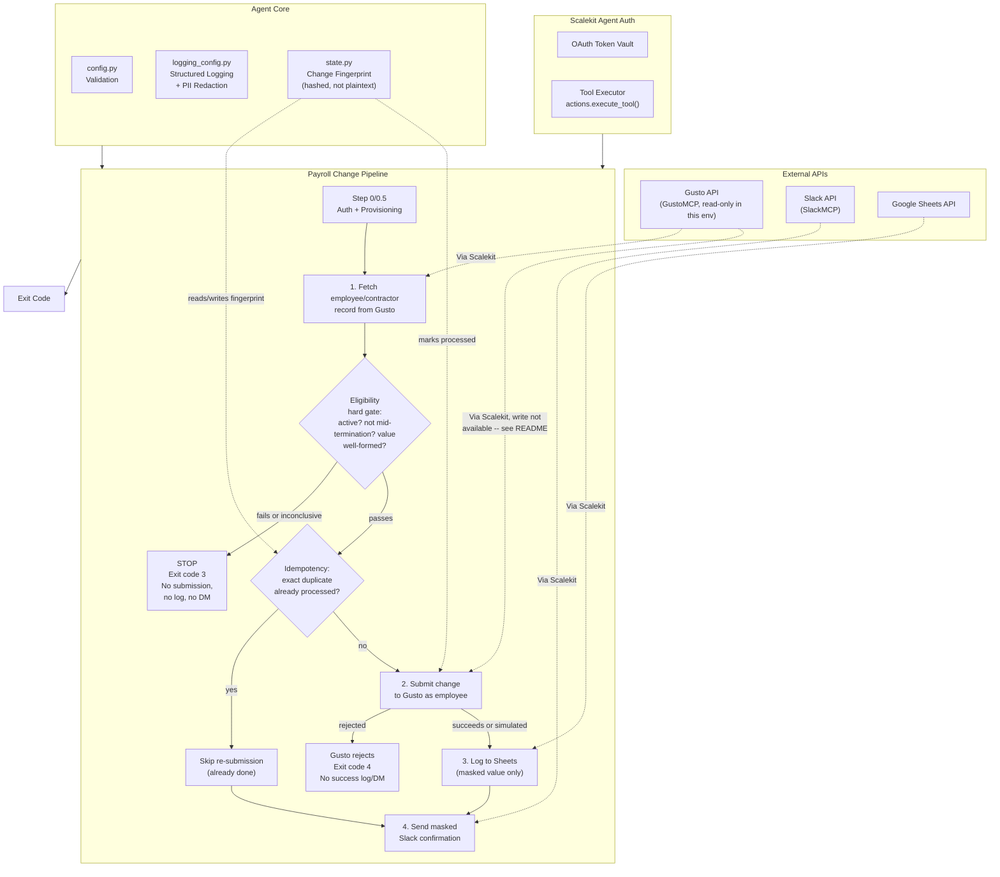

# Payroll Change Request Agent

**Gusto (verify + eligibility) -> Gusto (submit) -> Google Sheets + Slack**

This agent runs on behalf of an employee to submit a payroll or bank/direct-deposit
detail change. It verifies the employee's record and change eligibility in Gusto as a
hard gate, submits the change as that employee, logs the change to Google Sheets with
the sensitive new value masked, and sends a confirmation Slack DM to the employee.

Scalekit Agent Auth handles OAuth for all three connectors: token storage, refresh,
and every API call go through `actions.execute_tool()`. No manual token management, no
direct API imports, no credential storage in code.

This agent handles some of the most sensitive data any agent in this workspace
touches: bank account numbers, routing numbers, and payroll details. Read the
**Data Handling & Security** section below before deploying this anywhere near real
employee data.

## What It Does

| Step | Action | Tool |
|------|--------|------|
| 0 / 0.5 | Check connector auth, verify Sheets tab exists | `get_or_create_connected_account`, `googlesheets_add_sheet` |
| 1 | Fetch employee/contractor record, run the eligibility hard gate | `gustomcp_list_employees`, `gustomcp_list_contractors`, `gustomcp_get_employee`, `gustomcp_get_contractor` |
| 2 | Submit the payroll/bank-detail change as the employee (gated on Step 1 passing) | Gusto write tool (not currently exposed in this Scalekit environment, see below) |
| 3 | Log the change to Google Sheets, masked | `googlesheets_append_values` |
| 4 | Send a masked confirmation Slack DM to the employee | `slackmcp_slack_search_users`, `slackmcp_slack_send_message` |

**Example:** People Ops sets `EMPLOYEE_EMAIL=jane@company.com`, `CHANGE_TYPE=routing_number`,
`NEW_VALUE=<jane's new routing number>` and runs the agent. It confirms Jane is active,
not mid-termination, and has completed onboarding; validates the routing number's
format and checksum; submits the change; logs a masked row to the audit sheet; and DMs
Jane a masked confirmation.

## Architecture



The eligibility gate is drawn as a diamond because it is a real conditional that can
stop the entire pipeline before any write is attempted: `GATE -->|fails or
inconclusive| STOP` is not a warning path, it is a hard, exit-code-distinct stop (see
Exit Codes below).

## Prerequisites

- Python 3.9+
- A Scalekit workspace (Agent Auth) with connected accounts for:
  - **Gusto**, via the GustoMCP connector variant (`GUSTOMCP`)
  - **Slack**, via the SlackMCP connector variant (`SLACKMCP`) -- the plain `SLACK`
    connector commonly sits in `PENDING_AUTH` and is not used by this agent
  - **Google Sheets** (`GOOGLESHEETS`)
- An existing Google Sheet to log changes into (this agent auto-creates the *tab*
  inside it, not the spreadsheet itself; see Setup step 4)
- An existing Gusto company with the employee/contractor record you intend to change

**Data flow note:** this agent makes no calls to any LLM or third-party AI service.
The only network calls are to Scalekit (`hey.scalekit.dev` or your workspace's env
URL), which brokers the underlying Gusto/Slack/Google Sheets API calls. No payroll or
bank data leaves your Scalekit workspace's own connector calls.

## Setup

### 1. Install dependencies

```bash
pip install -r requirements.txt
```

### 2. Configure environment

```bash
cp .env.example .env
# fill in your real credentials and employee/change details
```

### 3. Set up Scalekit connectors

In your Scalekit dashboard, under Agent Auth > Connections, connect:
- **GustoMCP**: authorize with a Gusto account that has read access to the company's
  employees/contractors (`employees:read`, `contractors:read`, `compensations:read`
  scopes at minimum).
- **SlackMCP**: authorize with a workspace member who can search users and send DMs.
- **GoogleSheets**: authorize with a Google account that has edit access to your
  destination spreadsheet.

Copy the exact connection names shown in your dashboard into `GUSTO_CONNECTOR`,
`SLACK_CONNECTOR`, and `GOOGLE_SHEETS_CONNECTOR` in your `.env`. Scalekit often
auto-suffixes these per workspace (e.g. `gustomcp-SoSOMZ20`, `googlesheets-BOzvgKS0`)
-- the defaults in `.env.example` are this build's own workspace values and are
unlikely to match yours exactly.

### 4. Point the agent at your real data

- `EMPLOYEE_EMAIL`: the employee whose Gusto record this run is about.
- `EMPLOYEE_GUSTO_ID` (optional): skip the email lookup if you already know the
  Gusto UUID.
- `EMPLOYEE_RECORD_TYPE` (optional): `employee` or `contractor`, as a hint. Leave
  blank to let the agent try employee first, then fall back to contractor.
- `CHANGE_TYPE` / `NEW_VALUE`: the structured change being requested (see
  Configuration table below).
- `GOOGLE_SHEETS_SPREADSHEET_ID`: an existing spreadsheet's ID (from its URL). There
  is no tool to create a spreadsheet from scratch as part of this agent's normal
  flow (see Provisioning below) -- create one manually first.

### 5. Run

```bash
python run_flow.py
```

## Provisioning vs. Eligibility: Two Different Gates

This agent has two distinct kinds of checks that are easy to conflate, so they are
kept in separate modules on purpose:

- **`provisioning.py`** (Step 0.5): "does the setup/infrastructure work at all?" Is the
  Gusto connector reachable? Does the Sheets tab exist (creating it if not)? A
  provisioning failure is a setup problem (wrong spreadsheet ID, connector not
  authorized) and returns exit code 1.
- **`aggregator.py`'s `check_employee_eligibility()`** (Step 1, a hard business-logic
  gate): "should THIS employee's THIS specific change be allowed to proceed right
  now?" Is the employee active? Not mid-termination? Onboarding complete? Is the new
  value well-formed? A failure here is a correct, expected business decision, not an
  infrastructure problem, and returns its own distinct exit code (3).

Google Sheets has a `googlesheets_create_spreadsheet` tool in Scalekit's catalog, but
this agent's default flow does not depend on it: auto-creating a brand-new spreadsheet
on every misconfigured run would scatter a sensitive payroll-change audit trail across
many spreadsheets. You create ONE spreadsheet manually, put its ID in
`GOOGLE_SHEETS_SPREADSHEET_ID`, and `provisioning.py` auto-creates/manages the TAB
within it on every run.

## Usage

### One-Time Mode (Default)

```bash
python run_flow.py
```

Processes exactly one payroll-change request (as configured by `EMPLOYEE_EMAIL`,
`CHANGE_TYPE`, `NEW_VALUE`) and exits. Ideal for a People Ops-triggered workflow, a
form-submission webhook handler, or a manual one-off run -- this agent is not designed
to poll continuously, since a payroll-change request is a discrete, one-at-a-time
event, not a recurring digest.

```bash
# Example: trigger from a script per incoming form submission
EMPLOYEE_EMAIL=jane@company.com CHANGE_TYPE=routing_number NEW_VALUE=011401533 python run_flow.py
```

### Simulated Submission Mode (Safety / Testing)

```bash
SIMULATE_SUBMISSION=true python run_flow.py
```

Runs the entire pipeline, including a clearly-labeled `SIMULATED` Step 2, without
calling any real Gusto write tool. Useful for validating the eligibility gate,
masking, idempotency, Sheets logging, and Slack confirmation end to end without any
live financial write. This is also the ONLY way to see a `0` (success) exit code from
Step 2 in the current Scalekit environment for this workspace, since no Gusto write
tool is exposed here (see Data Handling & Security).

## Configuration

| Variable | Default | Notes |
|----------|---------|-------|
| `SCALEKIT_ENV_URL` | - | Your Scalekit workspace environment URL |
| `SCALEKIT_CLIENT_ID` | - | Scalekit client ID (`skc_...`) |
| `SCALEKIT_CLIENT_SECRET` | - | Scalekit client secret (`test_...` in dev) |
| `GUSTO_USER` | - | Identifier for the Gusto connected account (usually the People Ops operator's email) |
| `SLACK_USER` | - | Identifier for the Slack connected account |
| `GOOGLE_SHEETS_USER` | - | Identifier for the Google Sheets connected account |
| `GUSTO_CONNECTOR` | `gustomcp-SoSOMZ20` | Exact Gusto connection name from your Scalekit dashboard |
| `SLACK_CONNECTOR` | `slackmcp` | Exact SlackMCP connection name |
| `GOOGLE_SHEETS_CONNECTOR` | `googlesheets-BOzvgKS0` | Exact Google Sheets connection name |
| `EMPLOYEE_EMAIL` | - | The employee whose record is being read/changed and who receives the Slack DM |
| `EMPLOYEE_GUSTO_ID` | (blank) | Optional: skip the email->UUID lookup |
| `EMPLOYEE_RECORD_TYPE` | (blank) | Optional hint: `employee` or `contractor` |
| `EMPLOYEE_SLACK_ID` | (blank) | Optional: skip the email->Slack-ID lookup |
| `CHANGE_TYPE` | - | One of `bank_account`, `routing_number`, `pay_rate`, `compensation` |
| `NEW_VALUE` | - | The new value for `CHANGE_TYPE`. Never logged, never stored, in full -- see Data Handling & Security |
| `GOOGLE_SHEETS_SPREADSHEET_ID` | - | Must already exist |
| `GOOGLE_SHEETS_TAB_NAME` | `Payroll Change Log` | Auto-created if missing |
| `SIMULATE_SUBMISSION` | `false` | When `true`, Step 2 simulates rather than calling a real Gusto write |
| `LOG_LEVEL` | `INFO` | `DEBUG` / `INFO` / `WARNING` / `ERROR` |

## Exit Codes

| Code | Meaning | Use Case |
|------|---------|----------|
| `0` | Success | Change submitted (or simulated) and eligibility passed, or an exact-duplicate resubmission was correctly skipped |
| `1` | Error | Config missing/invalid, provisioning failed (Sheets destination unreachable), or an unexpected exception |
| `2` | No data | The employee has no matching record in Gusto at all (neither employee nor contractor) |
| `3` | Eligibility gate failed | The employee record exists but this specific change was correctly and deliberately refused (inactive, mid-termination, onboarding incomplete, malformed new value, or inconclusive data). See "Why a distinct exit code" below |
| `4` | Submission failed | Gusto rejected the change for a policy reason not caught by this agent's own eligibility check, OR no Gusto write tool is available in this Scalekit environment and `SIMULATE_SUBMISSION` was not set |
| `130` | Interrupted | Ctrl+C or SIGTERM |

### Why a distinct exit code for the eligibility gate (3), separate from "no data" (2)

Exit code `2` means "there was nothing to evaluate at all" (no employee record
exists). Exit code `3` means "the employee record exists, but this specific change
was correctly and deliberately refused". These are operationally different: a
monitoring setup should treat `3` as expected and frequent (people ops staff will
trigger this regularly for employees on leave, mid-termination, or with a typo'd
routing number, and it is not a bug), while `1` and `2` usually indicate a real setup
problem worth paging someone about. Folding the eligibility refusal into exit code `2`
would make "there's no record" indistinguishable from "there's a record but we
correctly said no" from the exit code alone, which defeats the purpose of a hard gate
that must be loud and distinct, not just another flavor of "no data". Exit code `4` is
kept separate again from `3`: `3` means "we refused to even try", `4` means "we tried
(or would have tried, and could not) and the attempt itself did not succeed" -- a
meaningfully different failure mode for anyone triaging a failed run.

## Monitoring

### Logging

```bash
python run_flow.py                    # INFO level (default)
LOG_LEVEL=DEBUG python run_flow.py    # verbose, includes Scalekit client init details
LOG_LEVEL=WARNING python run_flow.py  # quiet, only warnings/errors
```

Log levels:
- `DEBUG`: Scalekit client init, state file load details
- `INFO`: step-by-step progress, `[OK]` confirmations
- `WARNING`: connector not authorized, duplicate submission detected, Slack DM failed
  after an otherwise-successful change, tab auto-created
- `ERROR`: eligibility gate failed, employee not found, Gusto rejected the submission,
  Sheets audit log write failed after a successful change

### State

The idempotency state file lives at `state/processed_changes.json`. It stores a
SHA-256 fingerprint per processed change (never the plaintext new value) plus a
masked value and timestamp, so an exact-duplicate resubmission is skipped safely. To
force a resubmission of a change that was already processed (e.g. for testing),
delete the corresponding entry or the whole file:

```bash
rm state/processed_changes.json
```

## Error Handling & Edge Cases

- **Employee not found in Gusto**: Step 1 checks both `list_employees` and
  `list_contractors` (Gusto companies can be employee-only, contractor-only, or
  mixed). If neither returns a match, the agent logs a clear error and returns exit
  code 2. No submission, log, or DM is attempted.
- **Eligibility check fails for any reason**: logged loudly at ERROR level with every
  specific reason listed, returns exit code 3, and the pipeline stops before Step 2
  under all circumstances. This is a hard stop, never a silent skip.
- **Eligibility check is inconclusive** (e.g. Gusto's record is missing the
  `is_active` or `onboarding_status` field entirely): treated identically to a
  failure, not a pass. An eligibility check that cannot conclusively confirm
  eligibility must never be treated as eligible.
- **Malformed new value**: caught by `aggregator.py`'s `validate_new_value()` before
  any submission is attempted -- a routing number that is not exactly 9 digits or
  fails the standard ABA checksum, or a bank account number outside a plausible
  length range, is folded into the same hard-gate failure (exit code 3) as an
  ineligible employee record.
- **Duplicate/repeat submission of the identical change**: `state.py` computes a
  SHA-256 fingerprint over (employee email, change type, new value) and checks it
  against previously-processed changes before Step 2. An exact match is logged as a
  warning and the run returns success (exit code 0) without resubmitting to Gusto,
  re-logging to Sheets, or re-sending a Slack DM. A different new value for the same
  employee/field (e.g. correcting a typo in a follow-up submission) is correctly
  treated as a new, distinct change, not a duplicate.
- **Gusto rejects the submission for a policy reason not caught by the eligibility
  check**: the real rejection message is surfaced in the ERROR log (through the
  redaction layer, so no bank/routing-number-shaped substring in the message
  survives), and the run returns exit code 4. No Sheets log entry or Slack "success"
  DM is sent for a rejected change.
- **Sheets logging failure after a successful Gusto change**: logged at ERROR level
  with an explicit statement that the payroll change itself succeeded and is not
  lost, but the audit trail is now missing this entry and needs a manual add. This
  does NOT change the run's exit code away from 0 (or 4→0, if the write already
  succeeded) -- the payroll change's own success/failure is never conflated with the
  audit log's success/failure.
- **Slack confirmation failure after a successful change**: logged as a WARNING, not
  an ERROR, since the actual payroll change and the audit log already succeeded --
  only the employee's notification failed. Does not change the exit code.
- **No Gusto write tool available** (the current state of this Scalekit environment,
  verified live -- see Data Handling & Security): raises a specific
  `GustoWriteNotAvailableError`, logged clearly, and returns exit code 4, distinct
  from a generic connector failure. Set `SIMULATE_SUBMISSION=true` to exercise the
  rest of the pipeline safely instead.
- **The final summary always separates two facts**: whether the payroll change itself
  succeeded/failed, and whether the Sheets log / Slack notification succeeded/failed.
  These are never conflated into a single pass/fail exit code -- see the `[SUMMARY]`
  log line at the end of every run.

## Data Handling & Security

This agent handles bank account numbers, routing numbers, and payroll data: among the
most sensitive categories of data any agent in this workspace touches. This section
describes exactly what is and is not logged, stored, or transmitted, and why.

### What is NEVER logged, stored, or displayed in full

- The raw `NEW_VALUE` (a bank account number, routing number, or pay rate) is never
  passed to `logger.*()` anywhere in this codebase. `run_flow.py` computes a masked
  form (`aggregator.mask_value()`, showing only the last 4 characters) immediately
  after eligibility passes, and every subsequent log line, Sheets row, and Slack
  message uses only that masked form.
- The state file (`state/processed_changes.json`) never stores the plaintext new
  value or even the raw hash input -- only a one-way SHA-256 fingerprint (the hash of
  employee email + change type + new value) plus the already-masked value. See
  `state.py`'s module docstring for the full reasoning on why a hash was chosen over
  plaintext for the idempotency key.
- `.env.example` and every fixture/placeholder value in this repo use obviously-fake
  numeric strings (e.g. `000000000`) that also deliberately fail this agent's own
  routing-number checksum validation, so nobody mistakes the example file for
  something safe to run against real data as-is.

### Defense-in-depth: log redaction

`logging_config.py` redacts, unconditionally, from every log line:
- Scalekit credentials: `skc_...` client IDs, `test_...`/`sk_...`/`sk-...` secrets and
  API keys, `Bearer ...` tokens, JSON `token`/`access_token`/`api_key` fields (same
  patterns used by every other agent in this workspace).
- **Any bare 9-digit number** (the fixed length of a US ABA routing number) -- masked
  as `***REDACTED-ROUTING***`.
- **Any bare 8-17 digit number** (the practical range of US bank account numbers) --
  masked as `***REDACTED-ACCOUNT***`.
- Explicit `"account_number"` / `"routing_number"` / `"bank_account"` / `"aba_number"`
  JSON fields, in case a future code path or an upstream error message ever echoes one
  back.

This redaction is a second, independent line of defense, not the primary control:
application code is written to never pass a full unmasked value into a log message in
the first place. The redaction layer exists in case of a future bug, a raw exception
message from a connector that happens to echo back input, or a copy-paste mistake --
the same reasoning Scalekit's own `skc_`/`test_` patterns exist for credentials.
Already-masked values like `"ending in 1234"` are short enough (4 digits) that they
fall below the redaction patterns' minimum length and remain visible, which is
intentional: that masked form is the safe, useful value this agent is designed to
surface in logs, Sheets, and Slack.

### The eligibility gate is a hard, non-bypassable stop

See Exit Codes and Error Handling above. An eligibility failure or an inconclusive
eligibility result NEVER results in a silent skip that proceeds to submission anyway
-- it is always a loud ERROR-level log block and a distinct exit code (3).

### Why this build never submitted a real change to the live Gusto account

During development and live validation of this agent, `GustoConnector.submit_payroll_change()`
was **never called against real Gusto data**. This was a deliberate safety decision,
not a validation gap:

1. **Verified live, via Scalekit's `search_tools`**: every one of the 38 `gustomcp_*`
   tools exposed in this workspace's Scalekit environment has `read_only_hint: true`.
   There is no create/update/delete tool for employee records, contractor records,
   payment methods, bank accounts, or compensation anywhere in the connector's tool
   catalog. `submit_payroll_change()` is written the way a real write call would be
   structured against Gusto's documented REST API (the request shape, validation, and
   error handling are all real), but it raises `GustoWriteNotAvailableError` rather
   than guessing at and calling a tool name that does not exist.
2. Even if a write tool existed, a bank/direct-deposit-detail write is far more
   destructive and harder to reverse than, say, a PTO request: a wrong bank detail
   change can misdirect a real paycheck. This agent's own safety requirements
   explicitly call for validating only the READ paths live (fetch employee record,
   verify eligibility) and NOT submitting a real write during development, and this
   build follows that rule strictly.
3. The live Gusto company connected in this workspace ("Infrasity") is provisioned as
   `contractor_only` with zero W-2 employees on file, so there was no live employee
   bank-detail record this agent could safely exercise a real write against even if a
   write tool existed.

**What WAS validated live**: Step 0 (auth check against all three real connected
accounts), Step 0.5 (real Google Sheets tab provisioning), and Step 1 (a real,
live `gustomcp_get_contractor`/`gustomcp_list_contractors` call against this
workspace's actual Gusto company, returning a real contractor record for
`parv@infrasity.com` and evaluating real eligibility fields from it). **What was
exercised end-to-end but with a clearly-labeled simulated write**: the full pipeline
including Step 2 through Step 4, using `SIMULATE_SUBMISSION=true`, which logs and
records every downstream step (masking, idempotency, the real Google Sheets append,
the real Slack DM) exactly as it would for a genuine success, with `[SIMULATED]`
markers in both the log output and the Sheets audit row so nobody mistakes a test run
for a real one.

If a Gusto write tool becomes available in a future Scalekit connector version, only
the body of `submit_payroll_change()` needs to change; the eligibility gate,
idempotency design, masking, and Sheets/Slack logic are already correct and complete.

## Troubleshooting

| Issue | Solution |
|-------|----------|
| `Missing or invalid required config: ...` | Fill in every required variable listed in `.env.example`; `CHANGE_TYPE` must be one of the four supported values |
| `gustomcp-... -- EXPIRED` at Step 0 | The Gusto connected account's OAuth token expired. Open the authorization link the agent logs, or re-authorize via the Scalekit dashboard, then re-run |
| `EMPLOYEE NOT FOUND` (exit code 2) | Confirm `EMPLOYEE_EMAIL` matches exactly what's on file in Gusto (case-insensitive), or set `EMPLOYEE_GUSTO_ID` directly if you already know the UUID |
| `ELIGIBILITY GATE FAILED` (exit code 3) | Read every reason listed in the ERROR block; this is often correct and expected (employee is inactive, mid-termination, or the new value's format/checksum is invalid) |
| `GUSTO SUBMISSION NOT POSSIBLE` (exit code 4) | This Scalekit environment currently exposes no Gusto write tool (verified, not a bug). Use `SIMULATE_SUBMISSION=true` to validate the rest of the pipeline safely |
| Audit log row missing from Sheets after a successful change | Check the ERROR log for "AUDIT LOG WRITE FAILED after a SUCCESSFUL payroll change" and add the row manually; the payroll change itself was not lost |
| Slack DM never arrived | Check the WARNING log for a Slack send failure or an unresolved Slack user ID; the payroll change and audit log already succeeded regardless |
| `Cannot access Google Sheets spreadsheet '...'` | Create the spreadsheet manually at sheets.google.com first, share it with your connected Google account, and confirm `GOOGLE_SHEETS_SPREADSHEET_ID` matches the ID in its URL |

## Deployment

This agent is designed for one-shot, event-triggered invocation, not continuous
polling: run it once per incoming payroll-change request (e.g. from a People Ops
ticketing system, an internal form submission webhook, or a manual CLI invocation),
and let its exit code drive downstream automation (retry, alert, or mark-resolved
logic in whatever system triggered it). Suitable triggers include:
- A webhook handler that sets `EMPLOYEE_EMAIL`/`CHANGE_TYPE`/`NEW_VALUE` from a
  submitted form and invokes `python run_flow.py`.
- A serverless function invoked per request.
- A manual CLI run by a People Ops operator processing a ticket.

Do not run this agent on a fixed polling schedule against a static `.env` -- unlike
the sibling forecast/digest agents in this workspace, a payroll-change request is a
discrete, per-event action, not a recurring summary, and there is no meaningful
"check again in N minutes" semantics for a single change request.

## Production Checklist

- [ ] Gusto, SlackMCP, and Google Sheets connectors are all `ACTIVE` in your
      production Scalekit workspace (not the dev sandbox used to build this agent)
- [ ] `GUSTO_CONNECTOR` / `SLACK_CONNECTOR` / `GOOGLE_SHEETS_CONNECTOR` point at your
      production workspace's exact connection names, not this build's dev defaults
- [ ] A real Gusto write tool/capability exists and has been verified against a
      sandbox/test Gusto company (never production employee data) before
      `SIMULATE_SUBMISSION` is ever set to `false` in a way that reaches real payroll
      records
- [ ] The destination Google Sheet is access-restricted to People Ops staff only (it
      is an audit log of payroll-change activity, even though values are masked)
- [ ] `LOG_LEVEL` is `INFO` or higher in production (not `DEBUG`, which may surface
      more request detail than intended, even through the redaction layer)
- [ ] Whoever triggers this agent (webhook handler, ticketing integration, or human
      operator) has a documented runbook for exit codes 3 and 4, since both require a
      human decision, not an automatic retry
- [ ] `state/processed_changes.json` is persisted across runs (not reset on every
      invocation) so the idempotency guard actually works in your deployment
      environment
- [ ] Confirm your organization's actual policy on who is authorized to submit a
      payroll/bank-detail change on behalf of an employee, and that this agent's
      trigger path enforces that policy (this agent trusts its inputs; it is not
      itself an authorization/approval system)
