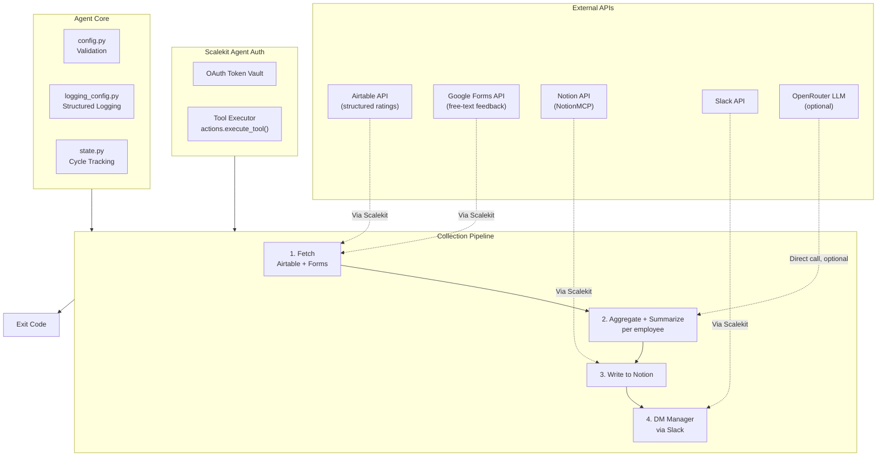

# Performance Review Collector Agent

**Airtable + Google Forms -> Notion + Slack**

An agent that collects performance review feedback on behalf of a manager, scoped to their direct reports, and turns it into per-employee summaries, written to Notion and delivered as a Slack DM digest.

All four services are connected through [Scalekit Agent Auth](https://scalekit.com) using a single `actions.execute_tool()` interface. No token management, no OAuth refresh logic, no credential storage in your code.

Connect three real services, delegate OAuth to your managers, and ship a working agent in minutes.

## What It Does

For one manager's review cycle, the agent runs a four-step pipeline:

| Step | Action | Tool |
|------|--------|------|
| 1 | Fetch review responses from Airtable and Google Forms | `airtable_list_records`, `googleforms_list_responses` |
| 2 | Aggregate and summarize feedback per employee | in-process aggregator + LLM/rule-based summarizer |
| 3 | Write per-employee summary to Notion | `notionmcp_notion-create-pages` / `notionmcp_notion-update-page` |
| 4 | DM the manager a digest in Slack | `slackmcp_slack_send_message` (or `slack_send_message`) |

**Example:** *"Summarize Q2 performance feedback for my team"* -> per-employee summaries written to Notion, manager notified via Slack with links.

Direct reports are resolved from a `Manager Email` column in Airtable (the source of truth for org structure), with an optional `DIRECT_REPORTS` env var fallback if that column is empty for a given manager.

## Architecture



## Prerequisites

- Python 3.11+
- A [Scalekit](https://scalekit.com) account (free tier works)
- An **empty Airtable base** (just the base; the agent creates the table and fields for you. Airtable's API has no way to create a base itself, so this one step stays manual)
- A Google Form collecting free-text feedback, with a question identifying which employee the feedback is about (the agent validates this at startup but cannot create form questions via API, see [Provisioning](#provisioning--auto-setup) below)
- A Notion workspace with a parent page to hold per-employee summary pages
- A Slack workspace where the agent can DM the manager
- An [OpenRouter](https://openrouter.ai) API key (optional; falls back to a deterministic rule-based summary).
**Data flow note:** setting `OPENROUTER_API_KEY` sends each employee's name and their raw feedback comments to OpenRouter's third-party API to generate the narrative summary. Leave it unset to keep all summarization local (rule-based, no data leaves your Scalekit-connected services). Assess this against your organization's data-handling policies before enabling it for real employee reviews.

## Setup

### 1. Install dependencies

```bash
pip install -r requirements.txt
```

### 2. Configure environment

```bash
cp .env.example .env
```

Fill in your credentials. See `.env.example` for all available options.

### 3. Set up Scalekit connectors

In the [Scalekit dashboard](https://scalekit.com), add four connections under Agent Auth > Connections: **Airtable**, **Google Forms**, a **Notion** MCP variant, and **Slack** (either variant).

**Airtable**: Complete the OAuth flow. Grant access to the base containing your review table.

**Google Forms**: Complete the OAuth flow with read access to your form and its responses.

**Notion**: Use an MCP-based Notion connection (page creation tools only exist on MCP variants, not the plain REST "Notion" connector). Share your parent page with the integration: open the page in Notion, click `...` > Connections > add your Scalekit integration.

**Slack**: Complete the OAuth flow with `chat:write` scope (or equivalent MCP scope). No channel invite needed since the agent sends a direct message to the manager.

**Copy the exact connection names** shown in your dashboard into `.env`. Scalekit auto-suffixes these per workspace (e.g. `airtable-3j16TKTG`, `googleforms-WqF2XTWv`, `notionmcp-chAb8Lfz`), so the generic provider labels won't work for the Step 0 auth check. See `AIRTABLE_CONNECTOR`, `GOOGLE_FORMS_CONNECTOR`, `NOTION_CONNECTOR`, `SLACK_CONNECTOR` in Configuration below.

### 4. Point the agent at your real data

- `AIRTABLE_BASE_ID` / `AIRTABLE_TABLE_NAME`: your review base and table
- `AIRTABLE_MANAGER_FIELD` / `AIRTABLE_EMPLOYEE_FIELD`: the column names that hold the manager's email and the employee's name
- `GOOGLE_FORM_ID`: from the form's URL or `googleforms_get_form`
- `FORM_EMPLOYEE_QUESTION_ID`: the question ID (from `googleforms_get_form`) that asks which employee the feedback is about
- `NOTION_PARENT_PAGE_ID`: the page under which per-employee pages will be created
- `MANAGER_EMAIL`: the manager this cycle is scoped to
- `MANAGER_SLACK_ID`: the Slack ID to DM. Use a **DM conversation ID** (`D...`) for a direct message, or a **channel ID** (`C...`) to post there instead

### 5. Run

```bash
python run_flow.py
```

## Provisioning & Auto-Setup

Every run starts with a **Step 0.5** provisioning check, before touching any review data:

- **Airtable**: `provisioning.py` calls `airtable_get_base_schema`. If `AIRTABLE_TABLE_NAME` doesn't exist yet in `AIRTABLE_BASE_ID`, the agent creates it automatically with the default review fields (`Employee Name`, `Manager Email`, `Communication Rating`, `Impact Rating`, `Comments`). If the table already exists, it's used as-is (and a warning is logged if either the manager or employee column is missing). The **base itself must already exist**: Airtable's API has no endpoint to create a new base, only tables within one.
- **Google Forms**: the agent validates the configured form is reachable and has at least one question, warning (not failing) if `FORM_EMPLOYEE_QUESTION_ID` doesn't match anything in the form. It does **not** create form questions automatically: Scalekit's `GOOGLEFORMS` connector only exposes `create_form` (title only), `get_form`, `list_responses`, and `get_response`; there is no add-question tool, since the underlying Forms API's item-creation endpoints aren't part of this connector's toolset. Create the form's questions once, manually, at forms.google.com.

If provisioning fails (e.g. the Airtable base doesn't exist, or the Google Form ID is wrong), the agent exits with code `1` and a clear error explaining exactly what to fix. It never silently proceeds against broken configuration.

## Usage

### One-Time Mode (Default)

Process one review cycle and exit:

```bash
python run_flow.py
```

Ideal for cron jobs, CI/CD pipelines, manual runs, or serverless functions.

```bash
0 9 * * MON cd /path/to/agent && python run_flow.py   # weekly, Monday mornings
```

### Continuous Mode (Polling)

Run indefinitely, re-checking for new feedback every N minutes:

```bash
POLLING_MODE=true POLL_INTERVAL_MINUTES=60 python run_flow.py
```

Press `Ctrl+C` to stop gracefully. The agent finishes the current cycle, exits with code `130`, and does not leave partial Notion writes or half-sent Slack digests.

## Configuration

Environment variables (set in `.env`):

| Variable | Default | Notes |
|----------|---------|-------|
| `SCALEKIT_ENV_URL` | - | Required: your Scalekit workspace URL |
| `SCALEKIT_CLIENT_ID` | - | Required: Scalekit client ID |
| `SCALEKIT_CLIENT_SECRET` | - | Required: Scalekit client secret |
| `AIRTABLE_USER` | - | Required: identity used to authorize Airtable |
| `GOOGLE_FORMS_USER` | - | Required: identity used to authorize Google Forms |
| `NOTION_USER` | - | Required: identity used to authorize Notion |
| `SLACK_USER` | - | Required: identity used to authorize Slack |
| `AIRTABLE_CONNECTOR` | `airtable` | Exact connection name from the Scalekit dashboard (often auto-suffixed, e.g. `airtable-3j16TKTG`) |
| `GOOGLE_FORMS_CONNECTOR` | `googleforms` | Exact connection name from the Scalekit dashboard (e.g. `googleforms-WqF2XTWv`) |
| `NOTION_CONNECTOR` | `notionmcp` | Exact connection name; must be an MCP-variant Notion connection |
| `SLACK_CONNECTOR` | `slackmcp` | Exact connection name; any name containing "mcp" uses the MCP send-message shape |
| `MANAGER_EMAIL` | - | Required: manager this cycle is scoped to |
| `MANAGER_SLACK_ID` | `MANAGER_EMAIL` | Slack ID to message: a DM conversation ID (`D...`) or channel ID (`C...`) |
| `DIRECT_REPORTS` | (empty) | Optional fallback list if Airtable's manager field is empty |
| `AIRTABLE_BASE_ID` | - | Required: Airtable base ID |
| `AIRTABLE_TABLE_NAME` | `Performance Reviews` | Table name or ID |
| `AIRTABLE_MANAGER_FIELD` | `Manager Email` | Column identifying the reviewing manager |
| `AIRTABLE_EMPLOYEE_FIELD` | `Employee Name` | Column identifying the employee |
| `AIRTABLE_VIEW` | (empty) | Optional: restrict to a specific view |
| `GOOGLE_FORM_ID` | - | Required: Google Form ID |
| `FORM_EMPLOYEE_QUESTION_ID` | (empty) | Question ID identifying the employee in each response |
| `NOTION_PARENT_PAGE_ID` | - | Required: parent page for per-employee summary pages |
| `REVIEW_PERIOD` | `Current Cycle` | Label used in page titles and summaries, e.g. `Q2 2026` |
| `POLLING_MODE` | `false` | Enable continuous polling |
| `POLL_INTERVAL_MINUTES` | `60` | Minutes between polling cycles |
| `LOG_LEVEL` | `INFO` | `DEBUG`, `INFO`, `WARNING`, `ERROR` |
| `OPENROUTER_API_KEY` | (empty) | Optional: enables LLM-written narrative summaries |
| `OPENROUTER_MODEL` | `openai/gpt-4o-mini` | LLM model to use |

## Exit Codes

| Code | Meaning | Use Case |
|------|---------|----------|
| `0` | Success | Summaries written, or no direct reports found (nothing to do) |
| `1` | Error | Config missing, auth failed, or 5 consecutive polling errors; investigate logs |
| `2` | No data | No feedback found for any direct report this cycle (normal, not an error) |
| `130` | Interrupted | Graceful shutdown via Ctrl+C or SIGTERM |

## Monitoring

### Logging

Structured logs with timestamps, levels, and auto-redacted secrets:

```bash
python run_flow.py                    # all logs
LOG_LEVEL=ERROR python run_flow.py     # errors only
LOG_LEVEL=DEBUG python run_flow.py     # verbose
```

Log levels:
- `DEBUG`: detailed execution flow, per-record pagination
- `INFO`: key milestones, per-employee summaries, Notion/Slack writes
- `WARNING`: auth issues, missing manager assignments, fallbacks
- `ERROR`: unrecoverable failures, missing config

### Polling Loop

```bash
POLLING_MODE=true POLL_INTERVAL_MINUTES=1440 python run_flow.py   # daily
# Ctrl+C stops after the current cycle finishes, exit code 130
```

### State

Processed `(manager, review_period)` cycles are stored in `state/processed_cycles.json`, so re-running the agent for a period you've already processed won't re-DM the manager. Notion pages are still safely upserted (title-matched) even if you re-run; no duplicate pages are created.

```bash
rm -f state/processed_cycles.json   # reset, e.g. to re-notify for testing
```

## Error Handling & Edge Cases

- **Missing manager assignment**: if no Airtable record is tagged with the manager's email, the agent falls back to the `DIRECT_REPORTS` env list; if that's also empty, it logs a warning and exits `0` (nothing to do, not an error).
- **Employee with zero feedback**: skipped from the Notion write and Slack digest individually; other employees in the same cycle still get processed.
- **Airtable/Google Forms fetch failure**: logged and treated as an empty result set for that source rather than crashing the whole cycle; the other source still contributes.
- **Notion write failure for one employee**: logged as a warning; the cycle continues to the next employee instead of aborting.
- **Slack DM failure**: logged as a warning; Notion pages that were already written are not rolled back.
- **Malformed/corrupted state file**: detected and treated as empty (fresh start) rather than crashing.
- **Non-numeric values in rating-looking Airtable fields**: silently ignored rather than crashing the averaging logic.
- **LLM summarization failure or empty response**: automatic fallback to the deterministic rule-based summary; the cycle never blocks on an LLM outage.
- **Ctrl+C / SIGTERM mid-cycle**: the in-flight cycle finishes (or the next poll doesn't start) and the process exits `130`; no partial state is marked processed.
- **Airtable table/fields missing**: auto-created at startup with a default schema (see [Provisioning & Auto-Setup](#provisioning--auto-setup)); the base itself must already exist.
- **Airtable base doesn't exist or isn't accessible**: provisioning fails fast with exit code `1` and an explicit instruction to create the base first (this can't be automated; Airtable has no create-base API).
- **Google Form missing or has no questions**: logged as an error (inaccessible) or warning (empty) at startup; the agent cannot create form questions via API, so this always needs a one-time manual step in the Google Forms UI.

## Troubleshooting

| Issue | Solution |
|-------|----------|
| `ModuleNotFoundError: scalekit` | Run `pip install -r requirements.txt` |
| `Missing required config: ...` | Run `cp .env.example .env` and fill in your values |
| `connector (...) -- INACTIVE` / `PENDING` | Open the auth link printed in logs, or authorize in the Scalekit dashboard |
| `Cannot access Airtable base '...'` | The base doesn't exist or isn't shared with your connected account. Create an empty base at airtable.com and set `AIRTABLE_BASE_ID` to its ID |
| `No direct reports resolved` | Check `AIRTABLE_MANAGER_FIELD` matches your table's column name, and that records are tagged with the manager's email |
| Notion page not created | Confirm `NOTION_CONNECTOR` is an MCP-variant connection name, and that the parent page is shared with the integration |
| Notion page created but empty | Check `NOTION_PARENT_PAGE_ID` is a page ID, not a database ID |
| Slack DM not received | Verify the bot has `chat:write` scope (or MCP equivalent); set `MANAGER_SLACK_ID` to a real DM conversation ID (`D...`) or channel ID (`C...`) |
| Form responses not grouped correctly | Set `FORM_EMPLOYEE_QUESTION_ID` explicitly using the question ID from `googleforms_get_form`. Matching is normalized (case/whitespace-insensitive) against Airtable's `Employee Name`, but a reviewer typing a genuinely different name like "Alex" instead of "Alex Kim" will still be logged and dropped |
| `Cannot access Google Form '...'` | Form ID is wrong or not shared with your connected account. Check the form's edit URL |
| `No colored output` | Colors auto-disable when output is piped; force with `FORCE_COLOR=1` |