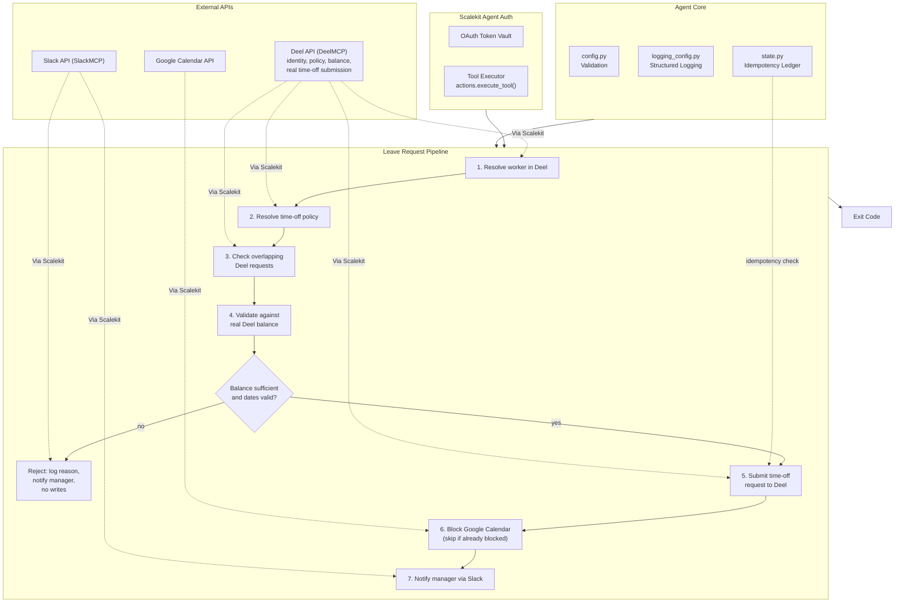

# PTO & Leave Request Agent

Processes one employee's leave request end to end: validates their real remaining balance in Deel, submits the request, blocks their Google Calendar, and DMs their manager in Slack. Insufficient balance or invalid dates are rejected before anything is written.

All connectors run through [Scalekit Agent Auth](https://scalekit.com) -- no manual OAuth, no token storage in code.

## What it does

| Step | Action |
|------|--------|
| 1 | Resolve the employee to their Deel worker record |
| 2 | Check their real remaining leave balance |
| 3 | Submit the time-off request to Deel (left pending approval) |
| 4 | Block their Google Calendar for the requested dates |
| 5 | DM their manager in Slack with the details |

If balance is insufficient or the dates are invalid, nothing is written -- the request is rejected up front and the manager is still notified, with the real reason.

## Architecture



## Setup

```bash
pip install -r requirements.txt
cp .env.example .env
```

Fill in `.env`:

1. **Scalekit credentials** -- from your Scalekit dashboard.
2. **Connections** -- in the Scalekit dashboard (Agent Auth > Connections), connect Deel, Google Calendar, and a Slack MCP connection. Copy each connection's exact name into `.env` (`DEEL_CONNECTOR`, etc.) -- these are workspace-specific, not generic labels.
3. **The request details** -- `EMPLOYEE_EMAIL`, `MANAGER_EMAIL` (or `MANAGER_SLACK_ID`), `PTO_START_DATE`/`PTO_END_DATE`, `PTO_TYPE`. See `.env.example` for the full list.

## Run

```bash
python run_flow.py
```

Add `POLLING_MODE=true POLL_INTERVAL_MINUTES=5` to keep checking until the request finishes processing (useful if a downstream step like Slack is briefly down). `Ctrl+C` stops it cleanly.

## Configuration reference

| Variable | Notes |
|----------|-------|
| `SCALEKIT_ENV_URL` / `SCALEKIT_CLIENT_ID` / `SCALEKIT_CLIENT_SECRET` | Your Scalekit credentials |
| `DEEL_USER` / `GOOGLE_CALENDAR_USER` / `SLACK_USER` | Identity used to authorize each connector |
| `*_CONNECTOR` | Exact connection name from your Scalekit dashboard |
| `EMPLOYEE_EMAIL` | Whose leave this is; must match Deel exactly |
| `EMPLOYEE_DEEL_PROFILE_ID` | Optional -- skip the lookup if you already know it |
| `MANAGER_EMAIL` / `MANAGER_SLACK_ID` | Who gets notified |
| `PTO_START_DATE` / `PTO_END_DATE` | `YYYY-MM-DD`, inclusive |
| `PTO_TYPE` | `vacation`, `paid`, `sick`, `personal`, `bereavement`, or `other` |
| `PTO_REASON` | Optional, shown to the manager |
| `GOOGLE_CALENDAR_ID` | Defaults to `primary` |
| `POLLING_MODE` / `POLL_INTERVAL_MINUTES` | Keep checking instead of exiting once |
| `LOG_LEVEL` | `DEBUG` / `INFO` / `WARNING` / `ERROR` |

## Exit codes

| Code | Meaning |
|------|---------|
| `0` | Success (submitted, or already completed on a prior run) |
| `1` | Config or connectivity error |
| `2` | Rejected -- insufficient balance or invalid dates |
| `130` | Interrupted (Ctrl+C) |

## Troubleshooting

| Issue | Fix |
|-------|-----|
| `Missing required config: ...` | Run `cp .env.example .env` and fill in your values |
| `connector (...) -- EXPIRED` / `PENDING_AUTH` | Re-authorize using the link printed in the logs, or via the Scalekit dashboard |
| `multiple connected accounts found for identifier` | Set the exact `*_CONNECTOR` value for that provider |
| `was not found in this Deel organization's org chart` | Confirm `EMPLOYEE_EMAIL` matches Deel exactly, or set `EMPLOYEE_DEEL_PROFILE_ID` |
| `has no time-off policy assigned` | Assign a matching policy for `PTO_TYPE` in the Deel dashboard |
| Rejected with `INSUFFICIENT_BALANCE` | Reflects the employee's real balance in Deel |
| Could not resolve manager in Slack | Verify their Slack profile email matches `MANAGER_EMAIL`, or set `MANAGER_SLACK_ID` directly |

## State

Progress is tracked in `state/processed_requests.json`, keyed by employee + type + dates, so re-running the same request never creates a duplicate. Delete it to force a re-run. The agent also checks Deel and Google Calendar directly for existing overlapping requests/events before writing anything, independent of this file.
