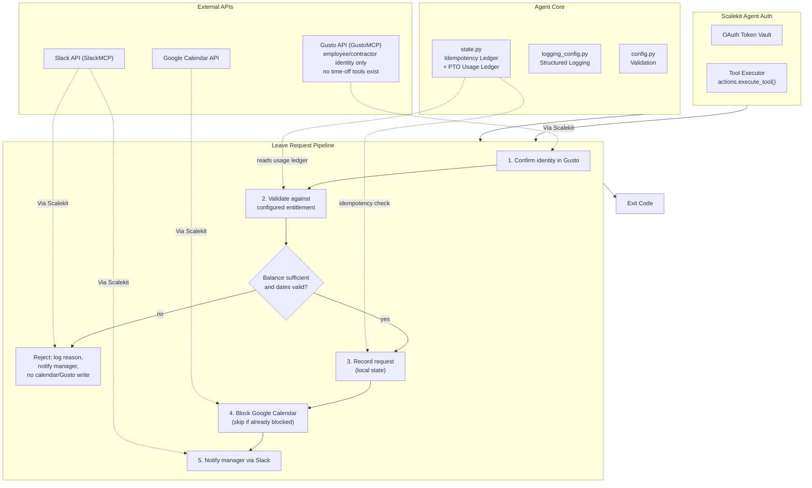

# PTO & Leave Request Agent

**Gusto (identity) + configured policy -> Google Calendar + Slack**

An agent that runs on behalf of one employee: confirms they are a real person in Gusto, validates the requested leave against a configured entitlement, blocks their Google Calendar for the requested dates, and DMs their manager in Slack. Insufficient balance or invalid dates are rejected before any write happens.

All three services are connected through [Scalekit Agent Auth](https://scalekit.com) using a single `actions.execute_tool()` interface. No token management, no OAuth refresh logic, no credential storage in your code.

## Important: what this agent can and cannot do with Gusto

This was verified live against the connected `GUSTOMCP` connector by enumerating its full tool catalog (`sk.actions.tools.list_tools(filter=Filter(provider="GUSTOMCP"))`, 38 tools total) before any code was written, not assumed from a tool description:

**GUSTOMCP has no time-off balance tool, no time-off policy tool, and no time-off request submission tool.** The full, real tool list is: `gustomcp_get_employee`, `gustomcp_list_employees`, `gustomcp_get_contractor`, `gustomcp_list_contractors`, `gustomcp_get_company`, `gustomcp_list_departments`, `gustomcp_list_locations`, `gustomcp_get_time_sheet`, `gustomcp_list_time_records` (hourly time-tracking, not PTO), `gustomcp_get_employee_earnings_summary`, `gustomcp_list_custom_fields_schema`, `gustomcp_list_employee_custom_fields`, plus payroll, compensation, contractor-payment, and pay-schedule tools. None of them read or write a leave balance, a leave policy, or a leave request. This was cross-checked against `gustomcp_get_token_info`'s OAuth scope list too, which has no `time_off:*` scope in this workspace.

This agent adapts around that gap the same way the sibling repos in this workspace adapted around Google Forms' missing question-creation capability and Airtable's missing base-creation capability, real limitations get documented and worked around, not silently faked:

- **Gusto's role is identity verification only.** Step 1 confirms `EMPLOYEE_EMAIL` resolves to a real employee or contractor record in this Gusto company (`gustomcp_list_employees`, falling back to `gustomcp_list_contractors`). The Gusto company connected in this workspace ("Infrasity") is tier `contractor_only` (verified via `gustomcp_get_company`), so `gustomcp_list_employees` legitimately returns `[]` and the contractor fallback is what actually resolves the identity in practice.
- **Leave balance/policy validation uses a configured entitlement** (`PTO_ANNUAL_ENTITLEMENT_DAYS`) plus a locally tracked running total of days used (`state/pto_usage.json`), not a live Gusto balance read. This is a real workaround for a real gap, if this same employee's PTO is also tracked inside Gusto by some other means, this ledger will not see it and can drift out of sync. See [Error Handling & Edge Cases](#error-handling--edge-cases).
- **"Submitting the time-off request to Gusto" is not a real Gusto API write in this workspace.** There is no tool to make it one. The request is instead recorded in this agent's own local state (`state/processed_requests.json`) as the system of record for what was requested and validated, clearly logged as `Step 3: Recording the leave request (Gusto has no time-off submission tool in this workspace...)` so nobody mistakes it for a live Gusto write. The Google Calendar block and Slack DM, in contrast, ARE real, live writes through real tools.

## What It Does

For one leave request, the agent runs a five-step pipeline:

| Step | Action | Tool |
|------|--------|------|
| 1 | Confirm the employee/contractor exists in Gusto | `gustomcp_list_employees`, `gustomcp_list_contractors` (or `gustomcp_get_employee`/`gustomcp_get_contractor` if `EMPLOYEE_GUSTO_UUID` is set) |
| 2 | Validate the request against the configured entitlement and usage ledger | in-process (aggregator.py), no live Gusto balance tool exists |
| 3 | Record the request (idempotency ledger, not a live Gusto write) | local state only, see above |
| 4 | Block the employee's Google Calendar for the requested dates | `googlecalendar_list_events` (overlap check), `googlecalendar_create_event` |
| 5 | Notify the manager via Slack DM | `slackmcp_slack_search_users`, `slackmcp_slack_send_message` |

**Example:** *"I need Sep 14-15 off for a family trip"* -> balance checked against the configured entitlement, calendar blocked with an `outOfOffice` event, manager DMed with the dates, remaining balance, and a link to the calendar event.

## Architecture



## Prerequisites

- Python 3.11+
- A [Scalekit](https://scalekit.com) account (free tier works)
- A Gusto company connected via the `GUSTOMCP` connector, with the requesting employee findable as either an employee or a contractor record
- A Google Calendar account for the employee (or whichever identity should have its calendar blocked)
- A Slack workspace where the agent can DM the manager
- No spreadsheet, base, or external policy document is required. Everything this agent needs beyond Gusto's identity check is configured directly in `.env` (`PTO_ANNUAL_ENTITLEMENT_DAYS`), because there is no Gusto tool to read a real policy/balance object from (see above).

## Setup

### 1. Install dependencies

```bash
pip install -r requirements.txt
```

### 2. Configure environment

```bash
cp .env.example .env
```

Fill in your credentials. See `.env.example` for all available options.

### 3. Set up Scalekit connectors

In the [Scalekit dashboard](https://scalekit.com), add three connections under Agent Auth > Connections: **GustoMCP**, **Google Calendar**, and a **Slack** MCP variant.

**Gusto**: Complete the OAuth flow via the `GUSTOMCP` connector (an MCP-based connector, not a plain REST `GUSTO` variant). Grant read access to employees/contractors. There is no scope this agent needs beyond read access, since no write tool to Gusto is used.

**Google Calendar**: Complete the OAuth flow for whichever identity's calendar should be blocked (usually the employee themselves).

**Slack**: Use an MCP-based Slack connection (send-message tool signatures differ between the plain REST `SLACK` connector and the `SLACKMCP` variant; this agent uses SlackMCP's `channel_id`/`message` parameter names). Complete the OAuth flow with `chat:write` scope (or equivalent MCP scope). No channel membership is required since this agent only sends DMs.

**Copy the exact connection names** shown in your dashboard into `.env`. Scalekit auto-suffixes these per workspace (e.g. `gustomcp-SoSOMZ20`), so the generic provider labels won't work for the Step 0 auth check or for disambiguating `execute_tool()` calls when one identifier has multiple connections of the same provider type. See `GUSTO_CONNECTOR`, `GOOGLE_CALENDAR_CONNECTOR`, `SLACK_CONNECTOR` in Configuration below.

### 4. Point the agent at a real request

- `EMPLOYEE_EMAIL`: whose leave this is; must match the email on file in Gusto (employee or contractor record)
- `MANAGER_EMAIL` or `MANAGER_SLACK_ID`: who gets notified
- `PTO_START_DATE` / `PTO_END_DATE`: the requested dates (inclusive, `YYYY-MM-DD`)
- `PTO_TYPE`: one of `vacation`, `sick`, `personal`, `bereavement`, `other`
- `PTO_ANNUAL_ENTITLEMENT_DAYS`: the employee's configured annual entitlement, since Gusto cannot supply this

### 5. Run

```bash
python run_flow.py
```

## Configuration

Environment variables (set in `.env`):

| Variable | Default | Notes |
|----------|---------|-------|
| `SCALEKIT_ENV_URL` | - | Required: your Scalekit workspace URL |
| `SCALEKIT_CLIENT_ID` | - | Required: Scalekit client ID |
| `SCALEKIT_CLIENT_SECRET` | - | Required: Scalekit client secret |
| `GUSTO_USER` | - | Required: identity used to authorize Gusto (often a People Ops admin, since Gusto access is company-admin-scoped) |
| `GOOGLE_CALENDAR_USER` | - | Required: identity used to authorize Google Calendar (usually the employee) |
| `SLACK_USER` | - | Required: identity used to authorize Slack |
| `GUSTO_CONNECTOR` | `gustomcp-SoSOMZ20` | Exact connection name from the Scalekit dashboard; must be the GustoMCP variant |
| `GOOGLE_CALENDAR_CONNECTOR` | `googlecalendar` | Exact connection name |
| `SLACK_CONNECTOR` | `slackmcp` | Exact connection name; must be an MCP-variant Slack connection |
| `EMPLOYEE_EMAIL` | - | Required: whose leave this run is for |
| `EMPLOYEE_NAME` | (from Gusto) | Optional display name; falls back to the Gusto first/last name, then to `EMPLOYEE_EMAIL` |
| `EMPLOYEE_GUSTO_UUID` | (empty) | Optional: skip the list-and-match-by-email lookup |
| `MANAGER_EMAIL` | - | Required (or `MANAGER_SLACK_ID`): resolved to a Slack user ID via search |
| `MANAGER_SLACK_ID` | (empty) | Optional: a literal Slack user ID, skips the search |
| `PTO_START_DATE` | - | Required: `YYYY-MM-DD`, inclusive |
| `PTO_END_DATE` | - | Required: `YYYY-MM-DD`, inclusive |
| `PTO_TYPE` | `vacation` | One of `vacation`, `sick`, `personal`, `bereavement`, `other` |
| `PTO_REASON` | (empty) | Optional free-text reason shown to the manager |
| `PTO_ANNUAL_ENTITLEMENT_DAYS` | `20` | Configured entitlement, since Gusto has no balance API to read instead |
| `GOOGLE_CALENDAR_ID` | `primary` | Destination calendar |
| `POLLING_MODE` | `false` | See [Usage](#usage) below; re-checks completion, does not resubmit |
| `POLL_INTERVAL_MINUTES` | `15` | Minutes between polling checks |
| `LOG_LEVEL` | `INFO` | `DEBUG`, `INFO`, `WARNING`, `ERROR` |

## Usage

### One-Time Mode (Default)

Process the configured leave request and exit:

```bash
python run_flow.py
```

Ideal for a People Ops-facing form submission handler, a Slack slash-command backend, or a manual run.

### Continuous Mode (Polling)

A single leave request is inherently a one-shot action, there is exactly one request to process, not an open-ended feed of changing data. `POLLING_MODE` here does not mean "resubmit the same request repeatedly." It means "keep checking whether this configured request has finished processing yet," which matters if a downstream step (e.g. Slack) is transiently down when the process starts:

```bash
POLLING_MODE=true POLL_INTERVAL_MINUTES=5 python run_flow.py
```

The loop exits as soon as the request reaches a terminal state (`0` = processed/already-complete, `2` = rejected by policy), or after 5 consecutive unexpected errors (`1`), or on `Ctrl+C` (`130`). It never re-runs a request that already completed; see [State](#state) below.

## Exit Codes

| Code | Meaning | Use Case |
|------|---------|----------|
| `0` | Success | Request processed (calendar blocked, manager notified), or already completed on a prior run and correctly skipped |
| `1` | Error | Config missing, employee not found in Gusto, Google Calendar unreachable, or 5 consecutive polling errors; investigate logs |
| `2` | Rejected | The leave request failed policy validation (insufficient balance or invalid/past dates), a business decision, not a system error |
| `130` | Interrupted | Graceful shutdown via Ctrl+C or SIGTERM |

## Monitoring

### Logging

Structured logs with timestamps, levels, and auto-redacted secrets (including the `skc_` Scalekit client ID pattern):

```bash
python run_flow.py                    # all logs
LOG_LEVEL=ERROR python run_flow.py     # errors only
LOG_LEVEL=DEBUG python run_flow.py     # verbose
```

Log levels:
- `DEBUG`: detailed execution flow, Scalekit client initialization, usage-ledger updates
- `INFO`: key milestones, connector auth status, balance calculation, calendar/Slack writes
- `WARNING`: auth issues, unresolved Slack manager, calendar block failures, overlap detection
- `ERROR`: unrecoverable failures, missing config, policy rejections

### State

Two separate, append-only-in-spirit JSON files under `state/`:

- **`state/processed_requests.json`** (idempotency ledger): one entry per request, keyed by a fingerprint of `employee_email + pto_type + start_date + end_date`. Re-running the agent with the exact same request skips all writes and returns exit code `0` without creating a duplicate calendar event or DM.
- **`state/pto_usage.json`** (usage ledger): a running total of business days used per employee, standing in for Gusto's missing balance API. Every completed, non-rejected request adds its day count here. This is a real, documented limitation, if this employee's PTO is tracked elsewhere too (e.g. inside Gusto itself, by a process this agent has no tool to read), this ledger will not see it.

```bash
rm -f state/processed_requests.json    # reset idempotency, e.g. to re-test the same request
rm -f state/pto_usage.json             # reset the usage ledger back to zero days used
```

A separate, independent overlap guard also checks live Google Calendar for an existing `outOfOffice` event in the requested window (`googlecalendar_list_events`) before creating a new one, so even a request with *different* dates that happens to overlap an existing block won't create a duplicate calendar entry; only the idempotency ledger above is keyed on exact-match requests.

## Error Handling & Edge Cases

- **Insufficient leave balance**: validated in Step 2, before any connector write. The request is rejected (exit code `2`), the specific shortfall is logged (requested vs. remaining vs. entitlement), and the manager is still notified via Slack that the request was NOT submitted, with the real reason. No calendar event is created and no Gusto record is written.
- **Invalid or past dates**: `config.py` validates `PTO_END_DATE >= PTO_START_DATE` and refuses a request whose end date has already elapsed, before the Scalekit client is even initialized. `aggregator.py`'s `validate_leave_request()` re-checks this at request-processing time too (`PAST_DATES` error code), since the configured date could technically still be in the past if `.env` is stale.
- **Overlapping/duplicate PTO request for the same exact dates**: `state.py`'s fingerprint-based idempotency ledger detects an exact repeat (same employee, type, and date range) and skips all writes on the second run, returning exit code `0` with a clear log line and no duplicate calendar event or Slack DM.
- **Overlapping PTO request for different (but overlapping) dates**: a separate, independent check in `run_flow.py` (`_find_overlapping_out_of_office`) lists existing Google Calendar events in the requested window and skips creating a new `outOfOffice` block if one already overlaps, while still recording the request and still notifying the manager. This catches cases the idempotency ledger's exact-match key would miss (e.g. requesting Sep 14-16 after already having Sep 14-15 blocked).
- **Manager not resolvable in Slack**: logged as a warning; the Gusto identity check, policy validation, request recording, and Google Calendar block all still complete. Only the Slack notification step is skipped. Set `MANAGER_SLACK_ID` directly if the manager's email doesn't match their Slack profile email.
- **Gusto API rejecting the request for a policy reason**: Gusto's connected tools in this workspace have no time-off submission endpoint to reject a request in the first place (see [Important: what this agent can and cannot do with Gusto](#important-what-this-agent-can-and-cannot-do-with-gusto)). The equivalent real rejection surfaced by this agent is the configured-entitlement check in Step 2, whose exact reason (insufficient balance, past dates) is always logged verbatim and sent to the manager, never swallowed.
- **Employee not found in Gusto**: Step 1 fails fast with exit code `1` and an actionable message (confirm `EMPLOYEE_EMAIL` matches Gusto exactly, or set `EMPLOYEE_GUSTO_UUID` directly). Checks employee records first, then contractor records, since a contractor-only Gusto company (like the one this agent was verified against) has zero employee records.
- **Calendar event creation failure**: logged as a warning; the leave request (Step 3's local record) has already succeeded by this point and is not rolled back. The pipeline continues to Step 5 and still notifies the manager, with an explicit note in the Slack message that the calendar block could not be created and should be confirmed manually.
- **Slack DM failure**: logged as a warning; does not affect the Gusto identity check, policy validation, request recording, or calendar block, all of which have already completed by Step 5.
- **Malformed/corrupted state file**: detected and treated as empty (fresh start) rather than crashing, for both the idempotency ledger and the usage ledger.
- **Google Calendar `outOfOffice` events reject a non-empty description** (a real Google API 400 `malformedOutOfOfficeEvent`, discovered live while building this agent): `create_out_of_office_block()` never passes a `description` field for this reason; the leave-type label is carried entirely in the event `summary`.
- **Ctrl+C / SIGTERM mid-run**: the in-flight step finishes (or the next polling check doesn't start) and the process exits `130`; partial progress up to that point is preserved in `state/processed_requests.json` (e.g. a calendar block that succeeded before an interrupt during the Slack step is not lost or redone on the next run once the request is marked `completed`).
- **Google Calendar unreachable at startup**: provisioning fails fast with exit code `1` before any leave-specific work begins, with an instruction to confirm `GOOGLE_CALENDAR_CONNECTOR` and `GOOGLE_CALENDAR_ID`.
- **Partial failures never leave you guessing**: every run ends with a single `[SUMMARY]` log line stating the outcome of all four meaningful steps (policy, Gusto record, calendar, Slack) in one place, regardless of which ones succeeded.

## Troubleshooting

| Issue | Solution |
|-------|----------|
| `ModuleNotFoundError: scalekit` | Run `pip install -r requirements.txt` |
| `Missing required config: ...` | Run `cp .env.example .env` and fill in your values |
| `connector (...) -- EXPIRED` / `PENDING_AUTH` | Open the auth link printed in logs (a real, workspace-specific magic link from `get_authorization_link`), or authorize in the Scalekit dashboard. Gusto OAuth tokens in particular can expire and require interactive reauthorization; this cannot be scripted or bypassed |
| `multiple connected accounts found for identifier` | Set the exact `*_CONNECTOR` env var for that provider; the same identifier is connected to more than one connection of that type in your workspace |
| `'...' was not found as an employee or contractor in this Gusto company` | Confirm `EMPLOYEE_EMAIL` matches the email on file in Gusto exactly (case-insensitive), or set `EMPLOYEE_GUSTO_UUID` directly |
| Leave request rejected with `INSUFFICIENT_BALANCE` | Check `PTO_ANNUAL_ENTITLEMENT_DAYS` and `state/pto_usage.json`; delete the usage ledger to reset if it's out of sync with reality |
| `error creating calendar event: ... malformedOutOfOfficeEvent` | This connector never sends a `description` with an `outOfOffice` event for this exact reason; if you see this, check for local modifications to `connectors.py` |
| Could not resolve manager in Slack | Verify the manager's Slack profile email matches `MANAGER_EMAIL`, or set `MANAGER_SLACK_ID` directly to a literal `U...` ID |
| Calendar block missing but Slack says it succeeded | Check the `[SUMMARY]` log line and `state/processed_requests.json`'s `calendar_error` field for that request's fingerprint |
| `No colored output` | Colors auto-disable when output is piped; force with `FORCE_COLOR=1` |

## Deployment

This agent is a one-shot action triggered by an event (a leave request being submitted somewhere upstream, e.g. an internal form or Slack workflow), not a recurring schedule like the sibling revenue-forecast or performance-review agents. Typical deployment patterns:

- **Serverless / webhook handler**: trigger `python run_flow.py` (with `.env` populated from the incoming request) from a Lambda, Cloud Function, or similar, invoked by whatever system collects the leave request in the first place.
- **CI/CD or internal tooling**: a People Ops internal tool shells out to this script per submitted request.
- **Manual / cron dry-run**: for testing or a manual People Ops workflow, run `python run_flow.py` directly with `.env` populated for one request at a time.

Because state is local, JSON files under `state/`, running this agent from multiple machines or containers without a shared, persistent volume for `state/` will not share idempotency or usage-ledger state across invocations. For production use beyond a single machine, back `state/` with a shared, durable store (e.g. mount a persistent volume, or swap `StateManager`/`UsageLedger`'s file-based I/O for a small database) before scaling out horizontally.

## Production Checklist

- [ ] `GUSTO_CONNECTOR`, `GOOGLE_CALENDAR_CONNECTOR`, `SLACK_CONNECTOR` all set to the exact connection names shown in your Scalekit dashboard, not the generic provider labels
- [ ] Gusto OAuth token freshness monitored separately; unlike the other two connectors, Gusto tokens in this workspace were observed to expire and require interactive reauthorization with no automatic refresh
- [ ] `PTO_ANNUAL_ENTITLEMENT_DAYS` set per-employee (or per-policy-tier) rather than left at the default `20` for every request
- [ ] `state/` backed by a persistent, shared volume if running from more than one machine or container
- [ ] `EMPLOYEE_GUSTO_UUID` populated wherever possible for high-volume use, to skip the list-and-match-by-email lookup and avoid ambiguity between same-named employees
- [ ] Manager notification failures (Slack) monitored separately from the pipeline's exit code, since exit code `0` can still mean "Slack was skipped, confirm manually"
- [ ] `LOG_LEVEL=INFO` or stricter in production; avoid `DEBUG` in shared logs since request reasons (`PTO_REASON`) may contain sensitive personal/medical context
- [ ] A real, authoritative time-off system reviewed periodically against `state/pto_usage.json` to catch drift, since this ledger is a workaround, not a system of record synced with Gusto
