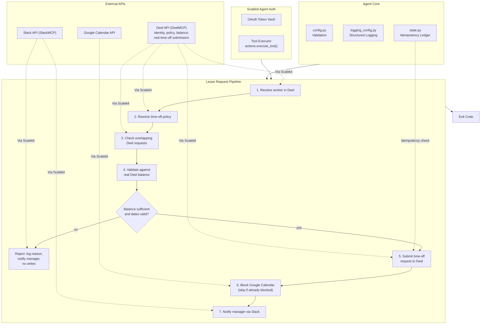

# PTO & Leave Request Agent

**Deel -> Google Calendar -> Slack**

An agent that runs on behalf of one employee: resolves them to a real worker in Deel, validates the requested leave against their real remaining balance, submits a real time-off request in Deel, blocks their Google Calendar for the requested dates, and DMs their manager in Slack. Insufficient balance or invalid dates are rejected before any write happens.

All three services are connected through [Scalekit Agent Auth](https://scalekit.com) using a single `actions.execute_tool()` interface. No token management, no OAuth refresh logic, no credential storage in your code.


## What It Does

For one leave request, the agent runs a seven-step pipeline:

| Step | Action | Tool |
|------|--------|------|
| 1 | Resolve the employee to a Deel worker | `deelmcp_contract_list` + `deelmcp_org_hris_person_get` (or a direct `hris_profile_id` if configured) |
| 2 | Resolve their assigned time-off policy | `deelmcp_timeoff_policy_list` |
| 3 | Check for an existing overlapping request in Deel | `deelmcp_timeoff_request_list` |
| 4 | Validate the request against their real remaining balance | `deelmcp_timeoff_entitlement_list` |
| 5 | Submit the time-off request (pending approval) | `deelmcp_timeoff_request_create` |
| 6 | Block the employee's Google Calendar for the requested dates | `googlecalendar_list_events` (overlap check), `googlecalendar_create_event` |
| 7 | Notify the manager via Slack DM | `slackmcp_slack_search_users`, `slackmcp_slack_send_message` |

**Example:** *"I need Sep 14-15 off for a family trip"* -> balance checked against the real Deel entitlement, a time-off request submitted to Deel and left pending approval, the calendar blocked with an `outOfOffice` event, and the manager DMed with the dates, remaining balance, and a link to the calendar event.

## Architecture



## Prerequisites

- Python 3.11+
- A [Scalekit](https://scalekit.com) account (free tier works)
- A Deel account connected via the `DEELMCP` connector, with the requesting employee findable in the org chart and a time-off policy assigned for each PTO type you plan to use
- A Google Calendar account for the employee (or whichever identity should have its calendar blocked)
- A Slack workspace where the agent can DM the manager

## Connector Notes

**Deel has no email-to-worker lookup tool.** Every time-off tool is scoped by `hris_profile_id` (a UUID), and there's no server-side "find worker by email" endpoint anywhere in the catalog. `deelmcp_hris_org_chart_get` looks like it should be that bulk fetch, but isn't usable as one: it requires a `groupByValue` that must already be a specific, known GUID (a team ID, for instance) no matter which grouping strategy you use, so it can't resolve an employee whose ID you don't already have. The real path this agent uses instead: `deelmcp_contract_list` (a genuine no-argument bulk listing of every contract, each carrying the assigned worker's `hris_profile_id` once onboarding is complete) combined with `deelmcp_org_hris_person_get` per candidate to read their real email and match it -- set `EMPLOYEE_DEEL_PROFILE_ID` directly to skip this entirely if you already know the ID, which also avoids the per-candidate cost of this lookup on a larger organization.

**A worker needs a policy assigned before a request can be submitted.** `deelmcp_timeoff_request_create` requires a `policy_id`, which comes from `deelmcp_timeoff_policy_list` scoped to that worker. If the worker has no policy assigned for the requested `PTO_TYPE`'s mapped Deel policy type (see the table below), Step 2 fails with a specific message rather than guessing at a policy or submitting without one.

**Requests are always submitted as `REQUESTED`, never `APPROVED`.** This agent proposes the request on the employee's behalf; approving it is a separate action taken later (`deelmcp_timeoff_request_review`) by a manager or approver, not something this agent does for itself.

| Tool | Notes |
|------|-------|
| `deelmcp_contract_list` | Real no-argument bulk listing of every contract in the org, each with a `worker.id` once onboarding is complete (`null` otherwise). |
| `deelmcp_org_hris_person_get` | Requires `hris_profile_id`. Returns the worker's real email under `employments[].email`/`work_email`, used to match against `EMPLOYEE_EMAIL`. |
| `deelmcp_timeoff_policy_list` | Requires `hris_profile_id`; resolves the policy assigned to this worker for a given `policy_type_name`. |
| `deelmcp_timeoff_entitlement_list` | Requires `hris_profile_id`; returns the real remaining balance for a policy type. |
| `deelmcp_timeoff_request_list` | Used to check for an existing `REQUESTED`/`APPROVED` request already overlapping the requested dates, before submitting a new one. Unlike `deelmcp_timeoff_request_create`, its `start_date`/`end_date` require a full datetime string, not a bare `YYYY-MM-DD` date -- a bare date is rejected with "Invalid datetime". Each returned request nests the worker under `recipient_profile.hris_profile_id`, not a flat field. |
| `deelmcp_timeoff_request_create` | Requires `recipient_profile_id`, `start_date`, `end_date`, `policy_id`. Always submitted with `status: "REQUESTED"`. The created request comes back under `time_offs: [...]`, a list -- not the `data: {...}` shape most other write tools use. |
| `googlecalendar_create_event` | No `end_datetime` field -- duration is computed from `event_duration_hour`/`event_duration_minutes`. An `outOfOffice` event type rejects a non-empty `description`, so this agent never sends one; the leave-type label lives in `summary` instead. |
| `slackmcp_slack_search_users` / `slackmcp_slack_send_message` | Returns a markdown text block, not structured JSON -- the Slack user ID is parsed out of the result text. `channel_id`/`message`, not `channel`/`text`. |

## PTO Type Mapping

`PTO_TYPE` is a small, human-readable set that maps onto Deel's real (much larger, country-specific) policy type taxonomy:

| `PTO_TYPE` | Deel `policy_type_name` |
|------------|--------------------------|
| `vacation` | `Vacation` |
| `paid` | `Paid leave` (Deel's own default general-purpose policy type in a freshly set up organization -- verified live) |
| `sick` | `Sick leave` |
| `personal` | `Personal leave` |
| `bereavement` | `Bereavement leave` |
| `other` | `Other leave` |

## Setup

### 1. Install dependencies

```bash
pip install -r requirements.txt
```

### 2. Configure environment

```bash
cp .env.example .env
```

Fill in your credentials. See `.env.example` for all available options.

### 3. Set up Scalekit connectors

In the [Scalekit dashboard](https://scalekit.com), add three connections under Agent Auth > Connections: **Deel** (the `DEELMCP` connector), **Google Calendar**, and an MCP-variant **Slack** connection.

**Deel**: Complete the OAuth flow via the `DEELMCP` connector. Grant read/write access to workers and time-off requests.

**Google Calendar**: Complete the OAuth flow for whichever identity's calendar should be blocked (usually the employee themselves).

**Slack**: Use an MCP-based Slack connection (`SLACKMCP`, not the plain REST `SLACK` connector -- the send-message parameter names differ). Complete the OAuth flow with `chat:write` scope. No channel membership is required since this agent only sends DMs.

**Copy the exact connection names** shown in your dashboard into `.env`. Scalekit auto-suffixes these per workspace (e.g. `deelmcp-zTWsHKTh`), so the generic provider labels won't work for the Step 0 auth check or for disambiguating `execute_tool()` calls when one identifier has multiple connections of the same provider type.

### 4. Point the agent at a real request

- `EMPLOYEE_EMAIL`: whose leave this is; must match the email on file in Deel's org chart
- `MANAGER_EMAIL` or `MANAGER_SLACK_ID`: who gets notified
- `PTO_START_DATE` / `PTO_END_DATE`: the requested dates (inclusive, `YYYY-MM-DD`)
- `PTO_TYPE`: one of `vacation`, `sick`, `personal`, `bereavement`, `other`

### 5. Run

```bash
python run_flow.py
```

## Configuration

Environment variables (set in `.env`):

| Variable | Default | Notes |
|----------|---------|-------|
| `SCALEKIT_ENV_URL` | - | Required: your Scalekit workspace URL |
| `SCALEKIT_CLIENT_ID` | - | Required: Scalekit client ID |
| `SCALEKIT_CLIENT_SECRET` | - | Required: Scalekit client secret |
| `DEEL_USER` | - | Required: identity used to authorize Deel (often a People Ops admin) |
| `GOOGLE_CALENDAR_USER` | - | Required: identity used to authorize Google Calendar (usually the employee) |
| `SLACK_USER` | - | Required: identity used to authorize Slack |
| `DEEL_CONNECTOR` | `deelmcp-zTWsHKTh` | Exact connection name from the Scalekit dashboard |
| `GOOGLE_CALENDAR_CONNECTOR` | `googlecalendar` | Exact connection name |
| `SLACK_CONNECTOR` | `slackmcp` | Exact connection name; must be an MCP-variant Slack connection |
| `EMPLOYEE_EMAIL` | - | Required: whose leave this run is for |
| `EMPLOYEE_NAME` | (from Deel) | Optional display name; falls back to the Deel worker's first/last name, then to `EMPLOYEE_EMAIL` |
| `EMPLOYEE_DEEL_PROFILE_ID` | (empty) | Optional: skip the org-chart fetch-and-match-by-email lookup |
| `MANAGER_EMAIL` | - | Required (or `MANAGER_SLACK_ID`): resolved to a Slack user ID via search |
| `MANAGER_SLACK_ID` | (empty) | Optional: a literal Slack user ID, skips the search |
| `PTO_START_DATE` | - | Required: `YYYY-MM-DD`, inclusive |
| `PTO_END_DATE` | - | Required: `YYYY-MM-DD`, inclusive |
| `PTO_TYPE` | `vacation` | One of `vacation`, `paid`, `sick`, `personal`, `bereavement`, `other` -- see [PTO Type Mapping](#pto-type-mapping) |
| `PTO_REASON` | (empty) | Optional free-text reason shown to the manager and included in the Deel request description |
| `GOOGLE_CALENDAR_ID` | `primary` | Destination calendar |
| `POLLING_MODE` | `false` | See [Usage](#usage) below; re-checks completion, does not resubmit |
| `POLL_INTERVAL_MINUTES` | `15` | Minutes between polling checks |
| `LOG_LEVEL` | `INFO` | `DEBUG`, `INFO`, `WARNING`, `ERROR` |

## Usage

### One-Time Mode (Default)

Process the configured leave request and exit:

```bash
python run_flow.py
```

Ideal for a People Ops-facing form submission handler, a Slack slash-command backend, or a manual run.

### Continuous Mode (Polling)

A single leave request is inherently a one-shot action -- there is exactly one request to process, not an open-ended feed of changing data. `POLLING_MODE` here does not mean "resubmit the same request repeatedly." It means "keep checking whether this configured request has finished processing yet," which matters if a downstream step (e.g. Slack) is transiently down when the process starts:

```bash
POLLING_MODE=true POLL_INTERVAL_MINUTES=5 python run_flow.py
```

The loop exits as soon as the request reaches a terminal state (`0` = processed/already-complete, `2` = rejected by policy), or after 5 consecutive unexpected errors (`1`), or on `Ctrl+C` (`130`). It never re-runs a request that already completed; see [State](#state) below.

## Exit Codes

| Code | Meaning | Use Case |
|------|---------|----------|
| `0` | Success | Request submitted to Deel, calendar blocked, manager notified -- or already completed on a prior run and correctly skipped |
| `1` | Error | Config missing, employee not found in Deel, no matching policy, Deel unreachable, Google Calendar unreachable, or 5 consecutive polling errors |
| `2` | Rejected | The leave request failed policy validation (insufficient balance or invalid/past dates), a business decision, not a system error |
| `130` | Interrupted | Graceful shutdown via Ctrl+C or SIGTERM |

## Monitoring

### Logging

Structured logs with timestamps, levels, and auto-redacted secrets:

```bash
python run_flow.py                    # all logs
LOG_LEVEL=ERROR python run_flow.py     # errors only
LOG_LEVEL=DEBUG python run_flow.py     # verbose
```

Log levels:
- `DEBUG`: detailed execution flow, Scalekit client initialization
- `INFO`: key milestones, connector auth status, balance calculation, Deel/calendar/Slack writes
- `WARNING`: auth issues, unresolved Slack manager, calendar block failures, overlap detection
- `ERROR`: unrecoverable failures, missing config, policy rejections

### State

`state/processed_requests.json` (idempotency ledger): one entry per request, keyed by a fingerprint of `employee_email + pto_type + start_date + end_date`. Re-running the agent with the exact same request skips all writes and returns exit code `0` without creating a duplicate Deel request, calendar event, or DM.

```bash
rm -f state/processed_requests.json    # reset idempotency, e.g. to re-test the same request
```

Two independent, live overlap checks also run before any write: `deelmcp_timeoff_request_list` checks Deel itself for an existing `REQUESTED`/`APPROVED` request in the window (catching a request submitted through Deel directly, not just through this agent), and `googlecalendar_list_events` checks for an existing `outOfOffice` calendar event. Both are stronger than the local idempotency fingerprint, which only catches a byte-for-byte repeat of the same request.

## Error Handling & Edge Cases

- **Insufficient leave balance**: validated in Step 4, against the real balance from `deelmcp_timeoff_entitlement_list`, before any write happens. The request is rejected (exit code `2`), the specific shortfall is logged, and the manager is still notified via Slack that the request was NOT submitted, with the real reason.
- **Invalid or past dates**: `config.py` validates `PTO_END_DATE >= PTO_START_DATE` and refuses a request whose end date has already elapsed, before the Scalekit client is even initialized. `aggregator.py`'s `validate_leave_request()` re-checks this at request-processing time too (`PAST_DATES` error code), since the configured date could technically still be in the past if `.env` is stale.
- **Employee not found in Deel's org chart**: Step 1 fails fast with exit code `1` and an actionable message (confirm `EMPLOYEE_EMAIL` matches Deel exactly, or set `EMPLOYEE_DEEL_PROFILE_ID` directly).
- **No matching time-off policy assigned**: Step 2 fails fast with exit code `1` naming the exact Deel policy type name it looked for, rather than submitting a request with a guessed or missing `policy_id`.
- **An existing overlapping request already exists in Deel**: Step 3 detects it via a live `deelmcp_timeoff_request_list` check and skips submission entirely, marking the run complete without creating a duplicate. This catches requests submitted outside this agent too, not just repeats of the same CLI invocation.
- **Deel's entitlement response has no recognizable balance field**: rather than silently treating this as zero or unlimited remaining balance, `parse_entitlement_remaining()` raises a specific error naming the fields it actually found, so a real API shape change surfaces immediately instead of silently misvalidating every future request.
- **Overlapping PTO request for different (but overlapping) calendar dates**: a separate, independent check in `run_flow.py` (`_find_overlapping_out_of_office`) lists existing Google Calendar events in the requested window and skips creating a new `outOfOffice` block if one already overlaps, while still submitting the Deel request and still notifying the manager.
- **Manager not resolvable in Slack**: logged as a warning; the Deel identity check, policy validation, balance check, request submission, and Google Calendar block all still complete. Only the Slack notification step is skipped. Set `MANAGER_SLACK_ID` directly if the manager's email doesn't match their Slack profile email.
- **Calendar event creation failure**: logged as a warning; the Deel time-off request has already succeeded by this point and is not rolled back. The pipeline continues and still notifies the manager, with an explicit note in the Slack message that the calendar block could not be created and should be confirmed manually.
- **Slack DM failure**: logged as a warning; does not affect the Deel submission or calendar block, both of which have already completed by this step.
- **Malformed/corrupted state file**: detected and treated as empty (fresh start) rather than crashing.
- **Google Calendar `outOfOffice` events reject a non-empty description** (a real Google API 400 `malformedOutOfOfficeEvent`): `create_out_of_office_block()` never passes a `description` field for this reason; the leave-type label is carried entirely in the event `summary`.
- **Ctrl+C / SIGTERM mid-run**: the in-flight step finishes (or the next polling check doesn't start) and the process exits `130`; partial progress up to that point is preserved in `state/processed_requests.json`.
- **Google Calendar unreachable at startup**: provisioning fails fast with exit code `1` before any leave-specific work begins, with an instruction to confirm `GOOGLE_CALENDAR_CONNECTOR` and `GOOGLE_CALENDAR_ID`.
- **Partial failures never leave you guessing**: every run ends with a single `[SUMMARY]` log line stating the outcome of all meaningful steps (Deel request ID, calendar, Slack) in one place, regardless of which ones succeeded.

## Troubleshooting

| Issue | Solution |
|-------|----------|
| `ModuleNotFoundError: scalekit` | Run `pip install -r requirements.txt` |
| `Missing required config: ...` | Run `cp .env.example .env` and fill in your values |
| `connector (...) -- EXPIRED` / `PENDING_AUTH` | Open the auth link printed in logs, or authorize in the Scalekit dashboard |
| `multiple connected accounts found for identifier` | Set the exact `*_CONNECTOR` env var for that provider; the same identifier is connected to more than one connection of that type in your workspace |
| `'...' was not found in this Deel organization's org chart` | Confirm `EMPLOYEE_EMAIL` matches the email on file in Deel exactly (case-insensitive), or set `EMPLOYEE_DEEL_PROFILE_ID` directly |
| `This employee has no '...' time-off policy assigned in Deel` | Confirm `PTO_TYPE` maps to a policy type this person actually has assigned (see [PTO Type Mapping](#pto-type-mapping)), or assign one in the Deel dashboard first |
| Leave request rejected with `INSUFFICIENT_BALANCE` | Check the employee's real balance directly in Deel; this reflects Deel's own data, not a local counter |
| Leave request rejected with `UNREADABLE_ENTITLEMENT` | Deel's entitlement response didn't include a field this agent recognizes -- check `connectors.py`'s `DeelConnector.get_entitlement()` against the real response shape in your workspace |
| `error creating calendar event: ... malformedOutOfOfficeEvent` | This connector never sends a `description` with an `outOfOffice` event for this exact reason; if you see this, check for local modifications to `connectors.py` |
| Could not resolve manager in Slack | Verify the manager's Slack profile email matches `MANAGER_EMAIL`, or set `MANAGER_SLACK_ID` directly to a literal `U...` ID |
| Calendar block missing but Slack says it succeeded | Check the `[SUMMARY]` log line and `state/processed_requests.json`'s `calendar_error` field for that request's fingerprint |


