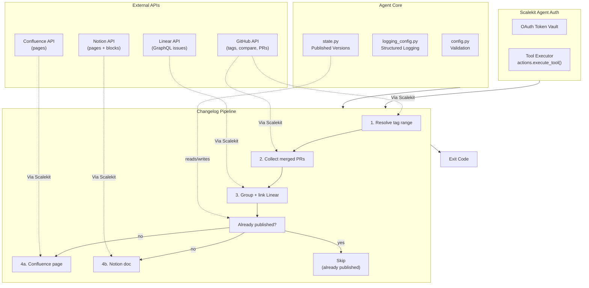

# Release Changelog Agent

**GitHub + Linear -> Confluence + Notion**

An agent that runs on behalf of a release manager: resolves the commit range for a release, collects the pull requests merged in it, groups them by feature / fix / chore, links each to its Linear issue, and publishes the changelog to a Confluence page and a Notion doc.

All four services are connected through [Scalekit Agent Auth](https://scalekit.com) using a single `actions.execute_tool()` interface. No token management, no OAuth refresh logic, no credential storage in your code.

## What It Does

For one release, the agent runs a four-step pipeline:

| Step | Action | Tool |
|------|--------|------|
| 1 | Resolve the release range from repo tags | `github_tags_list`, `github_release_get_latest` |
| 2 | Collect merged PRs since the last release tag | `github_commits_compare`, `github_pull_requests_list` |
| 3 | Group by feature / fix / chore, link Linear issues | in-process classifier + `linear_issue_get` |
| 4 | Publish to Confluence and Notion | `confluence_page_create`, `notion_page_create` |

**Example:** *"Generate changelog for v2.4.0 from merged PRs since the last release"* -> 26 PRs grouped into Features / Fixes / Chores, each linked to its GitHub PR and Linear issue, published to both a Confluence page and a Notion doc.

## Architecture



## Prerequisites

- Python 3.11+
- A [Scalekit](https://scalekit.com) account (free tier works)
- A **GitHub** account with read access to the target repo, which must have **at least two tags** (the changelog is a diff between two points)
- A **Linear** workspace (optional — set `ENABLE_LINEAR=false` to skip). Note the connector's GraphQL responses nest under a `data` key; the connector handles both that and the flat shape.
- A **Confluence** space you can create pages in (optional — `PUBLISH_CONFLUENCE=false`)
- A **Notion** page to publish under (optional — `PUBLISH_NOTION=false`)

## Setup

### 1. Install dependencies

```bash
pip install -r requirements.txt
```

### 2. Configure environment

```bash
cp .env.example .env
```

Fill in your credentials. See `.env.example` for all available options.

### 3. Set up Scalekit connectors

In the [Scalekit dashboard](https://scalekit.com), add connections under Agent Auth > Connections for each service you plan to use.

**GitHub**: Complete the OAuth flow with read access to the repository.

**Linear**: Complete the OAuth flow. Use the plain REST `LINEAR` connection, not `LINEARMCP` — a Linear MCP variant exists in Scalekit's catalog with a different toolset, while this agent is built against `linear_issue_get`.

**Confluence**: Complete the OAuth flow with permission to create pages in your target space.

**Notion**: Complete the OAuth flow, and **share the destination page with the integration** — Notion scopes access per page, so an unshared parent page returns "not found" even with a valid token.

**Copy the exact connection names** shown in your dashboard into `.env`. Scalekit auto-suffixes connection names per workspace (e.g. `github-a1b2c3d4`, `confluence-e5f6g7h8`), so the generic provider labels usually will not work — check yours under Agent Auth > Connections.

### 4. Run

```bash
python run_flow.py --dry-run   # render the changelog and print it, publish nothing
python run_flow.py             # publish for real
```

## How the Release Range Is Resolved

The two tags bounding a release are the config most likely to be wrong or omitted, so they are resolved with a documented fallback chain rather than being demanded on every run:

1. **Both tags set** — used as-is.
2. **Only `CURRENT_TAG` set** — the previous tag is the next one down the repo's tag list.
3. **Neither set** — the two most recent tags, i.e. "what shipped in the latest tag".
4. **No tags at all** — the agent raises rather than guessing, because a changelog with no baseline would silently cover the repo's entire history.

## How PRs Are Collected

Collection is exact rather than time-based, because "merged around the same time" is not the same as "in this release":

1. **Compare the two tags** and read PR numbers out of squash-merge commit messages (`... (#123)`). This reflects what is genuinely in the range.
2. **Resolve stragglers** — commits with no `(#123)` suffix (true merge commits, direct pushes) are mapped back to their PR via `github_commit_pull_requests_list`, capped at 25 lookups so a merge-heavy range cannot fire hundreds of extra calls. Anything beyond the cap is logged, not silently dropped.
3. **Fall back** to recently-merged PRs only if the compare itself fails.

PRs closed without merging are filtered out on `merged_at` — GitHub's pulls endpoint has no "merged" filter, so `state=closed` alone would put never-shipped work in your release notes.

## How Changes Are Grouped

Four passes, most reliable signal first. Each falls through only when the previous finds nothing:

1. **Conventional Commits** — `feat:`, `fix(scope):`, `chore!:` etc. Several types collapse into one bucket (refactor/style/test/build/ci all read as maintenance to a release audience).
2. **Bracketed type prefix** — `[chore] update collector`, common in repos that predate Conventional Commits.
3. **PR labels** — `bug`, `enhancement`, `documentation`.
4. **Leading imperative verb** — `Fix grafana datasource URL`, `Add Splunk`. Deliberately conservative: only unambiguous verbs are listed, and a component scope like `[shippingservice]` is stripped first so the verb is actually the first word.

Anything still unclassified lands in **Other Changes** rather than being guessed at.

Breaking changes (`!` marker or a "BREAKING CHANGE" note) are listed in a leading section *and* kept in their own category, so a breaking feature still reads as a feature.

## Linear Linking

Identifiers like `ENG-123` are parsed from the PR title, body, and **branch name** — a branch such as `eng-412-fix-login` is often the only signal when the title is clean prose. Each identifier is resolved once per run and cached.

Linear's `issue(id:)` resolver accepts the human identifier directly, so no separate UUID lookup is needed. A failed lookup drops the link rather than the changelog entry: identifiers get typo'd, issues get deleted, and other trackers use the same `ABC-123` shape.

Set `LINEAR_TEAM_PREFIXES=ENG,PLAT` to make matching exact and avoid false positives on strings like `UTF-8` or `CVE-2026`.


## Usage

```bash
python run_flow.py --dry-run                          # preview
RELEASE_VERSION=v2.4.0 python run_flow.py             # explicit version label
PREVIOUS_TAG=v1.1.0 CURRENT_TAG=v1.2.0 python run_flow.py   # explicit range
PUBLISH_NOTION=false python run_flow.py               # Confluence only
```

### Exit Codes

| Code | Meaning |
|------|---------|
| 0 | Success — changelog generated and published where enabled |
| 1 | Error — config missing, or Scalekit unreachable |
| 2 | No data — no merged pull requests in the resolved range |
| 130 | Interrupted (Ctrl+C or SIGTERM) |

## Troubleshooting

| Issue | Solution |
|-------|----------|
| `ModuleNotFoundError: scalekit` | Run `pip install -r requirements.txt` |
| `Missing required config: ...` | Run `cp .env.example .env` and fill in your values |
| `connector (...) -- EXPIRED` / `PENDING_AUTH` | Open the auth link printed in the Step 0 logs, or authorize in the Scalekit dashboard |
| `Missing required config: GITHUB_CONNECTOR` | Connector names have no default. Copy the exact connection name from Agent Auth > Connections — Scalekit auto-suffixes it per workspace (e.g. `github-a1b2c3d4`), so the generic `GITHUB` label will not work |
| `multiple connected accounts found for identifier` | Set the exact `*_CONNECTOR` env var for that provider; the same identifier is connected to more than one connection of that type in your workspace |
| `... has no tags, so there is no release baseline` | The repo has never been tagged. Tag a release, or set `PREVIOUS_TAG` and `CURRENT_TAG` explicitly |
| `... has only one tag` / `'X' is the oldest tag` | There is no earlier tag to diff against. Set `PREVIOUS_TAG` explicitly |
| `CURRENT_TAG 'X' not found` | The tag does not exist in that repo. The error lists the recent tags it did find |
| `No merged pull requests found between ...` (exit 2) | The range is genuinely empty, or the repo merges without squashing. Commits lacking a `(#123)` suffix are resolved via a per-commit lookup capped at 25 — the log says how many were skipped |
| Everything lands in **Other Changes** | The repo uses no recognised title convention. Grouping falls back through Conventional Commits, `[type]` prefixes, PR labels, then leading verbs; unrecognised titles stay in Other by design rather than being guessed at |
| `No Linear issue identifiers found in these pull requests` | Expected when PRs do not reference Linear. Identifiers are read from the PR title, branch name, and body — set `LINEAR_TEAM_PREFIXES=ENG,PLAT` to match exactly and avoid false positives like `UTF-8` |
| Linear links missing for a PR that does reference an issue | The lookup failed (typo'd, deleted, or not visible to the connected account). A failed lookup drops the link, never the changelog entry |
| `Confluence space 'X' not found` | The error lists the space keys visible to your account. `CONFLUENCE_SPACE_KEY` is the human key from the URL (e.g. `SD`), not the numeric id — the agent resolves that for you |
| Confluence page created but blank | `body_representation` and `body_value` must both be sent; the connector omits the body entirely if either is missing. Check for local edits to `ConfluenceConnector.create_page` |
| A second Notion page appeared for the same version | Expected if `state/published_releases.json` was deleted. Notion page titles are not unique, so it has no remote duplicate check — Confluence does |
| Notion publish fails with "not found" | Share the parent page with the Notion integration; Notion scopes access per page, so a valid token alone is not enough |
| `No colored output` | Colors auto-disable when output is piped; force with `FORCE_COLOR=1` |

