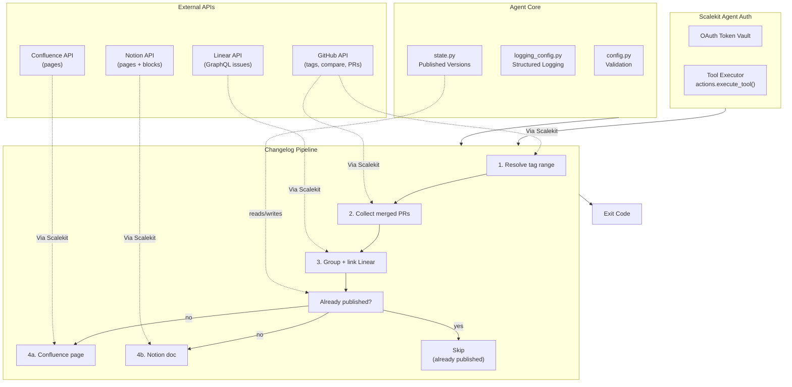

# Release Changelog Agent

**GitHub + Linear -> Confluence + Notion**

An agent that runs on behalf of a release manager: resolves the commit range for a release, collects the pull requests merged in it, groups them by feature / fix / chore, links each to its Linear issue, and publishes the changelog to a Confluence page and a Notion doc.

All four services are connected through [Scalekit Agent Auth](https://scalekit.com) using a single `actions.execute_tool()` interface. No token management, no OAuth refresh logic, no credential storage in your code.

## What It Does

For one release, the agent runs a four-step pipeline:

| Step | Action | Tool |
|------|--------|------|
| 1 | Resolve the release range from repo tags | `github_tags_list`, `github_release_get_latest` |
| 2 | Collect merged PRs since the last release tag | `github_commits_compare`, `github_pull_requests_list` |
| 3 | Group by feature / fix / chore, link Linear issues | in-process classifier + `linear_issue_get` |
| 4 | Publish to Confluence and Notion | `confluence_page_create`, `notion_page_create` |

**Example:** *"Generate changelog for v2.4.0 from merged PRs since the last release"* -> 26 PRs grouped into Features / Fixes / Chores, each linked to its GitHub PR and Linear issue, published to both a Confluence page and a Notion doc.

## Architecture



## Prerequisites

- Python 3.11+
- A [Scalekit](https://scalekit.com) account (free tier works)
- A **GitHub** account with read access to the target repo, which must have **at least two tags** (the changelog is a diff between two points)
- A **Linear** workspace (optional — set `ENABLE_LINEAR=false` to skip). Note the connector's GraphQL responses nest under a `data` key; the connector handles both that and the flat shape.
- A **Confluence** space you can create pages in (optional — `PUBLISH_CONFLUENCE=false`)
- A **Notion** page to publish under (optional — `PUBLISH_NOTION=false`)

## Setup

### 1. Install dependencies

```bash
pip install -r requirements.txt
```

### 2. Configure environment

```bash
cp .env.example .env
```

Fill in your credentials. See `.env.example` for all available options.

### 3. Set up Scalekit connectors

In the [Scalekit dashboard](https://scalekit.com), add connections under Agent Auth > Connections for each service you plan to use.

**GitHub**: Complete the OAuth flow with read access to the repository.

**Linear**: Complete the OAuth flow. Use the plain REST `LINEAR` connection, not `LINEARMCP` — a Linear MCP variant exists in Scalekit's catalog with a different toolset, while this agent is built against `linear_issue_get`.

**Confluence**: Complete the OAuth flow with permission to create pages in your target space.

**Notion**: Complete the OAuth flow, and **share the destination page with the integration** — Notion scopes access per page, so an unshared parent page returns "not found" even with a valid token.

**Copy the exact connection names** shown in your dashboard into `.env`. Scalekit auto-suffixes these per workspace (e.g. `github-g0DJbhbx`, `confluence-zXIthl0L`), so the generic provider labels usually will not work.

### 4. Run

```bash
python run_flow.py --dry-run   # render the changelog and print it, publish nothing
python run_flow.py             # publish for real
```

## How the Release Range Is Resolved

The two tags bounding a release are the config most likely to be wrong or omitted, so they are resolved with a documented fallback chain rather than being demanded on every run:

1. **Both tags set** — used as-is.
2. **Only `CURRENT_TAG` set** — the previous tag is the next one down the repo's tag list.
3. **Neither set** — the two most recent tags, i.e. "what shipped in the latest tag".
4. **No tags at all** — the agent raises rather than guessing, because a changelog with no baseline would silently cover the repo's entire history.

## How PRs Are Collected

Collection is exact rather than time-based, because "merged around the same time" is not the same as "in this release":

1. **Compare the two tags** and read PR numbers out of squash-merge commit messages (`... (#123)`). This reflects what is genuinely in the range.
2. **Resolve stragglers** — commits with no `(#123)` suffix (true merge commits, direct pushes) are mapped back to their PR via `github_commit_pull_requests_list`, capped at 25 lookups so a merge-heavy range cannot fire hundreds of extra calls. Anything beyond the cap is logged, not silently dropped.
3. **Fall back** to recently-merged PRs only if the compare itself fails.

PRs closed without merging are filtered out on `merged_at` — GitHub's pulls endpoint has no "merged" filter, so `state=closed` alone would put never-shipped work in your release notes.

## How Changes Are Grouped

Four passes, most reliable signal first. Each falls through only when the previous finds nothing:

1. **Conventional Commits** — `feat:`, `fix(scope):`, `chore!:` etc. Several types collapse into one bucket (refactor/style/test/build/ci all read as maintenance to a release audience).
2. **Bracketed type prefix** — `[chore] update collector`, common in repos that predate Conventional Commits.
3. **PR labels** — `bug`, `enhancement`, `documentation`.
4. **Leading imperative verb** — `Fix grafana datasource URL`, `Add Splunk`. Deliberately conservative: only unambiguous verbs are listed, and a component scope like `[shippingservice]` is stripped first so the verb is actually the first word.

Anything still unclassified lands in **Other Changes** rather than being guessed at. On a real 26-PR release in `open-telemetry/opentelemetry-demo`, this produced 10 features, 4 fixes, 5 chores, and 7 genuinely ambiguous entries — versus 26 in one bucket with Conventional Commits parsing alone.

Breaking changes (`!` marker or a "BREAKING CHANGE" note) are listed in a leading section *and* kept in their own category, so a breaking feature still reads as a feature.

## Linear Linking

Identifiers like `ENG-123` are parsed from the PR title, body, and **branch name** — a branch such as `eng-412-fix-login` is often the only signal when the title is clean prose. Each identifier is resolved once per run and cached.

Linear's `issue(id:)` resolver accepts the human identifier directly, so no separate UUID lookup is needed. A failed lookup drops the link rather than the changelog entry: identifiers get typo'd, issues get deleted, and other trackers use the same `ABC-123` shape.

Set `LINEAR_TEAM_PREFIXES=ENG,PLAT` to make matching exact and avoid false positives on strings like `UTF-8` or `CVE-2026`.

## Idempotency

A version is published at most once per repository per target.

| Target | Guard | Survives state deletion? |
|---|---|---|
| Confluence | Local state + **remote title search** in the space | ✅ |
| Notion | Local state only | ❌ |

The asymmetry is real and deliberate: Confluence page titles are unique within a space, so an existing page can be found reliably. **Notion titles are not unique**, so there is no equivalent remote check — deleting `state/published_releases.json` and re-running *will* create a second Notion page. Verified live.

State is recorded per target, so a run that publishes to Confluence and then fails on Notion records the Confluence page and does not recreate it on retry.

## Usage

```bash
python run_flow.py --dry-run                          # preview
RELEASE_VERSION=v2.4.0 python run_flow.py             # explicit version label
PREVIOUS_TAG=v1.1.0 CURRENT_TAG=v1.2.0 python run_flow.py   # explicit range
PUBLISH_NOTION=false python run_flow.py               # Confluence only
```

### Exit Codes

| Code | Meaning |
|------|---------|
| 0 | Success — changelog generated and published where enabled |
| 1 | Error — config missing, or Scalekit unreachable |
| 2 | No data — no merged pull requests in the resolved range |
| 130 | Interrupted (Ctrl+C or SIGTERM) |

## Verification Status

**All four services verified in a single end-to-end run** against `parv15/changelog-demo`, a small public repo built for this purpose (two tags, three squash-merged PRs referencing Linear issues from the title, the branch name, and the body respectively):

```
Resolved release range v0.1.0...v0.2.0 from repo tags
Compared v0.1.0...v0.2.0: 3 commit(s)
Grouped: 1 feature, 1 fix, 1 chore
Linked 3/3 Linear issue reference(s)
[OK] Published to Confluence
[OK] Published to Notion
```

The published Confluence page was read back through the API and contains 3 GitHub PR links and 3 `linear.app` issue links. A second run skipped both targets.


Built against tool schemas pulled live from the Scalekit environment, not guessed. Verified end-to-end against real services:

- **GitHub** — resolved `v1.1.0...v1.2.0` from real tags on `open-telemetry/opentelemetry-demo`, compared them (26 commits), and hydrated all 26 merged PRs.
- **Confluence** — space key `SD` resolved to numeric id `294916`, and a real changelog page was created. A second run found the existing page by title and skipped it.
- **Notion** — a real changelog page was created under a parent page with inline PR links.
- **Linear** — verified live against connection `linear-wuvcVfMm`. `linear_issue_get` resolved a real issue from its human identifier (`INF-33`) with no UUID lookup, and a nonexistent identifier returned `None` rather than raising. Identifier extraction was exercised from all three sources — PR title, branch name, and body — producing real `linear.app` links in the rendered changelog.

## Known Limits

- **Commit-to-PR lookups are capped** at 25 per run. A range with many true merge commits (rather than squash merges) may omit PRs beyond that; the agent warns with the count rather than appearing complete.
- **Notion duplicate risk** — deleting the state file will create a second Notion page for an already-published version, because Notion titles are not unique enough to check remotely.
- **`MAX_PRS` caps hydration at 100** (GitHub's `per_page` limit). A release containing more than 100 PRs will resolve their numbers from the compare, but PRs outside the most recent 100 merged are fetched individually, which is slower.
- **No release-notes generation from commit bodies** — the changelog summarises PR titles, not diffs. It does not attempt to describe what changed beyond what the author wrote.

## Project Structure

```
release-changelog-agent/
├── run_flow.py          # Orchestration: the 4-step pipeline
├── config.py            # Env-var config with fail-fast validation
├── connectors.py        # GitHub / Linear / Confluence / Notion via Scalekit
├── changelog.py         # Classification, grouping, and the three renderers
├── provisioning.py      # Tag-range and Confluence-space resolution
├── state.py             # Published-version state (idempotency)
├── logging_config.py    # Structured logging with secret redaction
├── requirements.txt
└── .env.example
```
