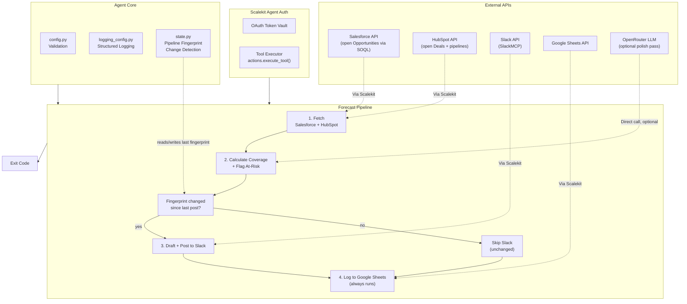

# Revenue Forecast Commentary Agent

**Salesforce + HubSpot -> Slack + Google Sheets**

An agent that runs on behalf of a RevOps analyst: pulls open pipeline by stage from Salesforce and HubSpot, calculates coverage ratios, flags at-risk segments, drafts commentary, posts it to Slack, and logs a pipeline snapshot to Google Sheets.

All four services are connected through [Scalekit Agent Auth](https://scalekit.com) using a single `actions.execute_tool()` interface. No token management, no OAuth refresh logic, no credential storage in your code.

## What It Does

For one forecast cycle, the agent runs a four-step pipeline:

| Step | Action | Tool |
|------|--------|------|
| 1 | Fetch open pipeline from Salesforce and HubSpot | `salesforce_soql_execute`, `hubspot_deal_pipelines_list`, `hubspot_deals_search` |
| 2 | Calculate coverage ratio and flag at-risk stages | in-process aggregator (rule-based) |
| 3 | Draft commentary and post to Slack | `slackmcp_slack_search_channels`, `slackmcp_slack_send_message` |
| 4 | Log a pipeline snapshot per stage to Google Sheets | `googlesheets_add_sheet`, `googlesheets_append_values` |

**Example:** *"What does this week's forecast look like?"* -> coverage ratio and at-risk stages calculated from live CRM data, commentary posted to `#revenue-ops`, snapshot rows appended to a running Google Sheets log.

## Architecture



## Prerequisites

- Python 3.11+
- A [Scalekit](https://scalekit.com) account (free tier works)
- A Salesforce org with at least one Opportunity object (open pipeline data)
- A HubSpot portal with a Deals pipeline configured (the default "Sales Pipeline" works out of the box)
- A Slack workspace where the agent can post to a channel or DM an analyst
- An **existing Google Sheets spreadsheet** (just the spreadsheet; the agent creates the destination tab and header row for you. There is a `googlesheets_create_spreadsheet` tool available through Scalekit, but this agent's normal flow does not call it automatically on every run, since doing so on every misconfigured run would scatter forecast history across many spreadsheets instead of accumulating it in one place. Create one spreadsheet manually, or once via that tool, and set its ID in `.env`.)
- An [OpenRouter](https://openrouter.ai) API key (optional; falls back to a deterministic rule-based commentary draft)
**Data flow note:** setting `OPENROUTER_API_KEY` sends the rule-based commentary draft (stage names, dollar figures, at-risk reasons) to OpenRouter's third-party API to polish its wording. Leave it unset to keep all commentary generation local (rule-based, no data leaves your Scalekit-connected services). Assess this against your organization's data-handling policies before enabling it for real forecast data.

## Setup

### 1. Install dependencies

```bash
pip install -r requirements.txt
```

### 2. Configure environment

```bash
cp .env.example .env
```

Fill in your credentials. See `.env.example` for all available options.

### 3. Set up Scalekit connectors

In the [Scalekit dashboard](https://scalekit.com), add four connections under Agent Auth > Connections: **Salesforce**, **HubSpot**, a **Slack** MCP variant, and **Google Sheets**.

**Salesforce**: Complete the OAuth flow. Grant read access to the Opportunity object.

**HubSpot**: Complete the OAuth flow with CRM read scopes (deals, pipelines). Use the plain REST HubSpot connection, not an MCP variant: a separate `HUBSPOTMCP` connector exists in Scalekit's tool catalog with a different, smaller toolset (`search_crm_objects`, `query_crm_data`, etc.), but this agent is built against the plain `HUBSPOT` connector's `hubspot_deal_pipelines_list` and `hubspot_deals_search` tools, which is the variant most workspaces actually have an ACTIVE connected account for. Verify with `list_connected_accounts` which variant is active in your workspace before assuming otherwise.

**Slack**: Use an MCP-based Slack connection (send-message tool signatures differ between the plain REST `SLACK` connector and the `SLACKMCP` variant; this agent uses SlackMCP's `channel_id`/`message` parameter names). Complete the OAuth flow with `chat:write` scope (or equivalent MCP scope), and invite the connected account into whatever channel you configure as `SLACK_CHANNEL` if it isn't already a member.

**Google Sheets**: Complete the OAuth flow with access to the spreadsheet you'll use as the log destination.

**Copy the exact connection names** shown in your dashboard into `.env`. Scalekit auto-suffixes these per workspace (e.g. `salesforce-1`, `googlesheets-BOzvgKS0`), so the generic provider labels won't work for the Step 0 auth check or for disambiguating `execute_tool()` calls when one identifier has multiple connections of the same provider type. See `SALESFORCE_CONNECTOR`, `HUBSPOT_CONNECTOR`, `SLACK_CONNECTOR`, `GOOGLE_SHEETS_CONNECTOR` in Configuration below.

### 4. Point the agent at your real data

- `ANALYST_EMAIL`: the RevOps analyst this cycle is labeled under (commentary and Sheets log; pipeline queries themselves are org-wide, not scoped to a single rep)
- `FORECAST_PERIOD`: a display label like `2026-W30` or `Q3 2026` shown in commentary and the Sheets log. Leave blank to default to the current ISO week. This is a label only: it does not control whether Slack gets a post, see [State](#state) below
- `SLACK_CHANNEL`: a channel name like `#revenue-ops` (resolved to an ID automatically) or a literal channel/user ID
- `GOOGLE_SHEETS_SPREADSHEET_ID` / `GOOGLE_SHEETS_TAB_NAME`: your destination spreadsheet and tab
- `COVERAGE_RATIO_TARGET` / `QUOTA_TARGET`: your team's coverage target multiple and quota figure (see [Coverage Ratio Formula](#coverage-ratio-formula--at-risk-flagging) below)

### 5. Run

```bash
python run_flow.py
```

## Coverage Ratio Formula & At-Risk Flagging

**Coverage ratio:**

```
coverage_ratio = total_open_pipeline_value / quota_target
```

This is the standard "pipeline coverage" metric used in SaaS sales planning. If quota this period is $100k and there is $350k of genuinely open pipeline, coverage is 3.5x. A commonly used rule of thumb is that healthy coverage sits at 3x-4x quota (accounting for typical win rates in the 20-35% range); below that, there usually isn't enough pipeline in the funnel to realistically hit the number even with a strong close rate. `COVERAGE_RATIO_TARGET` defaults to `3.0`, and the overall forecast is flagged **AT RISK** when coverage falls below it.

Neither Salesforce nor HubSpot expose an authoritative "quota" object through the tools available to this agent (HubSpot's Goals API is present as `hubspot_goal_targets_list`, but it manages per-user goal targets, not a single team quota figure), so `QUOTA_TARGET` is a configured number in the same currency units as the Amount/amount fields.

**At-risk stage flagging**, using only signals present on the records actually returned:

1. **Stale**: any open record's close date has already passed (a classic forecast-inflation signal: the deal's timeline slipped and nobody updated it).
2. **Thin**: a late-stage segment (stage label containing "negotiation", "contract", "decision", "review", or "closing") has fewer than 2 deals/opportunities.
3. **Underweighted**: a late-stage segment holds less than 5% of total open pipeline value, suggesting the deal isn't actually progressing at the rate its stage implies.

Each flagged stage lists its specific reason(s) in the commentary; the overall forecast's AT RISK/ON TRACK status is driven independently by the coverage ratio.

## Usage

### One-Time Mode (Default)

Process one forecast cycle and exit:

```bash
python run_flow.py
```

Ideal for cron jobs, CI/CD pipelines, manual runs, or serverless functions. This agent is naturally a **weekly-cadence** workflow (a RevOps forecast commentary rarely needs to run more than once a week), so a weekly cron entry is the primary deployment pattern:

```bash
0 9 * * MON cd /path/to/agent && python run_flow.py   # weekly, Monday mornings
```

### Continuous Mode (Polling)

Run indefinitely, re-checking on an interval (default: once a week, `10080` minutes):

```bash
POLLING_MODE=true POLL_INTERVAL_MINUTES=10080 python run_flow.py
```

Press `Ctrl+C` to stop gracefully. The agent finishes the current cycle, exits with code `130`, and does not leave a half-posted Slack message or a partially logged Sheets row.

## Configuration

Environment variables (set in `.env`):

| Variable | Default | Notes |
|----------|---------|-------|
| `SCALEKIT_ENV_URL` | - | Required: your Scalekit workspace URL |
| `SCALEKIT_CLIENT_ID` | - | Required: Scalekit client ID |
| `SCALEKIT_CLIENT_SECRET` | - | Required: Scalekit client secret |
| `SALESFORCE_USER` | - | Required: identity used to authorize Salesforce |
| `HUBSPOT_USER` | - | Required: identity used to authorize HubSpot |
| `SLACK_USER` | - | Required: identity used to authorize Slack |
| `GOOGLE_SHEETS_USER` | - | Required: identity used to authorize Google Sheets |
| `SALESFORCE_CONNECTOR` | `salesforce-1` | Exact connection name from the Scalekit dashboard |
| `HUBSPOT_CONNECTOR` | `hubspot` | Exact connection name; must be the plain REST HubSpot connector, not HUBSPOTMCP |
| `SLACK_CONNECTOR` | `slackmcp` | Exact connection name; must be an MCP-variant Slack connection |
| `GOOGLE_SHEETS_CONNECTOR` | `googlesheets-BOzvgKS0` | Exact connection name (often auto-suffixed) |
| `ANALYST_EMAIL` | - | Required: analyst this cycle is labeled under |
| `FORECAST_PERIOD` | current ISO week | Display label only, used in commentary and the Sheets log, e.g. `Q3 2026`. Does not gate the Slack post |
| `SLACK_CHANNEL` | `#revenue-ops` | Channel name (resolved to an ID) or a literal channel/user ID |
| `GOOGLE_SHEETS_SPREADSHEET_ID` | - | Required: destination spreadsheet ID |
| `GOOGLE_SHEETS_TAB_NAME` | `Forecast Log` | Tab/sheet name; auto-created if missing |
| `COVERAGE_RATIO_TARGET` | `3.0` | Coverage multiple below which the overall forecast is flagged at risk |
| `QUOTA_TARGET` | `100000` | Quota this cycle's total open pipeline is measured against |
| `STALE_DEAL_DAYS` | `90` | Reserved for future staleness-window tuning (see aggregator.py) |
| `POLLING_MODE` | `false` | Enable continuous polling |
| `POLL_INTERVAL_MINUTES` | `10080` | Minutes between polling cycles (default: weekly) |
| `LOG_LEVEL` | `INFO` | `DEBUG`, `INFO`, `WARNING`, `ERROR` |
| `OPENROUTER_API_KEY` | (empty) | Optional: enables an LLM polish pass over the rule-based commentary |
| `OPENROUTER_MODEL` | `openai/gpt-4o-mini` | LLM model to use |

## Exit Codes

| Code | Meaning | Use Case |
|------|---------|----------|
| `0` | Success | Pipeline checked and logged to Sheets; Slack posted only if the pipeline changed since the last post |
| `1` | Error | Config missing, provisioning failed, or 5 consecutive polling errors; investigate logs |
| `2` | No data | No open pipeline found in either Salesforce or HubSpot this cycle (normal, not an error) |
| `130` | Interrupted | Graceful shutdown via Ctrl+C or SIGTERM |

## Monitoring

### Logging

Structured logs with timestamps, levels, and auto-redacted secrets:

```bash
python run_flow.py                    # all logs
LOG_LEVEL=ERROR python run_flow.py     # errors only
LOG_LEVEL=DEBUG python run_flow.py     # verbose
```

Log levels:
- `DEBUG`: detailed execution flow, Scalekit client initialization
- `INFO`: key milestones, connector auth status, per-stage coverage results, Slack/Sheets writes
- `WARNING`: auth issues, unresolved Slack channels, HubSpot pipeline resolution failures
- `ERROR`: unrecoverable failures, missing config

### Polling Loop

Because Slack posting is gated by real pipeline change (see State below), polling mode is a genuine change detector, not a once-per-period digest: leave it running continuously and it stays quiet until Salesforce or HubSpot data actually moves, then posts.

```bash
POLLING_MODE=true POLL_INTERVAL_MINUTES=60 python run_flow.py   # check hourly
# Ctrl+C stops after the current cycle finishes, exit code 130
```

### State

Every cycle fetches fresh data from Salesforce and HubSpot and logs a snapshot row to Google Sheets (append-only, safe to run any number of times). Whether Slack gets a new post is decided separately: `state.py` computes a content fingerprint over each stage's deal count, total value, and at-risk flag, and only posts to Slack when that fingerprint differs from the last one posted for this analyst. This means:

- Running the agent repeatedly with unchanged pipeline data logs a fresh Sheets row each time but never re-posts the same commentary to Slack.
- A new deal, a stage move, an amount change, or a stage newly (or no longer) flagged at-risk changes the fingerprint and triggers a fresh Slack post on the next cycle.
- `FORECAST_PERIOD` is not part of this decision; it is purely a display label.

The last-posted fingerprint per analyst is stored in `state/processed_periods.json`.

```bash
rm -f state/processed_periods.json   # reset, e.g. to force a re-post for testing
```

## Error Handling & Edge Cases

- **Salesforce fetch failure**: logged and treated as zero opportunities for this cycle rather than crashing the whole run; HubSpot data still contributes if available.
- **HubSpot pipeline resolution failure**: if `hubspot_deal_pipelines_list` fails, HubSpot deal stage IDs cannot be resolved to labels or classified as open, so HubSpot contributes zero deals this cycle (logged as an error); Salesforce data still contributes.
- **No open pipeline in either CRM**: the cycle exits `2` (no data, not an error) without posting to Slack or writing to Sheets.
- **Slack channel not resolvable**: logged as a warning; the cycle continues to Step 4 and still logs the Google Sheets snapshot even if the Slack post is skipped.
- **Slack post failure**: logged as a warning; Google Sheets logging still proceeds afterward.
- **Google Sheets row-write failure for one stage**: logged as a warning per stage; other stages in the same cycle are still logged.
- **Malformed/corrupted state file**: detected and treated as empty (fresh start) rather than crashing.
- **Deals/opportunities with a past close date while still open**: flagged as a "stale" at-risk signal rather than silently included as healthy pipeline.
- **LLM commentary polish failure or empty response**: automatic fallback to the deterministic rule-based draft; the cycle never blocks on an LLM outage, and the LLM path never introduces numbers not already present in the rule-based draft.
- **Ctrl+C / SIGTERM mid-cycle**: the in-flight cycle finishes (or the next poll doesn't start) and the process exits `130`; no partial state is marked processed.
- **Google Sheets spreadsheet doesn't exist or isn't accessible**: provisioning fails fast with exit code `1` and an explicit instruction to create the spreadsheet first (this can't be automated as part of the normal run; see [Prerequisites](#prerequisites)).
- **HubSpot portal has zero deal pipelines**: logged as a warning; HubSpot contributes zero deals for the rest of the cycle rather than raising an error, since an empty-but-reachable portal is a valid (if unusual) state.

## Troubleshooting

| Issue | Solution |
|-------|----------|
| `ModuleNotFoundError: scalekit` | Run `pip install -r requirements.txt` |
| `Missing required config: ...` | Run `cp .env.example .env` and fill in your values |
| `connector (...) -- INACTIVE` / `PENDING` | Open the auth link printed in logs, or authorize in the Scalekit dashboard |
| `multiple connected accounts found for identifier` | Set the exact `*_CONNECTOR` env var for that provider; the same identifier is connected to more than one connection of that type in your workspace |
| `Cannot access Google Sheets spreadsheet '...'` | The spreadsheet doesn't exist or isn't shared with your connected account. Create an empty spreadsheet at sheets.google.com and set `GOOGLE_SHEETS_SPREADSHEET_ID` to its ID from the URL |
| `Cannot fetch HubSpot deal pipelines` | Confirm `HUBSPOT_CONNECTOR` points at an ACTIVE HubSpot connection with CRM read scopes |
| Commentary shows 0 open pipeline but you know deals exist | Check the HubSpot pipeline's stage `isClosed` metadata via `hubspot_deal_pipelines_list`; only stages with `isClosed: false` are queried as "open" |
| Slack message not posted | Verify the bot has `chat:write` scope (or MCP equivalent) and is a member of the target channel; set `SLACK_CHANNEL` to a channel that exists in your workspace, or a literal channel/user ID |
| `Could not resolve Slack channel '...'` | The channel name search returned no results; double-check spelling, or use a literal channel ID (`C...`) instead |
| Google Sheets row missing expected header | The header row is only written once, the first time the tab is empty; if you manually cleared the tab's values, the next run re-writes it |
| `No colored output` | Colors auto-disable when output is piped; force with `FORCE_COLOR=1` |
