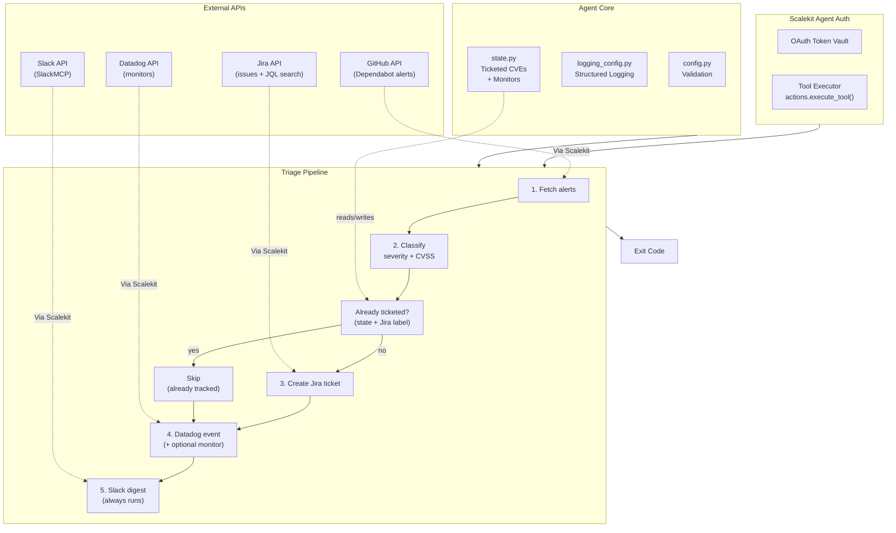

# Security Vulnerability Triage Agent

**GitHub -> Jira + Slack + Datadog**

An agent that runs on behalf of a security engineer: pulls open Dependabot vulnerability alerts from a GitHub repository, classifies each CVE by severity and CVSS score, opens a Jira ticket per CVE with its remediation path, posts a digest to the security Slack channel, and optionally sets a Datadog monitor for the most severe findings.

All four services are connected through [Scalekit Agent Auth](https://scalekit.com) using a single `actions.execute_tool()` interface. No token management, no OAuth refresh logic, no credential storage in your code.

## What It Does

For one triage cycle, the agent runs a five-step pipeline:

| Step | Action | Tool |
|------|--------|------|
| 1 | Fetch open Dependabot alerts for the repo | `github_dependabot_alerts_list` |
| 2 | Classify by severity (critical / high / medium / low) and CVSS | in-process triage (rule-based) |
| 3 | Open a Jira ticket per CVE with CVSS score and fix path | `jira_issues_search`, `jira_issue_create` |
| 4 | Record each finding as a Datadog event (+ optional monitor) | `datadog_event_create`, `datadog_monitor_create` |
| 5 | Post a triage digest to the security Slack channel | `slackmcp_slack_search_channels`, `slackmcp_slack_send_message` |

**Example:** *"Triage open CVEs in the payments-api repo and create Jira tickets"* -> every open Dependabot alert classified, a Jira ticket per high/critical CVE with its upgrade path, a monitor per critical CVE, and a digest in `#security-alerts`.

## Architecture



## Prerequisites

- Python 3.11+
- A [Scalekit](https://scalekit.com) account (free tier works)
- A **GitHub** account with access to the target repo, authorized with the `security_events` scope (`public_repo` is sufficient for public repos), and **Dependabot alerts enabled** on that repo under Settings > Code security
- A **Jira** site with a project you can create issues in
- A **Slack** workspace where the agent can post to a channel or DM an engineer
- A **Datadog** account (only needed if you enable monitor creation)

## Setup

### 1. Install dependencies

```bash
pip install -r requirements.txt
```

### 2. Configure environment

```bash
cp .env.example .env
```

Fill in your credentials. See `.env.example` for all available options.

### 3. Set up Scalekit connectors

In the [Scalekit dashboard](https://scalekit.com), add four connections under Agent Auth > Connections: **GitHub**, **Jira**, a **Slack** MCP variant, and **Datadog**.

**GitHub**: Complete the OAuth flow. Grant the `security_events` scope — without it the Dependabot endpoint returns 403 on private repos. Dependabot alerts must also be switched on for the repo itself.

**Jira**: Complete the OAuth flow. Use the plain REST Jira connection, not the `ATLASSIANMCP` variant: a separate Atlassian Rovo MCP connector exists in Scalekit's catalog with a different, smaller toolset (`createjiraissue` etc.), while this agent is built against the plain `JIRA` connector's `jira_issue_create` and `jira_issues_search` tools.

**Slack**: Use an MCP-based Slack connection. Send-message signatures differ between the plain REST `SLACK` connector and the `SLACKMCP` variant; this agent uses SlackMCP's `channel_id`/`message` parameter names. Grant `chat:write` (or the equivalent MCP scope) and invite the connected account into the channel you set as `SLACK_CHANNEL`.

**Datadog**: This connector authenticates with an **API key**, not OAuth. If it goes inactive, rotate the key in the Scalekit dashboard rather than looking for an authorization link.

**Copy the exact connection names** shown in your dashboard into `.env`. Scalekit auto-suffixes these per workspace (e.g. `github-g0DJbhbx`, `datadog-ohQjRdoK`), so the generic provider labels usually will not work, either for the Step 0 auth check or for disambiguating `execute_tool()` calls when one identifier has several connections of the same provider type.

### 4. Point the agent at your real data

- `GITHUB_OWNER` / `GITHUB_REPO`: the repository to triage
- `JIRA_PROJECT_KEY`: the short project key tickets land in (e.g. `SEC` for `SEC-123`)
- `SLACK_CHANNEL`: a channel name like `#security-alerts`, or a literal channel/user ID (a user ID sends a DM)
- `MIN_TICKET_SEVERITY` / `MONITOR_SEVERITY`: your routing thresholds (see below)

### 5. Run

```bash
python run_flow.py --dry-run   # classify and report, write nothing
python run_flow.py             # real run
```

## Classification & Routing Rules

**Severity** comes from the advisory itself. Each Dependabot alert carries both an advisory-level severity and a `security_vulnerability.severity` scoped to the specific affected package; the agent prefers the package-specific value, since that is the one describing *this* dependency. Unknown values degrade to `low` rather than failing the run.

**CVSS score** is read from `security_advisory.cvss.score`. GitHub reports `0.0` for advisories with no scored vector, so a 0 is normalized to "not scored" — a ticket claiming a genuine CVSS of 0 would be misleading.

**Sorting** is most-severe-first, with CVSS breaking ties within a severity band.

**Monorepo deduplication.** A monorepo hits the same advisory once per manifest, so GitHub returns one alert per occurrence — in testing, 100 raw alerts contained only 63 distinct CVEs. Alerts sharing a CVE id *and* package are collapsed into one ticket, keeping the highest-severity occurrence and recording every affected manifest in the ticket body. This matters because the cross-run Jira label search cannot catch same-run duplicates: none of those tickets exist yet when the run starts. The same advisory affecting two *different* packages stays separate, since those are genuinely separate remediations. When services pin different majors, every valid patch target is listed rather than naming one that is wrong for the others.

**Routing thresholds**, both configurable:

1. `MIN_TICKET_SEVERITY` (default `high`) — the floor for opening a Jira ticket. CVEs below it are still counted and listed in the Slack digest, they just don't create backlog items. This is what keeps low-severity advisory noise out of the security board.
2. `MONITOR_SEVERITY` (default `critical`) — the floor for creating a Datadog monitor. Validated to be **at or above** `MIN_TICKET_SEVERITY`, because a monitor for a CVE with no ticket would be an alert with no owner and no workflow behind it.

**Remediation path** is taken from `first_patched_version`. When an advisory has no patched version yet, the ticket says so explicitly and recommends pinning/removing the dependency instead of naming a version that doesn't exist.

## Idempotency

A CVE is ticketed **at most once per repository**, guarded at two levels:

1. **Local state** (`state/triaged_cves.json`) — the fast path, checked first.
2. **A Jira label search** — every ticket is labeled with its normalized CVE id (`cve-2023-32681`), so before creating anything the agent searches the project for that label.

The second guard is what makes dedup durable: deleting the state file costs one extra search per CVE but **never** produces duplicate tickets. Datadog monitors are guarded the same way, cross-checked against the live monitor list by name.

The Slack digest posts on **every** run by design — it is a daily summary, not an alert, and it is the one write here that is safe to repeat.

If the process is killed after a ticket is created but before state is written, the next run's Jira label search still finds the ticket, so the crash window costs a search rather than a duplicate.

## What Datadog Is For

Datadog is the **runtime visibility** leg: Jira tracks the remediation work, Slack notifies the humans, and Datadog is where a vulnerability finding becomes queryable operational data alongside the rest of your telemetry.

The agent writes to Datadog two ways, and the distinction matters:

**Events (on by default, `ENABLE_DATADOG_EVENTS`).** Each ticketable CVE posts an event via `datadog_event_create`, tagged `cve:`, `severity:`, `repo:`, and `package:`. This is the right primitive: "CVE-2026-9277 was found in shell-quote" is a discrete timestamped fact, which is exactly what an event is. Events need **no pre-existing metric stream**, so this works on any Datadog account immediately. Each CVE's `aggregation_key` is its id, so repeated runs build one event stream per CVE — a detection history — rather than duplicate noise. You can then filter the event explorer by `source:security-triage-agent`, overlay findings on dashboards, or correlate a CVE's appearance with a deploy.

**Monitors (off by default, `ENABLE_DATADOG_MONITORS`).** A monitor watches a *metric over time*, which only makes sense if you already pipe vulnerability counts into Datadog as a custom metric. The shipped `DATADOG_MONITOR_QUERY` references `vulnerability.exposure`, which is **not a built-in Datadog metric** — nothing emits it by default, so a monitor built on it sits in "No Data" forever. It is off by default and documented as a placeholder for exactly this reason. Turn it on only after pointing it at a metric your infrastructure actually emits.

If you want CVEs visible in Datadog, use events. Reach for monitors only when you have a real vulnerability metric to threshold on.

## Safety Defaults

- **Datadog monitors are off by default** (`ENABLE_DATADOG_MONITORS=false`). Monitor creation is the only persistent, hand-cleanup-required write in this flow, and its default query references a metric nothing emits (see [What Datadog Is For](#what-datadog-is-for)). Events, which work on any account, are on instead.
- **`--dry-run`** classifies and reports without creating tickets, monitors, or Slack messages.
- **Jira priority is retried away.** Many team-managed projects have no priority field on the create screen; if the first create fails, the agent retries once without it rather than dropping the ticket.
- **Issue-type fallback.** If `JIRA_ISSUE_TYPE` doesn't exist in the project, the agent logs a warning and falls back to a type that does (never `Subtask`, which needs a parent), instead of failing the run over a naming mismatch.

## Usage

### One-Time Mode (Default)

```bash
python run_flow.py
```

Runs one triage cycle and exits.

### Polling Mode

```bash
POLLING_MODE=true POLL_INTERVAL_MINUTES=1440 python run_flow.py
```

Re-triages on an interval (default daily). Because ticket creation is idempotent, repeated cycles only act on genuinely new CVEs.

### Exit Codes

| Code | Meaning |
|------|---------|
| 0 | Success — alerts triaged, tickets/monitors created as needed |
| 1 | Error — config missing, provisioning failed, or 5 consecutive polling errors |
| 2 | No data — no open Dependabot alerts for the repo this cycle |
| 130 | Interrupted (Ctrl+C or SIGTERM) |

## Testing

```bash
python test_triage.py
```

52 offline tests covering classification edge cases (GHSA-only advisories, missing CVSS blocks, non-numeric scores, null patched versions, unknown severities, malformed payloads), routing thresholds, ticket/digest rendering, connector response-shape handling, JQL escaping, and state persistence including corrupt-file recovery.

## Verification Status

Built against tool schemas pulled live from the Scalekit environment, not guessed. Verified end-to-end against real services:

- **Jira** — project and issue-type discovery, ticket creation, and the label-based dedup search all confirmed live (a real ticket was created, found by the dedup search, then deleted).
- **Slack** — digest delivery confirmed live via SlackMCP.
- **Datadog** — event creation confirmed live: a real run posted a CVE event that was then read back via `datadog_events_query` with correct `cve:`/`severity:`/`repo:` tags. Monitor listing also confirmed.
- **GitHub** — fetched **100 real open Dependabot alerts** from `parv15/opentelemetry-demo`, which collapsed to **63 unique CVEs** after monorepo deduplication (1 critical, 30 high, 28 medium, 4 low).
- **Full pipeline** — a real run created Jira ticket `ECS-25` for `CVE-2026-9277` (shell-quote, CVSS 8.1) with correct labels, `Highest` priority, and the full remediation path; a second run recognised it and skipped, confirming idempotency against live data; the Slack digest delivered on both runs. Test tickets were deleted afterward.

## Known Limits

- **Pagination**: GitHub caps `per_page` at 100 and paginates via opaque Link-header cursors, which Scalekit's response body does not expose. Repos with more than 100 open alerts triage only the most recent 100 per cycle; the agent logs a warning when it hits that ceiling rather than appearing complete.
- **Dependabot only**: this reads Dependabot dependency alerts. GitHub code scanning and secret scanning alerts are separate endpoints and are not covered.
- **Aggregate monitors**: one monitor per CVE, keyed by name. Two CVEs in the same package produce two monitors on the same query template.
- **No auto-close**: tickets are opened, never transitioned or closed when an alert is fixed upstream. Remediation tracking stays with the security team's normal Jira workflow.

## Project Structure

```
security-vulnerability-triage-agent/
├── run_flow.py          # Orchestration: the 5-step pipeline + polling loop
├── config.py            # Env-var config with fail-fast validation
├── connectors.py        # GitHub / Jira / Slack / Datadog via Scalekit
├── triage.py            # Classification, routing rules, ticket + digest rendering
├── provisioning.py      # Jira project/issue-type validation
├── state.py             # Ticketed-CVE and monitor state (idempotency)
├── logging_config.py    # Structured logging with secret redaction
├── test_triage.py       # 52 offline tests
├── requirements.txt
└── .env.example
```
