# Slack Triage Agent

> Automatically triage Slack messages into GitHub issues or Zendesk tickets using [Scalekit](https://scalekit.com) and [LangGraph](https://langchain-ai.github.io/langgraph/) — no webhook servers, no token management.

This agent polls Slack for new messages, classifies them based on keywords, and creates GitHub issues or Zendesk tickets accordingly. All third-party calls go through Scalekit's connected-accounts API so you never handle OAuth tokens directly.

---

## What It Does

| Step | Action |
|------|--------|
| Poll | Fetch messages from Slack every 30 seconds |
| Classify | Detect keywords: bug → GitHub, support → Zendesk |
| Route | Determine target action based on message content |
| Execute | Create GitHub issue or Zendesk ticket |
| Reply | Post confirmation in Slack thread |

---

## Architecture

```mermaid
graph TD
    A["Slack Workspace<br/>(C09K0K2RZ6Y)"] -->|monitor| B["Polling Agent<br/>(30s intervals)"]
    
    B -->|fetch| C["Slack Bot<br/>(slack-sKfekCVz)"]
    C -->|OAuth Token| D["Scalekit Vault<br/>(Secure Storage)"]
    
    B -->|route| E["Message Router"]
    E -->|keyword match| F["Rule-Based<br/>Router"]
    
    F -->|bug| H["GitHub Action"]
    F -->|feature| H
    F -->|support| I["Zendesk Action"]
    
    H -->|create issue| J["GitHub Repo"]
    I -->|create ticket| K["Zendesk Account"]
    
    H -->|reply| C
    I -->|reply| C
    C -->|post| A
    
    style A fill:#36c5f0
    style B fill:#2ecc71
    style C fill:#f39c12
    style D fill:#e74c3c
    style E fill:#9b59b6
    style F fill:#3498db
    style H fill:#16a085
    style I fill:#16a085
    style J fill:#34495e
    style K fill:#34495e
```



**Tools used via Scalekit Actions:**
- `slack_fetch_conversation_history` — list new messages
- `github_issue_create` — create GitHub issues
- `zendesk_create_ticket` — create Zendesk tickets (when configured)
- `slack_send_message` — post confirmation replies

**File map:**

```
main_polling.py       Main polling loop + message processing
sk_connectors.py      Scalekit API integration layer
actions.py            GitHub, Zendesk, Slack action handlers
routing.py            Message classification (keyword-based)
settings.py           Environment variable management
logging_config.py     Structured logging configuration
user_mapping.json     Slack user → Scalekit identifier mapping
```

---

## Prerequisites

- Python 3.10+
- A [Scalekit](https://scalekit.com) account with Slack and GitHub connections configured
- Your Scalekit environment URL, client ID, and client secret
- Slack channel ID to monitor
- GitHub repository (owner/name) to create issues in
- (Optional) Zendesk connector configured in Scalekit

---

## Quick Start

### 1. Clone and set up the environment

```bash
git clone https://github.com/scalekit-developers/workflow-agents-demos
cd workflow-agents-demos/slack-triage-agent
python3 -m venv .venv
source .venv/bin/activate          # Windows: .venv\Scripts\activate
pip install -r requirements.txt
```

### 2. Configure environment variables

```bash
cp .env.example .env
```

Edit `.env`:

```env
# Scalekit credentials (from app.scalekit.com)
SCALEKIT_ENV_URL=https://hey.scalekit.dev
SCALEKIT_CLIENT_ID=skc_xxxxx
SCALEKIT_CLIENT_SECRET=test_xxxxx

# Scalekit connector names
SCALEKIT_SLACK_CONNECTION=slack-sKfekCVz
SCALEKIT_GITHUB_CONNECTION=github-g0DJbhbx

# Channel to monitor
ALLOWED_CHANNELS=C09K0K2RZ6Y

# GitHub target
GITHUB_REPO_OWNER=parv15
GITHUB_REPO_NAME=devops-assistant-agent

# (Optional) Zendesk
# SCALEKIT_ZENDESK_CONNECTION=zendesk
```

### 3. Map Slack users

Edit `user_mapping.json`:

```json
{
  "U09LJ4LPSDU": {
    "scalekit_identifier": "parv@infrasity.com",
    "slack_username": "Parv Mittal",
    "github_username": "parvmittal"
  }
}
```

Find your Slack user ID: Profile → "..." menu → Copy member ID

### 4. Run the agent

```bash
python main_polling.py
```

### 5. Test

Post a message to your monitored Slack channel:

```
bug: Login button not working on mobile
```

Agent will:
- Detect "bug" keyword
- Create GitHub issue
- Reply in Slack thread with link

---

## Message Routing

Messages are classified and routed based on keywords:

| Keyword | Action | Destination |
|---------|--------|-------------|
| bug, issue, broken, error, crash | Create issue | GitHub |
| feature, request, add, enhancement | Create issue | GitHub |
| support, help, question, how | Create ticket | Zendesk |
| Other text | Ignore | — |

---

## Message Processing Guarantees

- **No duplicates**: Each message processed exactly once (timestamp tracking)
- **No feedback loops**: Bot replies filtered by `bot_id` field
- **No thread recursion**: Thread replies ignored (thread_ts != ts check)

---

## Configuration Reference

### Environment Variables

| Variable | Required | Default | Purpose |
|----------|----------|---------|---------|
| SCALEKIT_ENV_URL | Yes | — | Scalekit environment URL |
| SCALEKIT_CLIENT_ID | Yes | — | Scalekit client ID |
| SCALEKIT_CLIENT_SECRET | Yes | — | Scalekit client secret |
| SCALEKIT_SLACK_CONNECTION | Yes | — | Slack connector name in Scalekit |
| SCALEKIT_GITHUB_CONNECTION | Yes | — | GitHub connector name in Scalekit |
| ALLOWED_CHANNELS | Yes | — | Slack channel IDs to monitor |
| GITHUB_REPO_OWNER | Yes | — | GitHub username |
| GITHUB_REPO_NAME | Yes | — | GitHub repository name |
| POLL_INTERVAL_SECONDS | No | 30 | Polling interval in seconds |
| POLL_LOOKBACK_SECONDS | No | 86400 | Message history window (24h) |
| OPENAI_API_KEY | No | — | For LLM-based routing |
| OPENAI_MODEL | No | gpt-4 | LLM model |
| LOG_LEVEL | No | DEBUG | Logging level |
| FLASK_PORT | No | 5000 | Health endpoint port |

---

## Security

- **OAuth tokens**: Managed entirely by Scalekit vault — never stored in code
- **Environment variables**: Use `.env` file, never commit to git
- **Logging**: Secrets redacted automatically in logs

---

## Troubleshooting

| Problem | Cause | Solution |
|---------|-------|----------|
| Message not detected | Channel ID incorrect or message older than 24h | Verify `ALLOWED_CHANNELS`, post fresh message |
| Message not in user_mapping.json | Slack user ID not mapped | Add user ID to `user_mapping.json` |
| GitHub issue not created | GitHub connector not ACTIVE | Check Scalekit dashboard: github connector status |
| Duplicate GitHub issues | Should not happen | If it does: check logs, restart agent |
| "Address already in use" (Port 5000) | Flask port in use | Change `FLASK_PORT` in `.env` or stop other process |
| "connected account is not active" | OAuth not completed | Authorize connector in Scalekit dashboard |
| No messages in logs | Agent not running | Check: `python main_polling.py` is running |
| "No mapping found for Slack user" | User not in user_mapping.json | Add user ID and scalekit_identifier |
| Zendesk tickets not created | Zendesk connector not configured | See [ZENDESK_SETUP.md](ZENDESK_SETUP.md) |
| Slack replies not sent | Slack connector status PENDING_AUTH | Complete OAuth in Scalekit dashboard |

---

## Logging

Agent logs all major events. Monitor with:

```bash
# Watch real-time logs
python main_polling.py | grep -E "INFO|ERROR|DEBUG"

# Check specific action
python main_polling.py 2>&1 | grep "github_issue"
```

### Log Levels

- `DEBUG`: Polling cycles, message processing steps
- `INFO`: Messages detected, actions executed, issues created
- `WARNING`: Non-fatal issues
- `ERROR`: Failures (action execution, API calls)

---

## Graceful Shutdown

Stop the agent cleanly:

```bash
Ctrl+C
```

Agent will:
1. Set shutdown flag
2. Finish current polling cycle
3. Close connections
4. Exit with code 130

Response time: ~1 second

---

## Dependencies

| Package | Version | Purpose |
|---------|---------|---------|
| scalekit | 2.12.0+ | OAuth & Actions API |
| langgraph | 0.1+ | Message routing graph |
| flask | 3.0+ | Health endpoint |
| langchain | Latest | LLM integration |
| python-dotenv | Latest | .env loading |

See `requirements.txt` for complete list.

---

