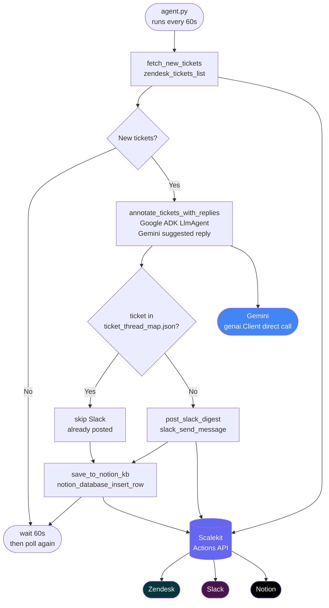

# Support Ticket Automation Agent

> Automate your Zendesk -> Slack -> Notion workflow using [Scalekit](https://scalekit.com) and [Google ADK](https://google.github.io/adk-docs/) — no webhook servers, no token management.

This agent polls Zendesk for new support tickets, generates AI-suggested replies with Gemini via Google ADK, posts a digest to a Slack channel, and saves resolved tickets to a Notion knowledge base. All third-party calls go through Scalekit's connected-accounts API so you never handle OAuth tokens directly.

**Reference:** [scalekit.com/agent-templates/support-ticket-automation-agent](https://www.scalekit.com/agent-templates/support-ticket-automation-agent)

---

## What it does

| Step | Action |
|------|--------|
| Fetch | Poll Zendesk for new tickets via Scalekit Actions (`zendesk_tickets_list`) |
| Classify + Reply | Gemini generates a suggested reply for each ticket (direct `genai.Client` call) |
| Notify | Post a batched digest of new tickets and AI replies to Slack (`slack_send_message`) |
| Knowledge base | Save tickets to a Notion database for future deflection (`notion_database_insert_row`) |

---

## Architecture



**Tools used via Scalekit Actions:**
- `zendesk_tickets_list` — list new tickets
- `slack_send_message` — post ticket digest
- `notion_database_insert_row` — write to knowledge base

**File map:**

```
agent.py              Main loop + deterministic pipeline + tool functions
settings.py           Env var loading and validation (fails fast on missing vars)
state/
  ticket_thread_map.json   Idempotency store: ticket_id -> "digest" | notion saved
```

---

## Prerequisites

- Python 3.10+
- A [Scalekit](https://scalekit.com) account with Zendesk, Slack, and Notion connections configured
- Your Scalekit environment URL, client ID, and client secret
- A Google API key for Gemini (get one at [aistudio.google.com](https://aistudio.google.com))
- A Slack channel ID for the digest
- A Notion database with four columns: **Name** (title, default), **Ticket ID** (number), **Category** (select), **Reply** (rich_text)

---

## Quick Start

### 1. Clone and set up the environment

```bash
git clone https://github.com/scalekit-developers/workflow-agents-demos
cd workflow-agents-demos/zendesk-slack-notion-agent
python3 -m venv .venv
source .venv/bin/activate          # Windows: .venv\Scripts\activate
pip install -r requirements.txt
```

### 2. Configure environment variables

```bash
cp .env.example .env
```

Open `.env` and fill in every value (see [Environment Variables](#environment-variables) below). The agent will print a clear error listing any missing variables on startup.

### 3. Run the agent

```bash
python agent.py
```

You should see log output like:

```
──────────────────────────────────────────────────────────
  Support Ticket Automation Agent
  Zendesk → Gemini → Slack → Notion via Scalekit Actions
──────────────────────────────────────────────────────────
  Environment : https://your-env.scalekit.dev
  Model       : gemini-2.5-flash
  Poll every  : 60s
  State file  : state/ticket_thread_map.json
──────────────────────────────────────────────────────────
  Press Ctrl+C to stop.
──────────────────────────────────────────────────────────

··········································································
10:00:00 | INFO     | ▶  Cycle #1
10:00:00 | INFO     | ↓  Fetching Zendesk tickets...
10:00:02 | INFO     | ✔  Fetched 3 ticket(s) from Zendesk.
10:00:02 | INFO     | ✦  Generating replies for 3 ticket(s) via Gemini...
10:00:04 | INFO     |     #1042: Thank you for contacting support…
10:00:04 | INFO     | →  Posting Slack digest (3 ticket(s))...
10:00:05 | INFO     | ✔  Slack digest posted to C09K0K2RZ6Y.
10:00:05 | INFO     | ◈  Saving ticket #1042 to Notion KB...
10:00:06 | INFO     | ✔  Notion KB row created for ticket #1042.
10:00:06 | INFO     | –  Next cycle in 60s...
```

Press **Ctrl+C** to stop cleanly.

### 4. Verify

Check these after the first poll cycle completes:

- **Log output** — you should see `Fetched N ticket(s) from Zendesk.` and `Slack digest posted successfully.`
- **State file** — `state/ticket_thread_map.json` should exist with entries like `{"1042": "digest", "notion_1042": true}`
- **Slack** — check the configured channel for the ticket digest message
- **Notion** — open your Notion database and confirm rows exist for saved tickets

---

## Features Demonstrated

| Scalekit Feature | Where in code |
|---|---|
| Agent Actions tool-calling | `agent.py` — `fetch_new_tickets`, `post_slack_digest`, `save_to_notion_kb` call `sk.actions.execute_tool()` |
| Delegated OAuth (no hardcoded tokens) | `agent.py` — `ScalekitClient` initialized from env vars; Zendesk/Slack/Notion tokens never in code |
| Connected accounts by identifier | `settings.py` — `ZENDESK_IDENTIFIER`, `SLACK_IDENTIFIER`, `NOTION_IDENTIFIER` |
| Connection name pinning | `settings.py` — `*_CONNECTION_NAME` vars passed to every `execute_tool` call |
| Token lifecycle (no refresh code) | Scalekit handles token refresh automatically — same call works on day 1 or day 180 |
| Google ADK (genai.Client) | `agent.py` — `_genai.Client.models.generate_content()` for reply generation per ticket |

---

## SDK versions

- `scalekit-sdk-python >= 2.12.0`
- `google-adk >= 2.3.0`
- Last verified: 2026-06-19

---

## Environment Variables

Copy `.env.example` to `.env` and fill in the values below.

### Required

| Variable | Description |
|----------|-------------|
| `SCALEKIT_ENV_URL` | Your Scalekit environment URL, e.g. `https://your-env.scalekit.dev` |
| `SCALEKIT_CLIENT_ID` | Client ID from your Scalekit app |
| `SCALEKIT_CLIENT_SECRET` | Client secret from your Scalekit app |
| `ZENDESK_IDENTIFIER` | Identifier that resolves the Zendesk connected account in Scalekit |
| `SLACK_IDENTIFIER` | Identifier that resolves the Slack connected account in Scalekit |
| `NOTION_IDENTIFIER` | Identifier that resolves the Notion connected account in Scalekit |
| `SLACK_SUPPORT_CHANNEL` | Slack channel ID for the digest (starts with `C`, e.g. `C1234567890`) |
| `NOTION_KB_DATABASE_ID` | Notion database ID for the knowledge base |
| `GOOGLE_API_KEY` | Google API key for Gemini (used by Google ADK) |

### Connection names (recommended)

Set these to pin each tool call to a specific connector. Without them, Scalekit resolves by identifier alone — which fails if the same identifier has multiple connections for the same service.

| Variable | Description |
|----------|-------------|
| `ZENDESK_CONNECTION_NAME` | Connector name for Zendesk, e.g. `zendesk-xxxxxxxx` |
| `SLACK_CONNECTION_NAME` | Connector name for Slack, e.g. `slack-xxxxxxxx` |
| `NOTION_CONNECTION_NAME` | Connector name for Notion, e.g. `notion-xxxxxxxx` |

> Find your connector names in Scalekit dashboard -> Connected Accounts -> the **connector** column.

### Optional

| Variable | Default | Description |
|----------|---------|-------------|
| `GOOGLE_ADK_MODEL` | `gemini-2.0-flash` | Gemini model used for reply generation and orchestration |
| `POLL_INTERVAL` | `60` | Seconds between poll cycles |
| `LOG_LEVEL` | `INFO` | Log verbosity: `DEBUG`, `INFO`, `WARNING`, `ERROR` |
