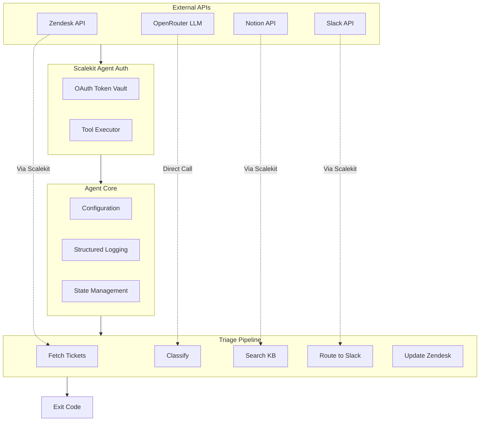

# Support Triage Agent: Zendesk + Slack + Notion

An agent that automates support ticket triage by classifying Zendesk tickets with an LLM, searching a Notion knowledge base for matching articles, routing structured alerts to the right Slack channel, and updating the ticket with tags, priority, and an internal note.

All three services are connected through [Scalekit Agent Auth](https://scalekit.com) using a single `actions.execute_tool()` interface. No token management, no OAuth refresh logic, no credential storage in your code.

## What It Does

For every new Zendesk ticket, the agent runs a five-step pipeline:

| Step | Action | Tool |
|------|--------|------|
| 1 | Fetch new/open tickets from Zendesk | `zendesk_search_tickets` |
| 2 | Classify category + severity using an LLM | OpenRouter (GPT-4o-mini) |
| 3 | Search Notion KB for matching articles | `notion_page_search` |
| 4 | Post structured alert to the right Slack channel | `slack_send_message` |
| 5 | Add tags, priority, and internal note to the ticket | `zendesk_ticket_update` + `zendesk_ticket_reply` |

**Classification categories:** billing, bug, feature_request, how_to, account_issue

**Severity levels:** P0 (service down), P1 (major issue), P2 (minor), P3 (question)

## Architecture



## Prerequisites

- Python 3.11+
- A [Scalekit](https://scalekit.com) account (free tier works)
- A Zendesk account with API access enabled
- A Notion workspace with a knowledge base database
- A Slack workspace with routing channels (e.g., #engineering, #billing, #support-triage)
- An [OpenRouter](https://openrouter.ai) API key (optional; falls back to rule-based classification)

## Setup

### 1. Install dependencies

```bash
pip install scalekit-sdk-python requests python-dotenv
```

### 2. Configure environment

```bash
cp .env.example .env
```

Fill in your credentials. See `.env.example` for all available options.

### 3. Set up Scalekit connectors

In the [Scalekit dashboard](https://scalekit.com), add three connectors under Agent Auth > Connections:

**Zendesk** - Enter your Zendesk email and API token. The subdomain must match your Zendesk account (e.g., `yourcompany` for `yourcompany.zendesk.com`).

**Notion** - Complete the OAuth flow, then share your KB database with the integration: open the database in Notion, click `...` > Connections > add your Scalekit integration.

**Slack** - Complete the OAuth flow with `chat:write` scope, then invite the bot to each routing channel: `/invite @your-bot-name`

### 4. Run

```bash
python run_flow.py
```

## Usage

### One-Time Mode (Default)

Process pending tickets once and exit:

```bash
python run_flow.py
```

This mode is ideal for:
- Cron jobs (e.g., `0 * * * * cd /path/to/agent && python run_flow.py`)
- CI/CD pipelines
- Manual testing
- Lambda/serverless functions

### Continuous Mode (Polling)

Run indefinitely, processing tickets every N minutes:

```bash
POLLING_MODE=true POLL_INTERVAL_MINUTES=5 python run_flow.py
```

Press Ctrl+C to stop gracefully.

This mode is ideal for:
- Long-running services
- systemd services
- Docker containers
- Always-on deployments

## Configuration

Environment variables (set in `.env`):

| Variable | Default | Notes |
|----------|---------|-------|
| `SCALEKIT_ENV_URL` | — | Required: Your Scalekit workspace URL |
| `SCALEKIT_CLIENT_ID` | — | Required: Scalekit client ID |
| `SCALEKIT_CLIENT_SECRET` | — | Required: Scalekit client secret |
| `ZENDESK_USER` | — | Required: Email used to authorize Zendesk |
| `SLACK_USER` | — | Required: Email used to authorize Slack |
| `NOTION_USER` | — | Required: Email used to authorize Notion |
| `SLACK_CONNECTOR` | `slack` | Connector name from Scalekit dashboard |
| `NOTION_DB_ID` | (empty) | Optional: Notion database ID for direct query |
| `SUPPORT_EMAIL` | `ZENDESK_USER` | Fallback email for routing |
| `CHANNEL_BUG` | `#engineering` | Slack channel for bugs |
| `CHANNEL_BILLING` | `#billing` | Slack channel for billing |
| `CHANNEL_FEATURE` | `#product-feedback` | Slack channel for feature requests |
| `CHANNEL_HOWTO` | `#support-triage` | Slack channel for how-to questions |
| `CHANNEL_ACCOUNT` | `#support-triage` | Slack channel for account issues |
| `FALLBACK_CHANNEL` | `#support-triage` | Fallback if category unmapped |
| `POLLING_MODE` | `false` | Enable continuous polling |
| `POLL_INTERVAL_MINUTES` | `2` | Minutes between polling cycles |
| `LOG_LEVEL` | `INFO` | Logging level: DEBUG, INFO, WARNING, ERROR |
| `OPENROUTER_API_KEY` | (empty) | Optional: For LLM classification |
| `OPENROUTER_MODEL` | `openai/gpt-4o-mini` | LLM model to use |

## How It Works

```
[14:32:10] I: Step 0: Checking connector auth
[14:32:12] I: ✓ zendesk (support@yourcompany.com) -- ACTIVE
[14:32:13] I: ✓ slack (support@yourcompany.com) -- ACTIVE
[14:32:14] I: ✓ notion (support@yourcompany.com) -- ACTIVE

[14:32:15] I: Step 1: Fetching new Zendesk tickets
[14:32:18] I: Found 3 new ticket(s)

[14:32:19] I: Step 2: Classifying ticket #4
[14:32:22] I: Category: billing | Severity: P1 | Subject: Billing charged twice...
[14:32:22] D: LLM classification OK

[14:32:23] D: Step 3: Searching Notion KB
[14:32:24] D: Skipped KB search (category 'billing' does not require it)

[14:32:25] D: Step 4: Routing to Slack
[14:32:26] I: Routed to Slack channel: #billing

[14:32:27] D: Step 5: Updating Zendesk ticket
[14:32:29] I: ✓ Ticket #4 triaged successfully
```

## Exit Codes

| Code | Meaning | Use Case |
|------|---------|----------|
| `0` | Success | ✓ Tickets processed, or no new tickets (polling mode continues) |
| `1` | Error | ✗ Auth failed, config missing, or 5 consecutive errors (investigate logs) |
| `2` | No data | ✓ No new tickets in one-time mode (normal, not an error) |
| `130` | Interrupted | ✓ Graceful shutdown via Ctrl+C or SIGTERM |

## Monitoring

### Logging

The agent produces structured logs with timestamps, levels, and auto-redacted secrets:

```bash
# Show all logs
python run_flow.py

# Show only errors
LOG_LEVEL=ERROR python run_flow.py

# Show debug info
LOG_LEVEL=DEBUG python run_flow.py
```

Log levels:
- `DEBUG` — Detailed execution flow, skipped steps
- `INFO` — Key milestones, tickets processed, routes
- `WARNING` — Auth issues, partial failures, fallbacks
- `ERROR` — Unrecoverable failures, missing config

### Polling Loop

When `POLLING_MODE=true`, the agent runs continuously:

```bash
# Run every minute (for testing)
POLLING_MODE=true POLL_INTERVAL_MINUTES=1 python run_flow.py

# Run every 5 minutes (production)
POLLING_MODE=true POLL_INTERVAL_MINUTES=5 python run_flow.py

# Press Ctrl+C to stop gracefully
# Agent finishes current ticket and exits with code 130
```

### State

Processed ticket IDs are stored in `state/processed_tickets.json`. This prevents duplicate processing across restarts.

```bash
# Clear processed tickets (useful for testing)
rm -f state/processed_tickets.json
```

## Troubleshooting

| Issue | Solution |
|-------|----------|
| `ModuleNotFoundError: scalekit` | Run `pip install -r requirements.txt` or `pip install scalekit-sdk-python requests python-dotenv` |
| `Missing Scalekit credentials` | Run `cp .env.example .env` and fill in your values from the Scalekit dashboard |
| `connector (...) -- INACTIVE` | Open the auth link printed in logs; if non-interactive, authorize in Scalekit dashboard |
| `No colored output` | Colors auto-disable when output is piped. To force colors: set `FORCE_COLOR=1` |
| `Too many logs` | Set `LOG_LEVEL=WARNING` or `LOG_LEVEL=ERROR` |
| `Agent processes same ticket twice` | Remove `state/processed_tickets.json` if corrupted |
| `LLM classification fails` | Ensure `OPENROUTER_API_KEY` is set; agent falls back to rule-based classification |
| `Slack messages fail` | Verify bot has `chat:write` scope and is invited to channels |
| `Notion search returns no results` | Try setting `NOTION_DB_ID` explicitly; ensure database is shared with integration |

## Deployment

### systemd Service (Linux)

Create `/etc/systemd/system/zendesk-triage.service`:

```ini
[Unit]
Description=Zendesk Support Triage Agent
After=network.target

[Service]
Type=simple
User=www-data
WorkingDirectory=/opt/zendesk-triage-agent
Environment="PATH=/opt/zendesk-triage-agent/venv/bin"
ExecStart=/opt/zendesk-triage-agent/venv/bin/python run_flow.py
Restart=on-failure
RestartSec=30
StandardOutput=journal
StandardError=journal

[Install]
WantedBy=multi-user.target
```

Enable and start:

```bash
sudo systemctl enable zendesk-triage
sudo systemctl start zendesk-triage
sudo journalctl -u zendesk-triage -f  # View logs
```

### Docker

```dockerfile
FROM python:3.11-slim

WORKDIR /app

COPY requirements.txt .
RUN pip install -r requirements.txt

COPY . .

ENV POLLING_MODE=true
ENV POLL_INTERVAL_MINUTES=5

CMD ["python", "run_flow.py"]
```

Build and run:

```bash
docker build -t zendesk-triage .
docker run --env-file .env zendesk-triage
```

### Cron (Hourly Processing)

Add to crontab:

```bash
0 * * * * cd /path/to/agent && python run_flow.py >> /var/log/zendesk-triage.log 2>&1
```

## Production Checklist

- [x] Pure Scalekit (no direct API imports)
- [x] All APIs via `sk.actions.execute_tool()`
- [x] Structured logging with colors
- [x] TTY-aware output (auto-disables in CI)
- [x] LOG_LEVEL env var working
- [x] No secrets in logs (auto-redacted)
- [x] Exit codes: 0/1/2/130
- [x] Graceful shutdown (Ctrl+C)
- [x] Polling + one-time modes
- [x] POLLING_MODE env var
- [x] POLL_INTERVAL_MINUTES configurable
- [x] Consecutive error tracking
- [x] .env.example clean (no secrets)
- [x] Startup validation (fail fast)
- [x] Configuration from env vars only
- [x] README with architecture diagram
- [x] Exit codes documented
- [x] Troubleshooting guide

## License

MIT

---

**Ready for production.** Deploy with confidence.
